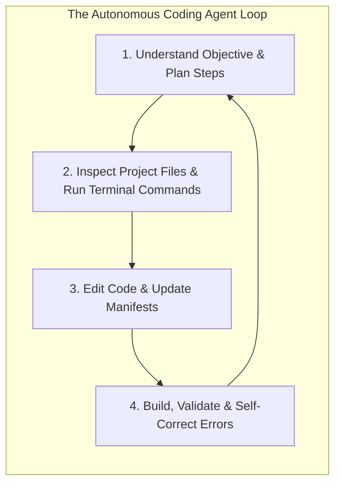

# Chapter 01: Coding Agents & UiPath CLI Architecture

This chapter explains what **Coding Agents** are, why the **UiPath CLI (`uip`)** was designed as an agent-friendly platform interface, and how tools like **Claude Code**, **Google Antigravity**, and **UiPath Autopilot** interact with it.

---

## 1. What is a Coding Agent?

A **Coding Agent** is an autonomous, tool-augmented AI pair programmer. Unlike basic code autocomplete (e.g. legacy Copilot) or generic chat assistants (e.g. ChatGPT in a browser), a coding agent operates directly inside your local development workspace.



### Key Capabilities of Modern Coding Agents:
1. **Autonomous Tool Execution:** Agents can run terminal commands (compiling, packing, validating schemas, publishing), inspect file trees, and search codebases.
2. **Context-Aware Reasoning:** Agents read workspace briefing documents (e.g., `CLAUDE.md`, `AGENTS.md`) and project descriptors to understand solution topology before taking action.
3. **Closed-Loop Verification:** When a build or test command fails, the agent reads the compiler error or CLI instructions and self-corrects without requiring manual intervention.

---

## 2. Dual-Use: Manual Developer Execution & Automated Scripting

Before exploring how AI agents interact with the CLI, it is important to emphasize that **the UiPath CLI (`uip`) is a standard, open command-line utility**:

- **Manual Interactive Use:** Every command demonstrated throughout this tutorial can be typed, inspected, and run manually by a developer in any terminal (Zsh, Bash, PowerShell).
- **CI/CD & DevOps Scripting:** All commands can be automated in shell scripts (`.sh` / `.ps1`) or incorporated into CI/CD pipelines (GitHub Actions, Azure DevOps, GitLab CI, Jenkins).
- **Full Transparency & Parity:** Because coding agents execute the exact same standard CLI commands that human developers use, there is zero hidden magic - developers can copy, inspect, replay, or debug any step taken by an agent.

---

## 3. Why `uip` is an Agent-Friendly Platform Interface

The modern UiPath CLI (`uip`) was engineered from the ground up to serve as a deterministic, machine-readable bridge between AI agents and the UiPath platform.

### Pillar 1: Structured JSON Data Exchange (`--output json` by Default)
- **Deterministic Parsing:** Unlike human CLIs that emit ANSI colors, interactive curses, and variable tables, `uip` outputs structured JSON envelopes by default.
- **Self-Healing Error Payloads:** Errors include actionable instructions and a `Retry` policy (e.g. `RetryWillNotFix` vs retryable transient conditions) that guide the agent's decision loop:
  ```json
  {
    "Result": "Failure",
    "Instructions": "A package with this version already exists. Re-pack with --version <new>",
    "ErrorCode": "invalid_argument",
    "Retry": "RetryWillNotFix"
  }
  ```
- **Built-in JMESPath Filtering (`--output-filter`):** Agents can filter responses natively at the CLI boundary without external tools like `jq`.

### Pillar 2: Agent Skills System (`uip skills install`)
- By running `uip skills install`, domain-specific skill modules (`uipath-platform`, `uipath-maestro-flow`, `uipath-agents`, `uipath-rpa`) are registered in the agent's context.
- Skills inform the agent of valid command options, project constraints, and architectural best practices before it makes tool calls.

### Pillar 3: Model Context Protocol (MCP) Server (`uip mcp`)
- The **Model Context Protocol (MCP)** is the open standard for connecting AI agents to tools and data sources.
- With `uip mcp`, agents query UiPath platform resources (processes, queues, connectors, schema validations) via typed RPC tools rather than raw string parsing.

### Pillar 4: Automated Briefing Generation (`CLAUDE.md` & `AGENTS.md`)
- Initializing a solution (`uip solution init`) generates tailored markdown briefings:
  - `CLAUDE.md` - Optimized for Anthropic's **Claude Code**.
  - `AGENTS.md` - Optimized for Google DeepMind's **Antigravity** and generic agentic IDEs.
- These briefings orient any agent entering the workspace on the build, test, packaging, and deployment lifecycle.

---

## 4. How the 3 Coding Agents Interact with `uip`

This tutorial has been tested and verified across three major agent environments:

| Coding Agent | Interaction Layer | Primary Role & Capabilities |
| :--- | :--- | :--- |
| **Claude Code**<br/>*(Anthropic)* | Terminal Bash Tool + JSON parsing + `CLAUDE.md` | Fast, shell-driven iteration, file editing, CLI validation, and packaging directly in the developer terminal. |
| **Google Antigravity**<br/>*(Google DeepMind)* | Sandboxed Bash Tool + `uip mcp` + Planning Loops + `AGENTS.md` | Autonomous multi-step planning, solution architecture generation, automated verification, and multi-agent delegation. |
| **UiPath Autopilot**<br/>*(UiPath Studio)* | In-IDE Engine + `@uipath/cli` tool modules under the hood | In-canvas natural language flow construction, activity generation, and automatic solution dependency sync. |

---

## 5. Key Takeaways

1. **Dual Utility:** `uip` serves as both a human developer terminal tool / CI/CD automation engine and an AI agent runtime.
2. **Deterministic Communication:** Structured JSON output and MCP protocols prevent hallucinations and ensure reliable tool calling.
3. **Domain Intelligence:** Pre-packaged skills and briefings (`CLAUDE.md` / `AGENTS.md`) ensure agents strictly follow enterprise architecture rules.

---

## 🔗 Navigation Links
- 🏠 [Return to Main README](../README.md)
- ➡️ [Proceed to Chapter 02: Environment Setup](./02-Setup.md)
