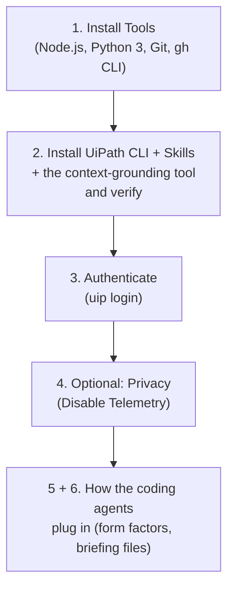
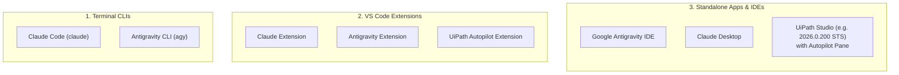

# Chapter 02: Environment Setup & Agent Configuration

This chapter sets up your local environment. Sections 1 to 3 are everything a student needs: install Git, Node.js and Python 3, install the **UiPath CLI (`uip`)** together with its **agent skills** and the one tool that needs Python, verify them, and authenticate against **UiPath Automation Cloud**. Section 4 is an optional privacy setting. Sections 5 and 6 explain how the coding agents you will use plug into all of this, and are worth reading once.



---

## 1. Prerequisites & Tool Installation

The tutorial needs five things: **Node.js** (v18 or higher), **Python 3** (3.11 or higher, for one CLI tool), the **UiPath CLI** (`uip`, installed in Section 2), **Git** (with the optional GitHub CLI), and a **UiPath Automation Cloud account** with access to Orchestrator and Solution Management (authenticated in Section 3).

> ⚠️ **Node.js is the main runtime.** It is required twice over: the UiPath CLI *is* an npm package, and Chapters 11, 12 and 14 run the batch runner and scoreboard with `node scripts/...`. Those two scripts use only the Node standard library, so there is no `npm install` to run in this repository.

> 💡 **Why Python as well.** One `uip` command group, `uip context-grounding`, is a wrapper over the UiPath Python SDK: the CLI tool shells out to the `uipath` Python package. Chapter 06 uses it to create, sync and, when needed, delete the Context Grounding index, and Chapter 14 uses it to re-sync. Without it those steps would have to be clicked through in the Orchestrator browser UI, which would break the one rule this tutorial keeps everywhere else: the coding agent does the work. You never write Python; you install it once so that `uip` can call it.

### 1.1 Git and GitHub CLI (`gh`)

#### 🍏 macOS (Homebrew)
```bash
# Install Git and GitHub CLI
brew install git gh

# Configure Git Identity
git config --global user.name "Your Name"
git config --global user.email "your.email@example.com"

# Authenticate GitHub CLI (optional)
gh auth login
```

#### 🪟 Windows 11 (PowerShell & winget)
```powershell
# Install Git and GitHub CLI
winget install --id Git.Git -e
winget install --id GitHub.cli -e

# Configure Git Identity
git config --global user.name "Your Name"
git config --global user.email "your.email@example.com"

# Authenticate GitHub CLI (optional)
gh auth login
```

#### 📥 Clone the Tutorial Repository
Every chapter from 03 on is run from the root of this repository: the prompts refer to `Data/`, `scripts/` and `TutorialSolution/` by relative path. Clone it once and stay inside it:
```bash
gh repo clone reitermayer/Fusion2026-CodingAgents
cd Fusion2026-CodingAgents
```
Without the GitHub CLI, `git clone https://github.com/reitermayer/Fusion2026-CodingAgents.git` does the same.

### 1.2 Node.js & npm Runtime
Ensure Node.js (v18 or higher) is installed:

#### 🍏 macOS
```bash
brew install node
node -v
npm -v
```

#### 🪟 Windows 11 (PowerShell)
```powershell
winget install --id OpenJS.NodeJS.LTS -e
node -v
npm -v
```

### 1.3 Python 3 and the UiPath Python SDK

Python 3.11 or higher, plus the `uipath` package installed as a global command-line tool. `uv` is the simplest way to get the package onto the PATH without touching a project environment; `pip` works too.

#### 🍏 macOS
```bash
brew install python uv
python3 --version          # 3.11 or higher
uv tool install uipath
uipath --version
```

#### 🪟 Windows 11 (PowerShell)
```powershell
winget install --id Python.Python.3.12 -e
winget install --id astral-sh.uv -e
python --version           # 3.11 or higher; reopen the terminal if it is not found
uv tool install uipath
uipath --version
```

> 💡 **Tip:** `uv tool install` puts the `uipath` command in a directory that `uv` adds to your PATH; if `uipath --version` is not found afterwards, run `uv tool update-shell` and reopen the terminal. The alternative without `uv` is `python3 -m pip install uipath` (`py -m pip install uipath` on Windows).

---

## 2. Installing the UiPath CLI and Its Agent Skills

The UiPath CLI is distributed via the `@uipath/cli` npm package. The same CLI also ships the **UiPath agent skills**: briefing documents that teach your coding agent how the `uip` commands and the flow file format work. Install both now, then verify, so that every later chapter starts from a known state.

### 2.1 Install the CLI

#### 💬 Prompt Your AI Coding Agent (Recommended)
```text
Install the UiPath CLI globally and report the installed version.
```

#### 💻 Underlying CLI Commands (What the Agent Executes)

**Global Installation (Recommended):**
```bash
npm install -g @uipath/cli
```

> **Updating the CLI:** If you have an older version installed, run `uip update` or `npm install -g @uipath/cli@latest` to upgrade to the latest version.

*(Alternatively, run commands without global installation using `npx @uipath/cli <command>`)*.

### 2.2 Install the Agent Skills

The skills cover solution management, Maestro flows, agents, Data Fabric, human-in-the-loop tasks and more. The installer detects the coding agents present on your machine and places the skill files where each one reads them (`--agent claude|antigravity|autopilot|...` targets one explicitly).

#### 💬 Prompt Your AI Coding Agent (Recommended)
```text
Install the official UiPath agent skills into my agent environment.
```

#### 💻 Underlying CLI Command (What the Agent Executes)
```bash
uip skills install
```

### 2.3 Install the Context Grounding Tool

Most `uip` command groups install themselves the first time you use them (Section 2.4 explains). One does not: `@uipath/context-grounding-tool` is not on the CLI's auto-install list, so it is installed by hand, and its `setup` command checks that it can find the Python package from Section 1.3.

#### 💬 Prompt Your AI Coding Agent (Recommended)
```text
Install the UiPath CLI tool @uipath/context-grounding-tool, then run uip context-grounding setup and confirm it reports the uipath Python package as installed.
```

#### 💻 Underlying CLI Commands (What the Agent Executes)
```bash
uip tools install "@uipath/context-grounding-tool"
uip context-grounding setup
```

`setup` answers with the Python it found and whether the package is there:
```json
{
  "Result": "Success",
  "Code": "ContextGroundingSetup",
  "Data": {
    "PythonPath": "python3.14",
    "Package": "uipath",
    "PackageInstalled": "Yes",
    "PackageVersion": "2.14.12"
  }
}
```
`"PackageInstalled": "No"` means Section 1.3 did not complete: the `uipath` package is missing from the Python that `uip` found. Install it for that Python and run `setup` again.

### 2.4 Verify the Installation

Three read-only commands confirm that the CLI runs, show you where its command tools appear, and check that the skills are in place.

#### 💬 Prompt Your AI Coding Agent (Recommended)
```text
Verify my UiPath CLI setup: report the CLI version, list the installed command tools, and list the installed UiPath skills with their count.
```

#### 💻 Underlying CLI Commands (What the Agent Executes)
```bash
uip --version
uip tools list
uip skills list
```

**At a glance** (checked with CLI version `1.200.1`):

| Command | What a healthy install prints |
| :--- | :--- |
| `uip --version` | a bare version string, `1.200.1` or newer |
| `uip tools list` | `"Result": "Success"` and exactly one entry, the context-grounding tool from Section 2.3 (see below for why only one) |
| `uip skills list` | `"Count": 25` or thereabouts, with the store at `~/.uipath/.skills` |

**In detail, and what to do if it does not match:**

**1. `uip --version`** prints just a version number:
```text
1.200.1
```
Any version from `1.200.0` upwards works for this tutorial. If you see `command not found` instead, the global npm install did not land on your PATH: close and reopen the terminal, and if that does not help, run `npm install -g @uipath/cli` again and read its output for errors.

> 💡 **The CLI keeps itself current.** Once a day, the first `uip` command you run checks for updates and prints something like `Updating UiPath CLI, tools, and skills within version 1.x` followed by `Re-running the requested command on the updated CLI`. That is normal: it updates the CLI, its tools and the skills within the same major version, then runs your command. So the version you see may already be newer than the one printed in this tutorial, and that is fine.

**2. `uip tools list`** shows exactly one entry, the tool you installed in Section 2.3, and that is correct:
```json
{
  "Result": "Success",
  "Code": "ToolList",
  "Data": [
    {
      "Name": "context-grounding-tool",
      "Version": "1.201.0",
      "Description": "Tool for context grounding operations via the UiPath Python SDK",
      "CommandPrefix": "context-grounding"
    }
  ]
}
```
The CLI you installed in Section 2.1 is only a small core. Each command group you type after `uip` (`solution`, `maestro`, `agent`, `or` for Orchestrator, `df` for Data Fabric, and so on) is a separate **tool**. The CLI downloads a tool the first time you use any command of that group, and keeps it from then on. So apart from the one tool that is not on the auto-install list, there is nothing to install by hand: the tools arrive as the tutorial needs them. The next one appears in the next section, when the login check calls Orchestrator, and by the end of the tutorial this list holds the seven groups the chapters use: `solution`, `maestro`, `agent`, `or`, `context-grounding`, `df` and `is` (Integration Service).

Look for `"Result": "Success"`. If a later chapter's first command in a new group fails during the download, the usual cause is a network proxy or a blocked npm registry, since the tools come from the same registry as the CLI itself.

**3. `uip skills list`** shows the skills you installed in step 2.2, and where they were put:
```json
{
  "Result": "Success",
  "Code": "SkillsList",
  "Data": {
    "StorePath": "/Users/you/.uipath/.skills",
    "Count": 25,
    "Skills": [
      { "Name": "uipath-admin", ... },
      { "Name": "uipath-agents", ... },
      ...
    ]
  }
}
```
Look for a `Count` greater than zero (about 25 at the time of writing) and, in the list of names, `uipath-solution`, `uipath-maestro-flow`, `uipath-agents`, `uipath-human-in-the-loop` and `uipath-platform`. Those five are the ones the later chapters rely on. A `Count` of `0` means step 2.2 did not run or did not find a coding agent to install for: run `uip skills install` again and read its output.

> 💡 **Why is everything JSON?** Every `uip` command answers in JSON by default. That is deliberate: a coding agent can read a JSON result precisely, instead of guessing at prose meant for humans. You do not need to read the JSON yourself in this tutorial; your agent does. When you do want a human view, add `--output table` to any command, for example `uip tools list --output table`.

### Optional: Enable Shell Autocompletion
#### 🍏 macOS / Linux (Zsh / Bash)
```bash
# For Zsh:
uip completion zsh >> ~/.zshrc
source ~/.zshrc

# For Bash:
uip completion bash >> ~/.bashrc
source ~/.bashrc
```

#### 🪟 Windows 11 (PowerShell)
```powershell
# Add to PowerShell Profile
Add-Content $PROFILE 'uip completion pwsh | Out-String | Invoke-Expression'
```

---

## 3. Authenticating with UiPath Automation Cloud

Before deploying or publishing solutions, authenticate the CLI with your UiPath Cloud tenant.

### 💬 Prompt Your AI Coding Agent (Recommended)
```text
Log me in to UiPath Automation Cloud with the CLI, confirm which organization, tenant and user I am authenticated as, then list the first three Orchestrator folders to prove the login works.
```

### 💻 Underlying CLI Commands (What the Agent Executes)

**Interactive Login (Browser OAuth):**
```bash
uip login
```
*This opens your default browser to authenticate via UiPath Automation Cloud SSO.*

**Non-Interactive Login (CI/CD & Headless Environments):**
```bash
uip login \
  --client-id <YOUR_CLIENT_ID> \
  --client-secret <YOUR_CLIENT_SECRET> \
  --organization <ORG_LOGICAL_NAME> \
  --tenant <TENANT_NAME>
```

**Verify Authentication & Active User Context:**
```bash
# Who am I? (takes no arguments)
uip user

# Which org / tenant am I pointed at, and when does the token expire?
uip login status
```

> ⚠️ **Note:** The command is `uip user`, with no subcommand. Running `uip user get` fails with `too many arguments for 'user'. Expected 0 arguments but got 1`.

**Prove It with a Real Call:**
```bash
uip or folders list --limit 3 --output table
```
This is the first command in the tutorial that talks to your tenant. Two things happen on the first run: the CLI downloads the Orchestrator tool (`or`), which becomes the first entry in `uip tools list`, and then lists your folders. Expect a table with at least one row, your personal workspace, with columns `Key`, `Name`, `Path` and `Type`. Before login the same command answers `Not logged in. Run 'uip login' first.`, which is also a useful thing to have seen once.

---

## 4. Optional: Privacy & Telemetry Configuration

This step is optional and changes nothing in the tutorial. By default, the UiPath CLI collects anonymous usage telemetry. If you prefer to opt out, set the `UIPATH_TELEMETRY_DISABLED` environment variable.

### 💬 Prompt Your AI Coding Agent (Recommended)
```text
Disable UiPath CLI telemetry for my shell and persist the setting across sessions.
```

### 💻 Underlying Shell Commands (What the Agent Executes)

#### 🍏 macOS / Linux (Bash / Zsh)
```bash
# Set for current terminal session
export UIPATH_TELEMETRY_DISABLED=true

# Persist across terminal sessions
echo 'export UIPATH_TELEMETRY_DISABLED=true' >> ~/.zshrc
source ~/.zshrc
```

#### 🪟 Windows 11 (PowerShell)
```powershell
# Set for current PowerShell session
$env:UIPATH_TELEMETRY_DISABLED = "true"

# Persist permanently for your Windows user account
[System.Environment]::SetEnvironmentVariable('UIPATH_TELEMETRY_DISABLED', 'true', 'User')
```

> ⚠️ **Only two values count as "disabled":** the CLI treats the variable as opting out when it is exactly `true` or `1`. Anything else (`TRUE`, `yes`, `on`, `disabled`) leaves telemetry **enabled**, and you get no warning about it. If you already have the variable set, check it with `echo $UIPATH_TELEMETRY_DISABLED` before assuming you have opted out.

> For details on telemetry policies and data handling, refer to the [UiPath CLI Telemetry Documentation](https://docs.uipath.com/automation-cloud/automation-cloud/latest/user-guide/cli-telemetry).

---

## 5. Coding Agent Interfaces & Form Factors

When developers work with AI coding agents, they typically interact with them across **three primary form factors**:



| Form Factor | Tool Examples | Best For |
| :--- | :--- | :--- |
| **1. Terminal CLIs** | • **Claude Code** (`claude`)<br/>• **Antigravity CLI** (`agy`) | Shell-native development, terminal pair-programming, fast command execution, and remote/SSH workflows. |
| **2. VS Code Extensions** | • **Claude Extension**<br/>• **Antigravity Extension**<br/>• **UiPath Extension** | In-editor code assistance, inline diff reviews, and side-panel agent chats inside standard VS Code. |
| **3. Standalone IDEs & Apps** | • **Google Antigravity IDE**<br/>• **Claude Desktop**<br/>• **UiPath Studio** (with Autopilot pane) | Complete graphical workspace with visual workflow canvases, dedicated Artifact/Planning panes, and full enterprise designer tooling. |

> 💡 **Note for Learners:** In this tutorial, when we refer to **Claude Code** or **Google Antigravity**, you can use whichever form factor fits your workflow best (CLI, VS Code extension, or standalone IDE). All of them interact with the same underlying UiPath platform via `uip`.

### 5.1 Recommended IDE: Visual Studio Code

Running inside **Visual Studio Code (VS Code)** provides an optimal experience for developers who want visual inspection of the solution file tree (`TutorialSolution/`), live diff reviews, integrated terminal execution, and side-panel agent pair programming.

#### Verified Toolchain & Extensions

| Tool / Component | Identifier / Extension ID | Tested Version | Description |
| :--- | :--- | :--- | :--- |
| **Visual Studio Code** | `code` | `v1.136.2` | Recommended editor & integrated workspace |
| **Google Antigravity** | `google.google-antigravity` | `v1.2.0` | In-editor multi-agent pair programming & artifacts |
| **Claude Code** | `anthropic.claude-code` | `v2.1.263` | In-editor agent chat & terminal CLI (`claude`) |
| **UiPath Autopilot** | `uipath.autopilot-vscode` | `v1.0.260828024` | Native enterprise automation assistance |
| **UiPath Maestro Flow** | `uipath.uipath-maestro` | `v1.201.14` | Flow graph language syntax support |
| **UiPath CLI** | `@uipath/cli` (`uip`) | `v1.200.1` | Deterministic platform orchestration engine |

To install the verified extensions into VS Code from your terminal:
```bash
code --install-extension google.google-antigravity
code --install-extension anthropic.claude-code
code --install-extension uipath.autopilot-vscode
code --install-extension uipath.uipath-maestro
```

---

## 6. Agent Briefing Files (`AGENTS.md` & `CLAUDE.md`)

When you open a workspace or initialize a solution (using `uip solution init`), the repository includes dedicated agent configuration files:
- **`CLAUDE.md`** - Optimized system instructions for Anthropic's **Claude Code**.
- **`AGENTS.md`** - Standard instructions for Google DeepMind's **Antigravity**, Cursor, Copilot, and agentic IDEs.
- **UiPath Autopilot Integration** - In UiPath Studio (e.g., version `2026.0.200 STS`), Autopilot natively reads solution and project metadata (`.uipx` and `.uiproj`).

> 💡 **Why Workspace Rules Empower You as a Developer:**  
> These briefing files teach your AI Coding Agent two vital capabilities:  
> 1. **Underlying Compilation Rules:** Using **Handlebars** (`{{ $vars... }}`) for flow-level prompt templates and text outputs, **JavaScript Expressions** (`=js:$vars...`) for typed booleans, numbers, and arrays, and the **flattened `{{input.<trigger>__output__<var>}}` form** for feeding flow data into an inline AI agent's own prompts. This allows you to **prompt your agent using 100% natural, high-level business language** throughout this entire course without having to micromanage syntax!  
> 2. **Rigorous Data-Verification Standards:** Instructing your agent never to merely check if a flow completed without exceptions, but to actively inspect and report the actual data payloads (node inputs, intermediate step outputs, and final flow return arguments) to guarantee that all strongly-typed values are valid and non-null. This matters most for AI agents: an LLM handed an empty input still returns a confident, plausible-looking answer, so a green `Completed` status proves nothing on its own.

---

## 7. Setup Verification Checklist

Run through this quick checklist to ensure your environment is fully ready:

- [x] `git --version` returns installed Git version.
- [x] `node -v` returns v18 or higher.
- [x] `python3 --version` returns 3.11 or higher, and `uipath --version` prints a version.
- [x] `uip --version` returns `1.200.0` or newer.
- [x] `uip context-grounding setup` reports `"PackageInstalled": "Yes"`.
- [x] `uip tools list` returns `"Result": "Success"` with `context-grounding-tool` as its one entry (the others arrive on first use).
- [x] `uip skills list` returns `"Code": "SkillsList"` with a non-zero `Data.Count` and `uipath-maestro-flow` among the names.
- [x] `uip user` returns your authenticated UiPath Cloud user profile.
- [x] `uip login status` returns `"Status": "Logged in"` with your organization and tenant.
- [x] `uip or folders list --limit 3 --output table` lists at least your personal workspace folder.
- [x] Optional: `echo $UIPATH_TELEMETRY_DISABLED` returns `true` or `1` if you chose to opt out.
- [x] Optional: `gh auth status` returns an authenticated GitHub account if you cloned with `gh`.

---

## 🔗 Navigation Links
- ⬅️ [Back to Chapter 01: Coding Agents & Architecture](./01-CodingAgents.md)
- 🏠 [Return to Main README](../README.md)
- ➡️ [Proceed to Chapter 03: UiPath Solutions and Projects](./03-SolutionsAndProjects.md)
