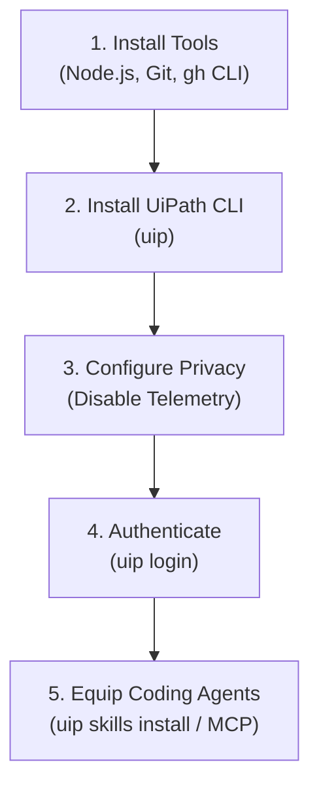
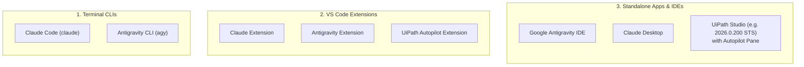

# Chapter 02: Environment Setup & Agent Configuration

This chapter guides you through setting up your local development environment, installing the **UiPath CLI (`uip`)**, configuring version control with **Git & GitHub CLI (`gh`)**, authenticating against **UiPath Automation Cloud**, and equipping AI coding assistants across their different interface form factors.



---

## 1. Prerequisites & Tool Installation

### 1.1 Git and GitHub CLI (`gh`)

#### 🍏 macOS (Homebrew)
```bash
# Install Git and GitHub CLI
brew install git gh

# Configure Git Identity
git config --global user.name "Your Name"
git config --global user.email "your.email@example.com"

# Authenticate GitHub CLI (optional)
gh auth login
```

#### 🪟 Windows 11 (PowerShell & winget)
```powershell
# Install Git and GitHub CLI
winget install --id Git.Git -e
winget install --id GitHub.cli -e

# Configure Git Identity
git config --global user.name "Your Name"
git config --global user.email "your.email@example.com"

# Authenticate GitHub CLI (optional)
gh auth login
```

### 1.2 Node.js & npm Runtime
Ensure Node.js (v18 or higher) is installed:

#### 🍏 macOS
```bash
brew install node
node -v
npm -v
```

#### 🪟 Windows 11 (PowerShell)
```powershell
winget install --id OpenJS.NodeJS.LTS -e
node -v
npm -v
```

---

## 2. Installing the UiPath CLI (`uip`)

The UiPath CLI is distributed via the `@uipath/cli` npm package. You can install it globally or run it on-demand via `npx`.

### 💬 Prompt Your AI Coding Agent (Recommended)
```text
Install the UiPath CLI globally and report the installed version.
```

### 💻 Underlying CLI Commands (What the Agent Executes)

**Global Installation (Recommended):**
```bash
npm install -g @uipath/cli
```

**Verify CLI Installation:**
```bash
uip --version
# Output should show: 1.200.0 or newer
```

> **Updating the CLI:** If you have an older version installed, run `uip update` or `npm install -g @uipath/cli@latest` to upgrade to the latest version.

*(Alternatively, run commands without global installation using `npx @uipath/cli <command>`)*.

### Optional: Enable Shell Autocompletion

#### 🍏 macOS / Linux (Zsh / Bash)
```bash
# For Zsh:
uip completion zsh >> ~/.zshrc
source ~/.zshrc

# For Bash:
uip completion bash >> ~/.bashrc
source ~/.bashrc
```

#### 🪟 Windows 11 (PowerShell)
```powershell
# Add to PowerShell Profile
Add-Content $PROFILE 'uip completion pwsh | Out-String | Invoke-Expression'
```

---

## 3. Privacy & Telemetry Configuration

By default, the UiPath CLI collects anonymous usage telemetry. You can opt out by setting the `UIPATH_TELEMETRY_DISABLED` environment variable.

### 💬 Prompt Your AI Coding Agent (Recommended)
```text
Disable UiPath CLI telemetry for my shell and persist the setting across sessions.
```

### 💻 Underlying Shell Commands (What the Agent Executes)

#### 🍏 macOS / Linux (Bash / Zsh)
```bash
# Set for current terminal session
export UIPATH_TELEMETRY_DISABLED=true

# Persist across terminal sessions
echo 'export UIPATH_TELEMETRY_DISABLED=true' >> ~/.zshrc
source ~/.zshrc
```

#### 🪟 Windows 11 (PowerShell)
```powershell
# Set for current PowerShell session
$env:UIPATH_TELEMETRY_DISABLED = "true"

# Persist permanently for your Windows user account
[System.Environment]::SetEnvironmentVariable('UIPATH_TELEMETRY_DISABLED', 'true', 'User')
```

> ⚠️ **Only two values count as "disabled":** the CLI treats the variable as opting out when it is exactly `true` or `1`. Anything else (`TRUE`, `yes`, `on`, `disabled`) leaves telemetry **enabled**, and you get no warning about it. If you already have the variable set, check it with `echo $UIPATH_TELEMETRY_DISABLED` before assuming you have opted out.

> For details on telemetry policies and data handling, refer to the [UiPath CLI Telemetry Documentation](https://docs.uipath.com/automation-cloud/automation-cloud/latest/user-guide/cli-telemetry).

---

## 4. Authenticating with UiPath Automation Cloud

Before deploying or publishing solutions, authenticate the CLI with your UiPath Cloud tenant.

### 💬 Prompt Your AI Coding Agent (Recommended)
```text
Log me in to UiPath Automation Cloud with the CLI, then confirm which organization, tenant and user I am authenticated as.
```

### 💻 Underlying CLI Commands (What the Agent Executes)

**Interactive Login (Browser OAuth):**
```bash
uip login
```
*This opens your default browser to authenticate via UiPath Automation Cloud SSO.*

**Non-Interactive Login (CI/CD & Headless Environments):**
```bash
uip login \
  --client-id <YOUR_CLIENT_ID> \
  --client-secret <YOUR_CLIENT_SECRET> \
  --organization <ORG_LOGICAL_NAME> \
  --tenant <TENANT_NAME>
```

**Verify Authentication & Active User Context:**
```bash
# Who am I? (takes no arguments)
uip user

# Which org / tenant am I pointed at, and when does the token expire?
uip login status
```

> ⚠️ **Note:** The command is `uip user`, with no subcommand. Running `uip user get` fails with `too many arguments for 'user'. Expected 0 arguments but got 1`.

---

## 5. Coding Agent Interfaces & Form Factors

When developers work with AI coding agents, they typically interact with them across **three primary form factors**:



| Form Factor | Tool Examples | Best For |
| :--- | :--- | :--- |
| **1. Terminal CLIs** | • **Claude Code** (`claude`)<br/>• **Antigravity CLI** (`agy`) | Shell-native development, terminal pair-programming, fast command execution, and remote/SSH workflows. |
| **2. VS Code Extensions** | • **Claude Extension**<br/>• **Antigravity Extension**<br/>• **UiPath Extension** | In-editor code assistance, inline diff reviews, and side-panel agent chats inside standard VS Code. |
| **3. Standalone IDEs & Apps** | • **Google Antigravity IDE**<br/>• **Claude Desktop**<br/>• **UiPath Studio** (with Autopilot pane) | Complete graphical workspace with visual workflow canvases, dedicated Artifact/Planning panes, and full enterprise designer tooling. |

> **Note for Learners:** In this tutorial, when we refer to **Claude Code** or **Google Antigravity**, you can use whichever form factor fits your workflow best (CLI, VS Code extension, or standalone IDE). All of them interact with the same underlying UiPath platform via `uip`.

---

## 6. Equipping Coding Agents with UiPath Skills

UiPath CLI includes native agent integration features designed specifically for agentic AI assistants.

### 6.1 Installing UiPath AI Agent Skills

Equip your coding assistants with official UiPath domain skills (covering solution management, maestro flows, coded agents, and RPA workflows):

#### 💬 Prompt Your AI Coding Agent (Recommended)
```text
Install the official UiPath agent skills into my agent environment.
```

#### 💻 Underlying CLI Command (What the Agent Executes)
```bash
uip skills install
```

### 6.2 Model Context Protocol (MCP) Server
UiPath CLI provides a built-in MCP server that allows AI coding assistants to query platform APIs and inspect resources directly.

#### 💬 Prompt Your AI Coding Agent (Recommended)
```text
Register the UiPath CLI MCP server with my coding agent so it can query the platform directly.
```

#### 💻 Underlying CLI Command (What the Agent Executes)
```bash
# Register the server with your agent (Claude Code example)
claude mcp add uipath -- uip mcp
```

> ⚠️ **Do not run `uip mcp` on its own.** It is not a command that prints a result and exits: it starts a stdio MCP server that holds the terminal open until you kill it. The server is meant to be **registered** in your agent's MCP configuration, which then launches and talks to it over stdin and stdout.

### 6.3 Agent Briefing Files (`AGENTS.md` & `CLAUDE.md`)

When you open a workspace or initialize a solution (using `uip solution init`), the repository includes dedicated agent configuration files:
- **`CLAUDE.md`** - Optimized system instructions for Anthropic's **Claude Code**.
- **`AGENTS.md`** - Standard instructions for Google DeepMind's **Antigravity**, Cursor, Copilot, and agentic IDEs.
- **UiPath Autopilot Integration** - In UiPath Studio (e.g., version `2026.0.200 STS`), Autopilot natively reads solution and project metadata (`.uipx` and `.uiproj`).

> 💡 **Why Workspace Rules Empower You as a Developer:**  
> These briefing files teach your AI Coding Agent two vital capabilities:  
> 1. **Underlying Compilation Rules:** Using **Handlebars** (`{{ $vars... }}`) for flow-level prompt templates and text outputs, **JavaScript Expressions** (`=js:$vars...`) for typed booleans, numbers, and arrays, and the **flattened `{{input.<trigger>__output__<var>}}` form** for feeding flow data into an inline AI agent's own prompts. This allows you to **prompt your agent using 100% natural, high-level business language** throughout this entire course without having to micromanage syntax!  
> 2. **Rigorous Data-Verification Standards:** Instructing your agent never to merely check if a flow completed without exceptions, but to actively inspect and report the actual data payloads (node inputs, intermediate step outputs, and final flow return arguments) to guarantee that all strongly-typed values are valid and non-null. This matters most for AI agents: an LLM handed an empty input still returns a confident, plausible-looking answer, so a green `Completed` status proves nothing on its own.

---

## 7. Setup Verification Checklist

Run through this quick checklist to ensure your environment is fully ready:

- [x] `git --version` returns installed Git version.
- [x] `gh auth status` returns authenticated GitHub account.
- [x] `uip --version` returns `@uipath/cli` version.
- [x] `echo $UIPATH_TELEMETRY_DISABLED` returns `true` or `1` (either disables telemetry).
- [x] `uip user` returns your authenticated UiPath Cloud user profile.
- [x] `uip login status` returns `"Status": "Logged in"` with your organization and tenant.
- [x] `uip skills install` completes successfully.

---

## 8. Budgeting Your Token Consumption

Every prompt in this tutorial spends tokens on a paid model. If you are running on a metered plan, or teaching a room of thirty people at once, it helps to know roughly what you are signing up for before you start.

> ⚠️ **These are estimates, not measurements.** They come from building and re-running this tutorial end to end, not from per-chapter instrumentation. Treat the order of magnitude as reliable and the exact numbers as not. Your own run can easily land at half or double these figures.

| # | Chapter | Rough total tokens | What drives it |
| :-: | :--- | ---: | :--- |
| 01 | Coding Agents | ~5k | Reading only, no agent work |
| 02 | Setup | 10k - 20k | Installs, login, skills |
| 03 | Solutions & Projects | 25k - 50k | Scaffolding, small JSON files |
| 04 | Building Your First Flow | 80k - 150k | Flow authoring, agent scaffolding, first debug run |
| 05 | Variables & Schemas | 60k - 120k | Schema edits plus payload inspection |
| 06 | Storage Buckets & Indexes | 120k - 250k | Many CLI round-trips, ingestion polling, large JSON payloads |
| 07 | Human in the Loop | 100k - 200k | Node wiring plus debug cycles on both branches |
| 08 | Sending Emails | 60k - 120k | Connector discovery, configure, one debug run |
| 09 | Receiving Emails | 60k - 120k | Trigger discovery and configuration, one regression run |
| 10 | Deployment | 40k - 80k | Pack, publish, deploy |
| | **Whole tutorial** | **~0.6M - 1.2M** | |

### What actually moves the number

1. **Debugging dominates.** A chapter that works first time costs a fraction of one where a binding is wrong and the agent iterates. The single most expensive habit is re-running a flow without reading the previous payload.
2. **Mode 2 is cheaper than Mode 3.** The 1-Shot Fast-Track is one long turn; the step-by-step walkthrough is a dozen turns that each re-send the accumulated conversation. Mode 3 is better for learning and worse for your bill.
3. **Flow files are large.** `EmailTriage.flow` passes 1,700 lines by Chapter 08, because each node type caches its full registry manifest in `definitions[]`. An agent that re-reads the whole file every turn burns tokens fast. Prefer targeted edits over full-file reads.
4. **`--output-filter` is a cost control, not just a convenience.** `uip or folders list --limit 200` returns pages of JSON; the same call with a filter returns three fields. Both answer your question; one costs fifty times more.
5. **Model choice.** A frontier model on a small chapter can cost more than a cheaper model on a large one. Nothing in this tutorial requires the largest available model.

> 💡 **Teaching this to a group?** Multiply by heads, then add a margin: learners hit more dead ends than the author did. A thirty-person workshop covering Chapters 03 to 09 is plausibly 18M to 35M tokens in aggregate. Ask people to pick Mode 2 for chapters they only want to see work, and Mode 3 for the two or three they actually want to understand.

---

## 🔗 Navigation Links
- ⬅️ [Back to Chapter 01: Coding Agents & Architecture](./01-CodingAgents.md)
- 🏠 [Return to Main README](../README.md)
- ➡️ [Proceed to Chapter 03: UiPath Solutions and Projects](./03-SolutionsAndProjects.md)
