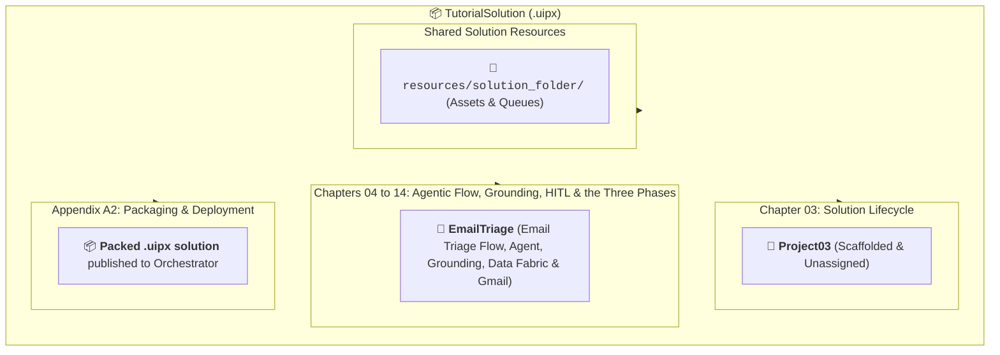
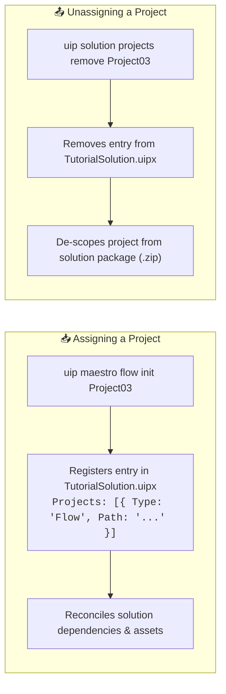

# Chapter 03: UiPath Solutions and Projects (Top-Down)

When building automations with modern coding agents, the architecture is organized top-down: a **Solution** serves as the multi-project enterprise container, while individual **Projects** (such as Maestro Flows, AI Agents, Coded Workflows, and Test Suites) are the modular building blocks inside it.

In this chapter, you will learn how to create your central multi-project solution - **`TutorialSolution`**, explore how projects are **assigned and unassigned** in the solution manifest, and understand project lifecycle management.

This solution is the container for everything the tutorial builds: an **email triage process** for a support inbox. From Chapter 04 on, a Maestro flow named `EmailTriage` grows chapter by chapter: first an agent that classifies an email, then a Context Grounding index that holds the department directory, then a human approval task for the sensitive cases, then a Data Fabric entity that records every human decision. Those recorded decisions are what lets the same flow be rebuilt in three versions, each trusted a little more than the last, and measured against a fixed batch of nine emails. Chapter 08 lays out that three-phase design once the baseline exists; for now, the job is the container.



> 💡 **Choose Your Starting Point:**
>
> **Mode 1: 🔄 Reset Solution (Clean Slate)**
> 💬 *Prompt your AI Coding Agent:*
> ```text
> Delete the TutorialSolution folder if it already exists so we can start Chapter 03 completely fresh.
> ```
> 💻 *Underlying CLI / Shell Command:*
> ```bash
> rm -rf ./TutorialSolution
> ```
>
> ---
>
> **Mode 2: ⚡ 1-Shot Autonomous Fast-Track**
> 💬 *Paste this master prompt into your coding assistant to execute the entire Chapter 03 in one turn:*
> ```text
> Perform the complete Chapter 03 workflow:
> 1. Create a new solution folder and solution named TutorialSolution.
> 2. Inside TutorialSolution, initialize a starter Maestro flow project named Project03.
> 3. List all registered projects to confirm assignment.
> 4. Delete Project03 by hand: remove its directory, delete both of its artifacts under resources/solution_folder, and remove its entry from TutorialSolution.uipx. Then confirm the solution lists no projects.
> 5. Turn TutorialSolution into its own git repository: add a .gitignore that ignores dist/, userProfile/ and .DS_Store, commit everything with the message "Chapter 03 done" and tag the commit ch03-done. Then show me the latest commit with its tag.
> ```
>
> ---
>
> **Mode 3: 📖 Step-by-Step Guided Walkthrough (Recommended for Learning)**
> Proceed through Sections 1 through 8 below, pasting each prompt step-by-step.

---

## 1. Architectural Shift: Legacy Single Projects vs. Modern Solutions

Before diving into commands, understand the architectural transformation in the UiPath platform:

| Dimension | Legacy Single-Project (`project.json`) | Modern Multi-Project Solution (`.uipx`) |
| :--- | :--- | :--- |
| **Root Manifest** | `project.json` in the root folder. | `TutorialSolution.uipx` in root, with individual `project.uiproj` sub-manifests. |
| **Composition** | Monolithic: all workflows share one package. | Modular: holds multiple flows, agents, and test suites side-by-side. |
| **Cloud Provisioning** | Uploads an isolated `.nupkg` process. | Deploys entire systems (processes, assets, queues, buckets) in one package. |
| **Agent Support** | Unstructured text prompts in UI. | Tailored briefing files (`CLAUDE.md`, `AGENTS.md`) scaffolded automatically. |

---

## 2. Creating the Solution and Starter Project

You will create the **`TutorialSolution`** folder and scaffold your first project inside it.

`Project03` is a throwaway, and the number in its name only says which chapter created it. It exists so you can watch what registering a project does to the solution manifest, and Section 6 deletes it again, so that the solution is empty when Chapter 04 adds the real project, `EmailTriage`. That is also what makes this chapter safe to repeat: whatever you try with `Project03`, the checkpoint at the end records a clean solution.

### 💬 Prompt Your AI Coding Agent (Recommended)
Open Claude Code or Google Antigravity in your root directory and paste:

```text
Create a new solution folder and solution named TutorialSolution and initialize a starter Maestro flow project named Project03.
```

### 💻 Underlying CLI Commands (What the Agent Executes)

**🍏 macOS / Linux (Bash / Zsh):**
```bash
# 1. Initialize the parent solution container
uip solution init TutorialSolution

# 2. Enter the solution and scaffold the starter project
cd TutorialSolution
uip maestro flow init Project03
```

**🪟 Windows 11 (PowerShell):**
```powershell
# 1. Initialize the parent solution container
uip solution init TutorialSolution

# 2. Enter the solution and scaffold the starter project
Set-Location .\TutorialSolution
uip maestro flow init Project03
```

---

## 3. Anatomy of the Generated Solution

Inspecting `TutorialSolution/` reveals the standard modern UiPath solution structure:

```text
TutorialSolution/
├── TutorialSolution.uipx        <-- Master Solution Manifest (registers all projects)
├── CLAUDE.md                    <-- Briefing file for Anthropic Claude Code
├── AGENTS.md                    <-- Briefing file for Google Antigravity & AI IDEs
├── resources/                   <-- Declarative cloud resources
│   └── solution_folder/
│       ├── package/
│       │   └── Project03.json   <-- Package artifact for the registered project
│       └── process/
│           └── flow/
│               └── Project03.json   <-- Process artifact, grouped by project type
└── Project03/                   <-- Starter Maestro Flow Project
    ├── project.uiproj           <-- Project-level manifest
    ├── Project03.flow           <-- Declarative JSON flow graph
    └── operate.json             <-- Runtime / entry-point metadata
```

---

## 4. The Assign and Unassign Concept

A Solution is not merely a folder containing files on disk; it is a **formally registered system**. Every time a project is created, imported, or deleted, it directly impacts the parent solution manifest (`TutorialSolution.uipx`):



### 1. Assigning a Project:
When you run `uip maestro flow init Project03` (or `uip solution projects add Project03`), the CLI **assigns** the project by:
- Adding the project's relative path and unique GUID to the `"Projects"` array in `TutorialSolution.uipx`.
- Triggering the Solution Resource Reconciler to discover and bind required cloud assets.
- Including the project in future solution packaging (`uip solution pack`).

### 2. Unassigning a Project:
When a project is no longer needed, you must **unassign** it from the manifest. 
> ⚠️ **Important:** Simply deleting a folder from your filesystem *without* unassigning it leaves a broken dangling reference in `TutorialSolution.uipx`. Proper unassignment keeps the solution manifest clean and valid.

---

## 5. Inspecting Registered Projects

Verify which projects are currently **assigned** inside `TutorialSolution.uipx`:

### 💬 Prompt Your AI Coding Agent (Recommended)
```text
List all projects currently assigned to TutorialSolution.
```

### 💻 Underlying CLI Command (What the Agent Executes)
```bash
uip solution projects list
```

**Output:**
```json
{
  "Result": "Success",
  "Code": "SolutionProjectsList",
  "Data": [
    {
      "Name": "Project03",
      "Type": "Flow",
      "Id": "<project GUID>",
      "ProjectRelativePath": "Project03/project.uiproj",
      "ProjectFilePath": "<absolute path>/TutorialSolution/Project03/project.uiproj"
    }
  ]
}
```

---

## 6. Deleting the Starter Project

`Project03` has done its job. Remove it now, so that the solution is empty when Chapter 04 adds `EmailTriage`.

> ⚠️ **Why not `uip solution projects remove Project03`?**
> That is the normal command, and you will use it from Chapter 04 on. It refuses here, because `Project03` is the only project in the solution: *"Cannot remove the only project in the solution. Add another project first, or delete the solution folder manually."* So this one time you do by hand the three things the command does for you: delete the project folder, delete the two artifacts that registering it wrote (Section 3), and remove its entry from the manifest.

### 💬 Prompt Your AI Coding Agent (Recommended)
```text
Delete Project03 from TutorialSolution by hand: remove its directory, delete both of its artifacts under resources/solution_folder, and remove its entry from TutorialSolution.uipx. Then confirm the solution lists no projects.
```

### 💻 Underlying Actions (What the Agent Executes)

1. **Delete the project folder and both artifacts.** Searching by name catches `package/Project03.json` and `process/flow/Project03.json` in one go:
   ```bash
   # macOS / Linux:
   rm -rf Project03
   find resources/solution_folder -name 'Project03.json' -delete

   # Windows 11 (PowerShell):
   Remove-Item -Recurse -Force .\Project03
   Get-ChildItem -Recurse -Filter Project03.json .\resources\solution_folder | Remove-Item -Force
   ```

2. **Remove the manifest entry** by opening `TutorialSolution.uipx` and setting `"Projects": []`.

3. **Verify** that the solution lists no projects (expect `"Data": []`):
   ```bash
   uip solution projects list
   ```

> 💡 **Why step 1 deletes the artifacts:** they stay bound to the key of the project you just removed. A later project with the same name gets a new key, and the scaffold then reports `Project name already exists` with `"ProjectArtifacts": { "Created": false }`, even though it still writes the files. Deleting both artifacts now avoids that.

---

## 7. 📌 Checkpoint: The Solution Gets Its Own Repository

`TutorialSolution/` is listed in the tutorial repository's `.gitignore`: it is your workspace, not part of the tutorial, and nothing records its state. From here on, every chapter ends with a **checkpoint**: a commit and a tag in a small git repository that lives inside the solution folder. A later chapter's reset (Mode 1) then brings the files back to exactly the previous chapter's end state with one command, whatever you tried in between.

Two things a checkpoint does not do. It does not snapshot the tenant: the Orchestrator folder, the index, the entity and the connections live in the cloud, and every reset from Chapter 06 on says separately what to do about them. And a checkpoint is yours alone: from Chapter 06 on the files carry ids from your tenant, so someone else's tag would validate and fail at runtime. The tags let you go **back**; jumping **forward** is a rebuild, and [WORKSHOP.md](../WORKSHOP.md) lists the fast paths for that.

### 💬 Prompt Your AI Coding Agent (Recommended)
```text
Turn TutorialSolution into its own git repository: add a .gitignore that ignores dist/, userProfile/ and .DS_Store, commit everything with the message "Chapter 03 done" and tag the commit ch03-done. Then show me the latest commit with its tag.
```

### 💻 Underlying CLI Commands (What the Agent Executes)

**🍏 macOS / Linux (Bash / Zsh):**
```bash
printf 'dist/\nuserProfile/\n.DS_Store\n' > TutorialSolution/.gitignore
git -C TutorialSolution init -q
git -C TutorialSolution add -A
git -C TutorialSolution commit -qm "Chapter 03 done"
git -C TutorialSolution tag -f ch03-done
git -C TutorialSolution log --oneline --decorate -1
```

**🪟 Windows 11 (PowerShell):**
```powershell
Set-Content -Path .\TutorialSolution\.gitignore -Value "dist/`nuserProfile/`n.DS_Store"
git -C TutorialSolution init -q
git -C TutorialSolution add -A
git -C TutorialSolution commit -qm "Chapter 03 done"
git -C TutorialSolution tag -f ch03-done
git -C TutorialSolution log --oneline --decorate -1
```

The last command prints one line, the commit with its tag, and is how you verify any checkpoint from now on:
```text
a1b2c3d (HEAD -> main, tag: ch03-done) Chapter 03 done
```
The commit hash will differ on your machine. Later on, `git -C TutorialSolution tag -n` lists every checkpoint you have, each with its message.

> 💡 **Tip:** `userProfile/` holds the debug overrides the CLI writes for your user, and `dist/` is where Appendix A2 packs the solution; neither belongs in a checkpoint. `.batch-runs/`, which Chapter 11 creates, is kept on purpose: the phase 1 run logs are part of the Part 5 starting point. The nested repository is invisible to the tutorial repository (the whole folder is ignored there) and to `uip solution pack`, which packs only the registered projects and the resource definitions.

---

## 8. Summary Checklist & Practice

- [x] Initialized the multi-project container: `TutorialSolution`.
- [x] Scaffolded and assigned the starter project: `Project03`.
- [x] Understood the **Assign and Unassign** mechanism in `TutorialSolution.uipx`.
- [x] Inspected assigned projects using `uip solution projects list`.
- [x] Deleted `Project03` by hand (folder, both artifacts, manifest entry) so the solution is empty for Chapter 04.
- [x] Gave `TutorialSolution` its own git repository; `git -C TutorialSolution log --oneline --decorate -1` shows `tag: ch03-done` and "Chapter 03 done".

---

## 🔗 Navigation Links
- ⬅️ [Back to Chapter 02: Environment Setup](./02-Setup.md)
- 🏠 [Return to Main README](../README.md)
- ➡️ [Proceed to Chapter 04: Building a Maestro Flow](./04-BuildingFirstFlow.md)
