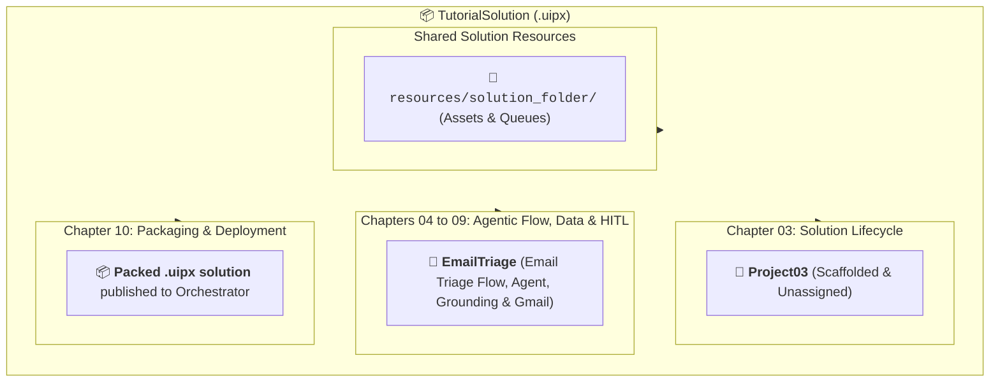
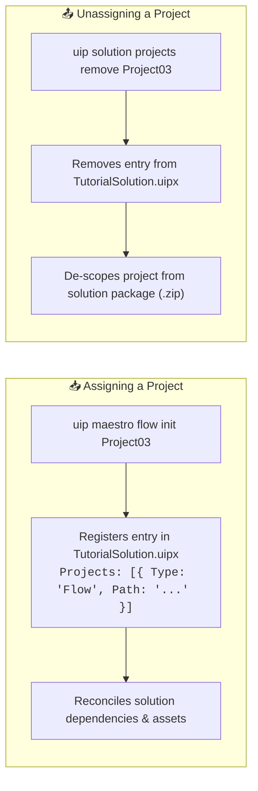

# Chapter 03: UiPath Solutions and Projects (Top-Down)

When building automations with modern coding agents, the architecture is organized top-down: a **Solution** serves as the multi-project enterprise container, while individual **Projects** (such as Maestro Flows, AI Agents, Coded Workflows, and Test Suites) are the modular building blocks inside it.

In this chapter, you will learn how to create your central multi-project solution - **`TutorialSolution`**, explore how projects are **assigned and unassigned** in the solution manifest, and understand project lifecycle management.



> 💡 **Choose Your Starting Point:**
>
> **Mode 1: 🔄 Reset Solution (Clean Slate)**
> 💬 *Prompt your AI Coding Agent:*
> ```text
> Delete the TutorialSolution folder if it already exists so we can start Chapter 03 completely fresh.
> ```
> 💻 *Underlying CLI / Shell Command:*
> ```bash
> rm -rf ./TutorialSolution
> ```
>
> ---
>
> **Mode 2: ⚡ 1-Shot Autonomous Fast-Track**
> 💬 *Paste this master prompt into your coding assistant to execute the entire Chapter 03 in one turn:*
> ```text
> Perform the complete Chapter 03 workflow:
> 1. Create a new solution folder and solution named TutorialSolution.
> 2. Inside TutorialSolution, initialize a starter Maestro flow project named Project03.
> 3. List all registered projects to confirm assignment.
> 4. Unassign and delete Project03 to demonstrate project lifecycle cleanup, including its leftover solution artifacts, then confirm the solution reports no assigned projects and no leftover files named after the project.
> ```
>
> ---
>
> **Mode 3: 📖 Step-by-Step Guided Walkthrough (Recommended for Learning)**
> Proceed through Sections 1 through 7 below, pasting each prompt step-by-step.

---

## 1. Architectural Shift: Legacy Single Projects vs. Modern Solutions

Before diving into commands, understand the architectural transformation in the UiPath platform:

| Dimension | Legacy Single-Project (`project.json`) | Modern Multi-Project Solution (`.uipx`) |
| :--- | :--- | :--- |
| **Root Manifest** | `project.json` in the root folder. | `TutorialSolution.uipx` in root, with individual `project.uiproj` sub-manifests. |
| **Composition** | Monolithic: all workflows share one package. | Modular: holds multiple flows, agents, and test suites side-by-side. |
| **Cloud Provisioning** | Uploads an isolated `.nupkg` process. | Deploys entire systems (processes, assets, queues, buckets) in one package. |
| **Agent Support** | Unstructured text prompts in UI. | Tailored briefing files (`CLAUDE.md`, `AGENTS.md`) scaffolded automatically. |

---

## 2. Creating the Solution and Starter Project

You will create the **`TutorialSolution`** folder and scaffold your first project inside it.

### 💬 Prompt Your AI Coding Agent (Recommended)
Open Claude Code or Google Antigravity in your root directory and paste:

```text
Create a new solution folder and solution named TutorialSolution and initialize a starter Maestro flow project named Project03.
```

### 💻 Underlying CLI Commands (What the Agent Executes)

**🍏 macOS / Linux (Bash / Zsh):**
```bash
# 1. Initialize the parent solution container
uip solution init TutorialSolution

# 2. Enter the solution and scaffold the starter project
cd TutorialSolution
uip maestro flow init Project03
```

**🪟 Windows 11 (PowerShell):**
```powershell
# 1. Initialize the parent solution container
uip solution init TutorialSolution

# 2. Enter the solution and scaffold the starter project
Set-Location .\TutorialSolution
uip maestro flow init Project03
```

---

## 3. Anatomy of the Generated Solution

Inspecting `TutorialSolution/` reveals the standard modern UiPath solution structure:

```text
TutorialSolution/
├── TutorialSolution.uipx        <-- Master Solution Manifest (registers all projects)
├── CLAUDE.md                    <-- Briefing file for Anthropic Claude Code
├── AGENTS.md                    <-- Briefing file for Google Antigravity & AI IDEs
├── resources/                   <-- Declarative cloud resources
│   └── solution_folder/
│       ├── package/
│       │   └── Project03.json   <-- Package artifact for the registered project
│       └── process/
│           └── flow/
│               └── Project03.json   <-- Process artifact, grouped by project type
└── Project03/                   <-- Starter Maestro Flow Project
    ├── project.uiproj           <-- Project-level manifest
    ├── Project03.flow           <-- Declarative JSON flow graph
    └── operate.json             <-- Runtime / entry-point metadata
```

> 💡 **Two things students often ask about:**
> - There is no `definitions.json`. Solution resources live as one file per resource under `resources/solution_folder/`, and registering a single project writes **two** artifacts: `package/<ProjectName>.json` and `process/<type>/<ProjectName>.json`. Delete a project the wrong way and both are left behind (see Section 6).
> - A `userProfile/` directory may appear later. It is created by the CLI on operations such as `uip solution resources refresh`, not by `uip solution init`, so do not expect it in a freshly scaffolded solution.

---

## 4. The Assign and Unassign Concept

A Solution is not merely a folder containing files on disk; it is a **formally registered system**. Every time a project is created, imported, or deleted, it directly impacts the parent solution manifest (`TutorialSolution.uipx`):



### 1. Assigning a Project:
When you run `uip maestro flow init Project03` (or `uip solution projects add Project03`), the CLI **assigns** the project by:
- Adding the project's relative path and unique GUID to the `"Projects"` array in `TutorialSolution.uipx`.
- Triggering the Solution Resource Reconciler to discover and bind required cloud assets.
- Including the project in future solution packaging (`uip solution pack`).

### 2. Unassigning a Project:
When a project is no longer needed, you must **unassign** it from the manifest. 
> ⚠️ **Important:** Simply deleting a folder from your filesystem *without* unassigning it leaves a broken dangling reference in `TutorialSolution.uipx`. Proper unassignment keeps the solution manifest clean and valid.

---

## 5. Inspecting Registered Projects

Verify which projects are currently **assigned** inside `TutorialSolution.uipx`:

### 💬 Prompt Your AI Coding Agent (Recommended)
```text
List all projects currently assigned to TutorialSolution.
```

### 💻 Underlying CLI Command (What the Agent Executes)
```bash
uip solution projects list
```

**Output:**
```json
{
  "Result": "Success",
  "Code": "SolutionProjectsList",
  "Data": [
    {
      "Name": "Project03",
      "Type": "Flow",
      "ProjectRelativePath": "Project03/project.uiproj"
    }
  ]
}
```

---

## 6. Deleting and Unassigning an Unused Project

In real-world development, temporary experiments or scaffolded prototypes become obsolete. As a solution architect, you need to know how to clean up unused projects.

Since `Project03` was only created to learn the solution lifecycle, you will now unassign and remove it so that `TutorialSolution` is clean and ready for Chapter 04.

> ⚠️ **Why not just `uip solution projects remove Project03`?**
> That is the correct command in general, and it is what you will use from Chapter 04 onward. It cannot be used here: `Project03` is the **only** project in the solution, and the CLI deliberately refuses to unregister the last one, replying *"Cannot remove the only project in the solution. Add another project first, or delete the solution folder manually."* So this one time you clean up by hand, which means you also have to clean up what the CLI would normally have removed for you.

### 💬 Prompt Your AI Coding Agent (Recommended)
```text
Unassign and delete Project03 from TutorialSolution, remove its directory from disk, and delete its leftover solution package artifact so the solution is completely clean.
```

### 💻 Underlying Actions (What the Agent Executes)

1. **Delete the project directory and every leftover artifact named after it:**
   ```bash
   # macOS / Linux:
   rm -rf Project03
   find resources/solution_folder -name 'Project03.json' -delete

   # Windows 11 (PowerShell):
   Remove-Item -Recurse -Force .\Project03
   Get-ChildItem -Recurse -Filter Project03.json .\resources\solution_folder | Remove-Item -Force
   ```
   *Registering one project writes two artifacts (`package/` and `process/flow/`). Search by name rather than deleting a single known path, so nothing is missed.*

2. **Unassign the project** by opening `TutorialSolution.uipx` and setting `"Projects": []`.

3. **Verify `TutorialSolution` has no assigned projects** (expect `"Data": []`):
   ```bash
   uip solution projects list
   ```

> 💡 **Why deleting the artifacts matters:** `uip solution projects remove` prunes a project's artifacts automatically. A hand-edit of the manifest does not, so the `Project03.json` files under `resources/solution_folder/` survive, still bound to the `projectKey` of a project that no longer exists. If you later create a project named `Project03` again, it is issued a **new** project key, which no longer matches the leftovers, and the scaffold logs an ERROR-level `Project name already exists` with `"ProjectArtifacts": { "Created": false }`. **Either leftover file is enough to trigger it**, which is why step 1 searches by name. The message is misleading rather than fatal: the project files are still written and the project is still registered. Note that `uip solution resources refresh` does **not** clean these up.

---

## 7. Summary Checklist & Practice

- [x] Initialized the multi-project container: `TutorialSolution`.
- [x] Scaffolded and assigned the starter project: `Project03`.
- [x] Understood the **Assign and Unassign** mechanism in `TutorialSolution.uipx`.
- [x] Inspected assigned projects using `uip solution projects list`.
- [x] Unassigned and deleted `Project03` to prepare a clean container for Chapter 04.

---

## 🔗 Navigation Links
- ⬅️ [Back to Chapter 02: Environment Setup](./02-Setup.md)
- 🏠 [Return to Main README](../README.md)
- ➡️ [Proceed to Chapter 04: Building a Maestro Flow](./04-BuildingFirstFlow.md)
