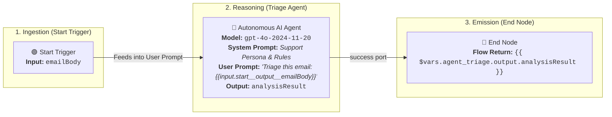
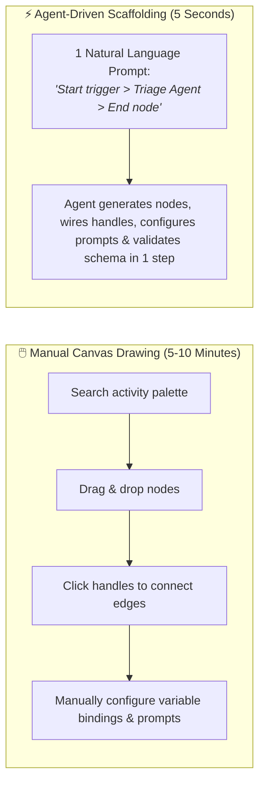
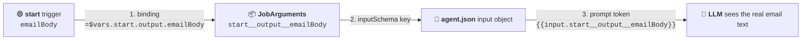
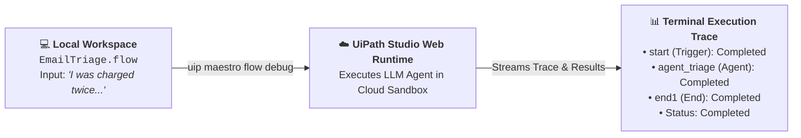

# Chapter 04: Building Your First Maestro Flow

In this chapter, you will build your first end-to-end agentic workflow by adding a new project - **`EmailTriage`** - to your existing **`TutorialSolution`**. 

You will learn why scaffolding flows with an **AI Coding Agent** (Claude Code or Google Antigravity) is dramatically faster than manual visual canvas design, how to discover and assign cloud LLM models, and how to debug and inspect live agent decisions directly from your terminal.



> 💡 **Choose Your Starting Point:**
>
> **Mode 1: 🔄 Reset Solution (Clean Slate)**
> 💬 *Prompt your AI Coding Agent:*
> ```text
> Delete the EmailTriage project folder inside TutorialSolution so we can start Chapter 04 fresh. Keep the solution itself, and do not attempt to unregister the project from the solution manifest.
> ```
> 💻 *Underlying CLI / Shell Command:*
> ```bash
> cd ./TutorialSolution
> rm -rf ./EmailTriage
> ```
>
> 💡 **Why you delete the folder but do not unregister the project:**
> `EmailTriage` is the only project in `TutorialSolution`, and `uip solution projects remove` deliberately refuses to remove the last one (*"Cannot remove the only project in the solution"*). You do not need it: re-running `uip maestro flow init EmailTriage` reuses the existing manifest entry and reports `"SolutionRegistration": { "Status": "AlreadyRegistered" }` together with `"ProjectArtifacts": { "Created": true }`.
>

> ---
>
> **Mode 2: ⚡ 1-Shot Autonomous Fast-Track**
> 💬 *Paste this master prompt into your coding assistant to execute the entire Chapter 04 in one turn:*
> ```text
> Inside TutorialSolution, perform the complete Chapter 04 flow creation:
> 1. Initialize a new Maestro flow project named EmailTriage.
> 2. Build the flow with 3 sequential nodes: Manual Start Trigger -> Autonomous AI Agent -> End Node.
> 3. Configure the Start trigger with flow input argument 'emailBody' (string).
> 4. Configure the Agent with model 'gpt-4o-2024-11-20' to act as a Customer Support Triage AI that analyzes incoming customer emails for category, urgency (1-5), and action items.
> 5. Configure the End node to return the agent's triage analysis as the flow output argument 'triageResult' (string).
> 6. Format the canvas layout and validate the flow with 'uip maestro flow validate'.
> 7. Run a cloud debug test with input emailBody: "Hi, I was charged twice for my subscription this morning ($120 x 2). I need an immediate refund for the duplicate charge or I will cancel my account!".
> 8. Report the actual data from the debug run: confirm the agent really received the email text, produced a non-null triage analysis, and that the flow returned it as triageResult.
> ```
>
> ---
>
> **Mode 3: 📖 Step-by-Step Guided Walkthrough (Recommended for Learning)**
> Proceed through Sections 1 through 10 below, pasting each prompt step-by-step.

---

## 1. Why Scaffold Flows with a Coding Agent Instead of Drawing?

In traditional workflow design, developers open a visual canvas (in UiPath Studio or the VS Code extension) and manually drag nodes from palettes, drag connection handles between ports, configure property forms, and manually create variable bindings.

While visual design is great for inspection, **using a Coding Agent to scaffold the workflow gives you massive advantages**:



### Key Advantages of Agent Scaffolding:
1. **Speed & Zero Friction:** Scaffolding a complete 3-node flow with prompt instructions takes **5 seconds** in text, compared to several minutes of manual point-and-click work.
2. **Automated Schema & Port Wiring:** The agent automatically handles compiler rules (like wiring the agent's `"success"` port and declaring required output variables) with zero syntax errors.
3. **Drafted Business Logic & Prompts:** Describing your intent (*"Classify support emails by department and urgency 1-5"*) causes the agent to author both the System Prompt and User Prompt dynamically.
4. **The Best of Both Worlds:** You let the Coding Agent do the 90% heavy lifting in seconds, and you can still open the visual canvas in Studio or VS Code anytime to inspect, debug, or fine-tune.

---

## 2. What Agent Are We Building?

We are building a **Customer Email Support Triage & Priority Routing Agent**:

- **The Input Data (`start.output.emailBody`):**
  > *"Hi, I was charged twice for my subscription this morning ($120 x 2). I need an immediate refund for the duplicate charge or I will cancel my account!"*
- **What the Agent Evaluates:**
  - **Category / Department:** `Billing & Refunds`
  - **Urgency Score:** `5` (on a scale of 1 to 5)
  - **Escalation Flag:** `true` (due to churn risk)
  - **Action Plan:** Recommend immediate refund and customer follow-up.
- **The Output Delivery:**
  - The structured decision is delivered to the **End node** to be consumed by downstream ticketing systems or Orchestrator.

---

## 3. Adding the `EmailTriage` Project to the Solution

Since you created `TutorialSolution` in Chapter 03, you simply add a new Maestro Flow project to it. Initializing the project automatically **assigns** it into `TutorialSolution.uipx`:

### 💬 Prompt Your AI Coding Agent (Recommended)
```text
Inside TutorialSolution, initialize a new Maestro flow project named EmailTriage.
```

### 💻 Underlying CLI Command (What the Agent Executes)

**🍏 macOS / Linux (Bash / Zsh):**
```bash
cd ./TutorialSolution
uip maestro flow init EmailTriage
```

**🪟 Windows 11 (PowerShell):**
```powershell
Set-Location .\TutorialSolution
uip maestro flow init EmailTriage
```

> **Solution Impact:**  
> Running this command automatically registers and assigns `EmailTriage/project.uiproj` inside `TutorialSolution.uipx`. You can verify this assignment anytime with `uip solution projects list`.

---

## 4. Discovering Available LLM Models

Autonomous AI Agents in UiPath require an explicit LLM model assignment. You can query all available models provisioned on your cloud tenant:

### 💬 Prompt Your AI Coding Agent (Recommended)
```text
List all available LLM models for my UiPath tenant so we can select a model for our Triage AI Agent.
```

### 💻 Underlying CLI Command (What the Agent Executes)
```bash
uip agent model list
```

**Example Available Models on Tenant:**
- **OpenAI:** `gpt-4o-2024-11-20`, `gpt-4o-mini-2024-07-18`, `gpt-4.1-2025-04-14`
- **Google Vertex AI:** `gemini-2.5-flash`, `gemini-2.5-pro`
- **AWS Bedrock:** `anthropic.claude-sonnet-4-5-20250929-v1:0`

> 💡 **Your tenant's list will differ, and it changes over time.** Newer families (for example `gpt-5.x`, `gemini-3.x`, `anthropic.claude-sonnet-5`) appear as they are provisioned. Always run the command rather than copying this list. This tutorial pins `gpt-4o-2024-11-20` so every chapter produces comparable results.

> 💡 **Why Explicit Model Assignment Matters:**  
> If an agent node is created without specifying the `"model"` property in its schema inputs, the visual editor will display a *"Model is required"* warning until a model is selected. Setting `"model": "gpt-4o-2024-11-20"` in the scaffolding prompt ensures the flow is immediately production-ready.

---

## 5. Prompting Your Coding Agent to Build the Triage Flow

Now, prompt your AI coding assistant (Claude Code or Google Antigravity) to construct the complete agentic workflow inside `EmailTriage`:

### 💬 Prompt Your AI Coding Agent (Recommended)

```text
In EmailTriage, create a Maestro flow with 3 nodes: Start trigger -> Autonomous AI Agent -> End node.

Configure the workflow as follows:
1. Set a flow input argument 'emailBody' (string) on the Start trigger.
2. Configure the Agent with model 'gpt-4o-2024-11-20' to act as a Customer Support Triage AI that analyzes incoming customer emails for category, urgency (1-5), and action items.
3. Configure the End node to return the agent's triage analysis as the flow output argument 'triageResult' (string).
4. Wire the flow sequentially and validate it with 'uip maestro flow validate'.
```

> **What the Agent Does Automatically Under the Hood:**
> 1. **Flow Input Argument:** Configures `emailBody` on the Start trigger so it is accepted when the flow runs.
> 2. **Inline Agent Scaffolding:** Runs `uip agent init EmailTriage --inline-in-flow`, which creates a UUID-named agent folder inside the project holding `agent.json` (the agent's canonical model, prompts, and schemas).
> 3. **Input Delivery Wiring:** Connects the trigger data to the agent through the three aligned pieces described in Section 6 below, so the LLM actually receives the email text.
> 4. **Agent Schema:** Sets model `gpt-4o-2024-11-20`, authors the triage System Prompt, and declares the typed output `analysisResult` in the agent's `outputSchema`.
> 5. **Flow Output Argument:** Connects the Agent's `"success"` port to the End node and forwards `{{ $vars.agent_triage.output.analysisResult }}` as the flow output `triageResult`.
> 6. **Validation:** Runs `uip agent refresh`, `uip agent validate`, and `uip maestro flow validate` to ensure 0 compiler errors.

---

## 6. How Flow Data Actually Reaches the Agent

This is the single most important mechanic in the chapter, and the one most likely to fail silently.

An inline Autonomous Agent does **not** read `{{ $vars.start.output.emailBody }}` from its prompt. The Maestro runtime builds the agent's `JobArguments` exclusively from the **flow node's binding list**, then hands them to the agent under a flattened key:

$$\mathbf{\$vars.\text{trigger}.output.\text{var}} \;\longrightarrow\; \mathbf{\text{trigger}\_\_output\_\_\text{var}}$$

So `$vars.start.output.emailBody` becomes the key `start__output__emailBody`, and three pieces must agree on that exact name:

| # | Where | What it does | Value |
| :--- | :--- | :--- | :--- |
| 1 | `EmailTriage.flow` node `inputs.agentInputVariables[]` | **Delivery.** The only thing the runtime turns into `JobArguments`. | `{ "id": "start__output__emailBody", "type": "string", "binding": "=$vars.start.output.emailBody" }` |
| 2 | `agent.json` `inputSchema.properties` | **Contract.** Binds `JobArguments` to the agent's `input` object. | `"start__output__emailBody": { "type": "string" }` |
| 3 | `agent.json` `messages[].content` | **Resolution.** The prompt token the model sees. | `{{input.start__output__emailBody}}` |



> ⚠️ **The Silent Failure Mode:**
> If you write `{{ $vars.start.output.emailBody }}` inside `agent.json`, **both `uip maestro flow validate` and `uip agent validate` still report `"Valid"`, and the debug run still reports `"finalStatus": "Completed"`.** The model simply receives the literal token instead of the email and invents a plausible-looking triage. This is exactly why Section 9 makes you inspect the data payload rather than the status. The `binding` key is also mandatory: an entry written with `value` instead of `binding` is ignored by the converter and yields empty `JobArguments`.

> 💡 **Where the prompts live:** `inputs.systemPrompt` / `inputs.userPrompt` on the flow node are only non-empty placeholders required by the validator. The canonical prompts belong in `agent.json` `messages[]`. After editing `agent.json`, always run `uip agent refresh` so the `contentTokens` mirror is regenerated from your text.

---

## 7. Verifying and Validating the Flow

Once your AI assistant builds or updates the flow, you can verify its layout and schema:

### 💬 Prompt Your AI Coding Agent (Recommended)
```text
Refresh and validate the inline agent, then format the canvas layout of EmailTriage/EmailTriage.flow and run schema validation to ensure there are no compiler errors.
```

### 💻 Underlying CLI Commands (What the Agent Executes)

```bash
# 1. Regenerate the inline agent's derived files (prompt contentTokens, bindings)
uip agent refresh EmailTriage/<agent-project-uuid> --inline-in-flow

# 2. Schema-check the inline agent itself
uip agent validate EmailTriage/<agent-project-uuid> --inline-in-flow

# 3. Auto-format canvas layout and node positions
uip maestro flow format EmailTriage/EmailTriage.flow

# 4. Validate schema & port integrity
uip maestro flow validate EmailTriage/EmailTriage.flow
```
*When successful, the output returns `"Status": "Valid"` with 0 schema errors.*

> 💡 **Tip:** `<agent-project-uuid>` is the UUID-named folder created inside `EmailTriage/` by `uip agent init --inline-in-flow`. It must match the agent node's `inputs.source` value in the `.flow` file.

---

## 8. Visual Canvas Controls in Studio & VS Code

When opening `EmailTriage.flow` in **UiPath Studio** or the **VS Code Flow Designer**, use the bottom-right canvas toolbar for visual layout polish:

| Control | Icon | What it Does |
| :--- | :---: | :--- |
| **Zoom In / Out** | 🔍 `+` / `–` | Zoom into individual prompts or inspect node details. |
| **Fit to Screen** | 🔲 | Re-centers and scales the entire flow graph to fit comfortably in your active viewport. |
| **Tidy Up** | 🧹 *(Broom)* | **Automatic visual reflow.** While the CLI formatter sets the baseline layout, clicking "Tidy Up" in the visual editor dynamically spaces wide cards (like the Autonomous Agent) with zero overlap. |

---

## 9. Testing and Debugging the Flow Live

Now that your flow is synthesized and validated, you can run a live cloud debug session directly from your coding agent or terminal using `uip maestro flow debug`.

This uploads your local flow definition to the **Studio Web execution engine**, executes the autonomous AI agent against the cloud LLM runtime, and streams execution traces back to your terminal.

### 💬 Prompt Your AI Coding Agent (Recommended)
```text
Debug and test the EmailTriage flow in Studio Web using test input emailBody: "Hi, I was charged twice for my subscription this morning ($120 x 2). I need an immediate refund for the duplicate charge or I will cancel my account!"
```

### 💻 Underlying CLI Command (What the Agent Executes)
```bash
uip maestro flow debug EmailTriage \
  --inputs '{"emailBody": "Hi, I was charged twice for my subscription this morning ($120 x 2). I need an immediate refund for the duplicate charge or I will cancel my account!"}'
```



### 📋 Live Execution Report & Node Outputs

When the debug session completes, the CLI returns the execution report. **A green status is not a passing test.** Read the `variables` block, not just `elementExecutions`:

```json
{
  "Result": "Success",
  "Code": "FlowDebug",
  "Data": {
    "jobKey": "5b7e2f90-1c3d-4a86-9e42-d0a6c8b1f753",
    "finalStatus": "Completed",
    "studioWebUrl": "https://cloud.uipath.com/your-org/your-tenant/studio_/designer/...",
    "elementExecutions": [
      { "elementId": "start",        "elementType": "StartEvent",  "status": "Completed" },
      { "elementId": "agent_triage", "elementType": "ServiceTask", "status": "Completed" },
      { "elementId": "end1",         "elementType": "EndEvent",    "status": "Completed" }
    ],
    "variables": {
      "elements": [
        {
          "elementId": "agent_triage",
          "inputs": {
            "JobArguments": {
              "start__output__emailBody": "Hi, I was charged twice for my subscription this morning ($120 x 2). I need an immediate refund for the duplicate charge or I will cancel my account!"
            }
          },
          "outputs": {
            "analysisResult": "Category: Billing & Refunds | Urgency: 5 | Escalation: true | Actions: Verify the duplicate charge in the billing system; Process a refund for the duplicate charge if confirmed; Notify the customer of the refund status and timeline."
          }
        }
      ],
      "globals": {
        "agent_triage.error": null,
        "start.output.emailBody": "Hi, I was charged twice for my subscription this morning ($120 x 2)...",
        "triageResult": "Category: Billing & Refunds | Urgency: 5 | Escalation: true | Actions: Verify the duplicate charge in the billing system; ..."
      }
    }
  }
}
```

### ✅ The Three Checks That Actually Prove the Flow Works

> 📌 **Reading the payload:** `variables.elements` is an **array**, not an object keyed by node id. Find a node by matching its `elementId` field, then read that entry's `inputs` and `outputs`.

| Check | Where to look | What proves success |
| :--- | :--- | :--- |
| **1. The agent received real data** | the `variables.elements` entry whose `elementId` is `agent_triage`, then `.inputs.JobArguments` | `start__output__emailBody` holds the **actual email text**, not a literal `{{...}}` token and not an empty object. |
| **2. The agent produced typed data** | the same entry's `.outputs` | `analysisResult` is non-null and matches the declared `outputSchema`. |
| **3. The flow returned the data** | `variables.globals` | `triageResult` is non-null and carries the forwarded agent result; `agent_triage.error` is `null`. |

> ⚠️ **If `JobArguments` is empty:** your input wiring is broken (see Section 6). The run will still report `"Completed"` and the agent will still write a confident-looking answer, because the LLM hallucinates a triage from an empty email. Never accept `finalStatus` alone as evidence.

---

## 10. Summary Checklist & Practice

- [x] Initialized the `EmailTriage` project inside `TutorialSolution`.
- [x] Discovered available LLM models using `uip agent model list`.
- [x] Prompted the AI coding agent to create the 3-node Customer Email Triage flow with explicit model assignment (`gpt-4o-2024-11-20`).
- [x] Understood the 3-piece input wiring (`agentInputVariables` binding, `inputSchema` key, `{{input.<key>}}` prompt token).
- [x] Refreshed and validated the inline agent, then validated the flow schema using `uip maestro flow validate`.
- [x] Used the visual canvas toolbar (**Fit to Screen** and **Tidy Up**) to organize the workflow layout.
- [x] Tested the AI agent live in cloud debug using `uip maestro flow debug`.
- [x] Verified the actual data payload: `JobArguments`, agent outputs, and `variables.globals`.

---

## 🔗 Navigation Links
- ⬅️ [Back to Chapter 03: Solutions & Projects](./03-SolutionsAndProjects.md)
- 🏠 [Return to Main README](../README.md)
- ➡️ [Proceed to Chapter 05: Variables, Schemas & Complex Data](./05-VariablesAndSchemas.md)
