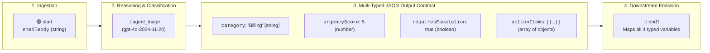
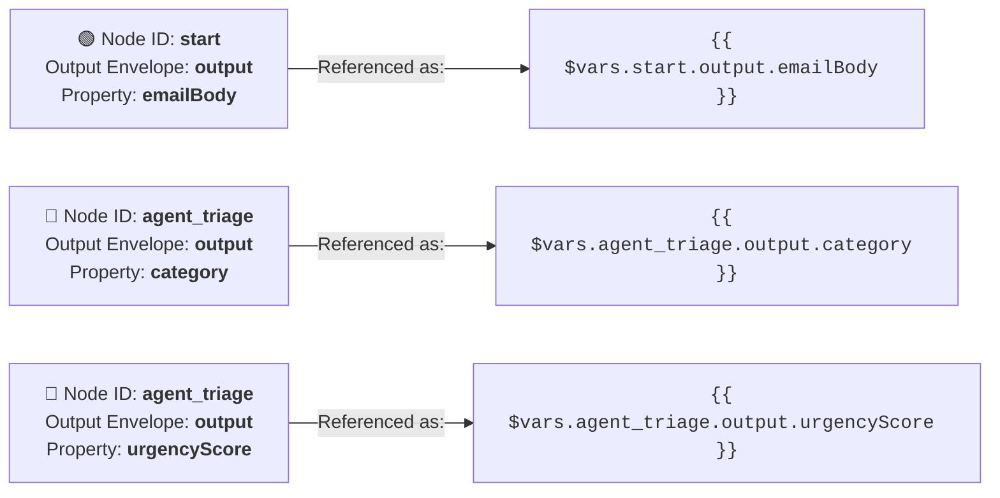
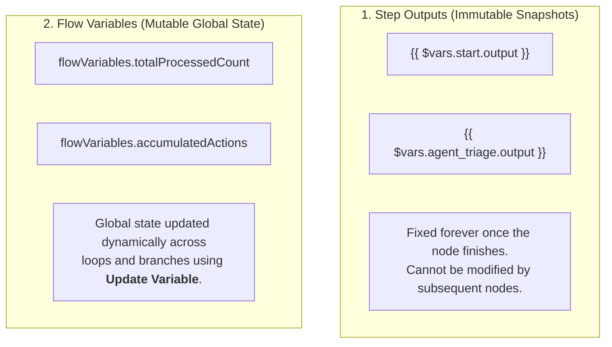

# Chapter 05: Variables, Schemas & Complex Data

In Chapter 04, you scaffolded a baseline flow with a single text output. In real-world enterprise automations, AI Agents must evaluate incoming data and return **strongly-typed, structured variables** (such as status flags, priority scores, and lists of action items) that downstream systems can process deterministically.

In this chapter, you will enhance the **`EmailTriage`** project by mastering **Flow Data Types**, the `{{ $vars.NodeId.OutputEnvelope.Property }}` **Handlebars namespacing formula**, and the distinction between **Step Outputs** and mutable **Flow Variables** (via "Update Variable").



> 💡 **Choose Your Starting Point:**
>
> **Mode 1: 🔄 Reset to the Chapter 04 Checkpoint**
> 💬 *Prompt your AI Coding Agent:*
> ```text
> Reset TutorialSolution to its ch04-done checkpoint: hard-reset the solution's own git repository to that tag and remove untracked files. Then validate EmailTriage and confirm it returns exactly one output argument, triageResult, forwarded from the agent's analysisResult. If the tag does not exist, stop and tell me.
> ```
> 💻 *Underlying CLI / Shell Command:*
> ```bash
> git -C TutorialSolution reset -q --hard ch04-done
> git -C TutorialSolution clean -qfd
> uip maestro flow validate TutorialSolution/EmailTriage/EmailTriage.flow --output json   # exactly one output argument: triageResult
> ```
>
> ---
>
> **Mode 2: ⚡ 1-Shot Autonomous Fast-Track**
> 💬 *Paste this master prompt into your coding assistant to execute the entire Chapter 05 in one turn:*
> ```text
> In TutorialSolution/EmailTriage, upgrade the flow to output multi-typed variables:
> 1. Configure the Triage AI Agent to return four strongly-typed output variables instead of the single analysisResult string. The schema lives in agent.json inside EmailTriage/<agent-id>/: replace its whole outputSchema object (remove analysisResult) with
>    - 'category' (type: string, description: "Classified department category")
>    - 'urgencyScore' (type: number, description: "Urgency score from 1 to 5")
>    - 'requiresEscalation' (type: boolean, description: "True if customer is at churn risk")
>    - 'actionItems' (type: array of objects, description: "List of recommended next steps")
>    Edit the file as a complete JSON document, re-read it and confirm it parses, update the system prompt to ask for exactly these four fields, then run uip agent refresh on the agent folder with --inline-in-flow.
> 2. Forward all four agent outputs (category, urgencyScore, requiresEscalation, actionItems) through the End node as the final flow return arguments.
> 3. Format the canvas layout and validate the flow with 'uip maestro flow validate'.
> 4. Run a cloud debug test with input emailBody: "Hi, I was charged twice for my subscription this morning ($120 x 2). I need an immediate refund for the duplicate charge or I will cancel my account!".
> 5. Report the flow's returned data and confirm the types are real: urgencyScore must come back as a number, requiresEscalation as a boolean, and actionItems as a list of objects. If any of them is null or a quoted string, the output mapping is broken - fix it and re-run.
> 6. Finish with the checkpoint: commit everything in TutorialSolution to its own git repository with the message "Chapter 05 done" and move the tag ch05-done to that commit.
> ```
>
> ---
>
> **Mode 3: 📖 Step-by-Step Guided Walkthrough (Recommended for Learning)**
> Proceed through Sections 1 through 9 below, pasting each prompt step-by-step.

---

## 1. Understanding Flow & Agent Data Types

Both Maestro Flows and AI Agents exchange data using strongly-typed variable schemas:

| Type | Description | Support Triage Example | Usage in Automation |
| :--- | :--- | :--- | :--- |
| **`string`** | Text sequence | `category: "Billing & Refunds"` | Ticket routing, subject lines, messages |
| **`number` / `int`** | Numeric values | `urgencyScore: 5` | SLA prioritization (1-5), order totals |
| **`boolean`** | Logical flag | `requiresEscalation: true` | Conditional branching (`if/else`) |
| **`object`** | Single JSON dictionary | `{"amount": 120, "currency": "USD"}` | Grouped record attributes |
| **`array`** | List of primitive values | `["billing", "refund", "churn_risk"]` | Multi-tagging in CRM |
| **`array of objects`** | List of structured JSON records | `[{"action": "Refund", "priority": "High"}]` | **Multi-step action items & loop processing** |

### 🌟 Why "Array of Objects" is Crucial
In real-world automation, AI decisions often produce multiple action items. An **`array of objects`** allows the agent to output a list of structured records that downstream loop nodes (`core.logic.loop`) can iterate over and execute sequentially.

---

## 2. Prompting Your Agent to Upgrade to Multi-Typed Variables

Now, prompt your AI pair programmer (Claude Code or Google Antigravity) to upgrade `EmailTriage/EmailTriage.flow` so the Autonomous Agent returns multiple strongly-typed variables instead of a single string:

### 💬 Prompt Your AI Coding Agent (Recommended)

```text
Upgrade the Triage AI Agent in EmailTriage so it returns four strongly-typed variables instead of the single analysisResult string:
1. The agent's output schema lives in agent.json inside EmailTriage/<agent-id>/. Replace its whole outputSchema object (remove analysisResult) with these four properties:
   - 'category' (type: string, description: "Classified department category")
   - 'urgencyScore' (type: number, description: "Urgency score from 1 to 5")
   - 'requiresEscalation' (type: boolean, description: "True if customer is at churn risk")
   - 'actionItems' (type: array of objects, description: "List of recommended next steps")
   Edit the file as a complete JSON document, then re-read it and confirm it still parses. Update the system prompt so it asks for exactly these four fields, and run uip agent refresh on the agent folder with --inline-in-flow so the flow node's output variables are regenerated.
2. Forward all four agent outputs (category, urgencyScore, requiresEscalation, actionItems) through the End node as the final flow return arguments.
3. Format the canvas layout and validate the flow with 'uip maestro flow validate'.
```

> 💡 **Prompt Engineering Tip for Students: Why the Verb "Forward" Matters**  
> When instructing an AI coding agent, using the verb **"forward"** (e.g. *"forward agent outputs through the End node"*) explicitly communicates the end-to-end data pipeline:  
> 1. It binds the upstream agent's output variables to the End node's inputs.  
> 2. It sets each End node output `source` so the values reach the flow's callers (`variables.globals`): `{{ $vars.<agentNode>.output.<property> }}` for strings, and `=js:$vars.<agentNode>.output.<property>` for numbers, booleans, and arrays.  
> Without the word "forward", coding agents might only declare the variables on the agent without completing the return wiring at the End node!

> ⚙️ **What the Coding Agent Does Behind the Scenes:**  
> 1. **Typed Agent Schema:** Replaces the agent's `outputSchema` in `agent.json` with the 4 properties (with `actionItems` declared as an `array` of objects), and mirrors them one-per-entry in the flow node's `agentOutputVariables`. The prompt asks for a whole-document edit and a re-read on purpose: an agent that patches the schema line by line can leave the old `analysisResult` entry half-open, and the file then fails to parse at the next validate. That was observed with a smaller model; the re-read catches it before it costs a debug cycle.
> 2. **Declarative Code Edit:** Maps each output on the End node: string fields via Handlebars (`{{ $vars... }}`), numbers, booleans, and arrays via JavaScript expressions (`=js:$vars...`), and declares all 4 as `direction: "out"` in `variables.globals`.
> 3. **Verification Tooling:** Executes `uip agent refresh`, `uip agent validate`, and the `uip` CLI commands below to recalculate canvas layout positions and validate schema correctness.

### 💻 Underlying CLI Commands (What the Agent Executes to Verify)

```bash
# 1. Auto-format canvas coordinates and layout
uip maestro flow format EmailTriage/EmailTriage.flow

# 2. Compile and validate schema & variable bindings
uip maestro flow validate EmailTriage/EmailTriage.flow
```

> ⚠️ **The `=js:` Prefix Is Not Optional (Verified Failure):**
> Typed End node outputs must read `"source": "=js:$vars.agent_triage.output.urgencyScore"`. If the prefix is dropped to a bare `"$vars.agent_triage.output.urgencyScore"`, the flow **still validates as `"Valid"` and still runs to `"Completed"`**, but the serializer rewrites `$vars` to `vars` and the returned data is silently destroyed:
>
> | Output | Declared type | With `=js:` | Without the prefix |
> | :--- | :--- | :--- | :--- |
> | `category` | string | `"Billing & Refunds"` | `"Billing & Refunds"` (strings use Handlebars, unaffected) |
> | `urgencyScore` | number | `5` | `null` |
> | `requiresEscalation` | boolean | `true` | `null` |
> | `actionItems` | array of objects | `[{ "action": "...", "priority": "High" }, ...]` | `"vars.agent_triage.output.actionItems"` (literal string) |
>
> This is the Chapter 04 lesson one layer deeper: a passing `validate` and a green `Completed` prove nothing. Only the data payload does.

---

## 3. Demystifying Flow Variables: The Namespacing Formula

When working with Maestro Flows, you will frequently see Handlebars expressions like `{{ $vars.start.output.emailBody }}` or `{{ $vars.agent_triage.output.category }}`. Here is how data flow works under the hood:

### 3.1 The Namespacing Formula

Variables in Maestro are **namespaced by the specific node** that generated them:

$$\mathbf{\{\{\, \$vars \,.\, \text{NodeId} \,.\, \text{OutputEnvelope} \,.\, \text{Property} \,\}\}}$$



- **`$vars`** = The universal runtime variable scope container in Maestro.
- **`NodeId`** = The unique ID of the node that produced the data (e.g. `start`, `agent_triage`).
- **`OutputEnvelope`** = The output container defined by the node schema (e.g. `output`, `error`).
- **`Property`** = The specific field or key inside the payload (e.g. `category`, `urgencyScore`, `actionItems`).

### 3.2 Naming a Value vs. Binding a Value

The formula above is the **address** of a value: it is how you name a value in prose, in diagrams, and inside string fields. It is not automatically how you **bind** that value into a field. The path stays identical; only the wrapper changes with the target type:

| What you are doing | Form | Example |
| :--- | :--- | :--- |
| Naming the value, or binding it into a **string** field | Handlebars, `{{ ... }}` | `{{ $vars.agent_triage.output.category }}` |
| Binding it into a **number, boolean, object or array** field | `=js:` expression, no braces | `=js:$vars.agent_triage.output.urgencyScore` |

So `{{ $vars.agent_triage.output.urgencyScore }}` in the diagram above is correct as an *address*. Use it as the End node `source` for that number and the value comes back as `null`, which is exactly the failure the warning in Section 2 describes.

---

## 4. Single vs. Multi-Output Nodes

Nodes are not limited to one single return value. Many activities produce **multiple distinct output envelopes**:

| Node Type | Node ID | Available Output Envelopes | Example Syntax |
| :--- | :--- | :--- | :--- |
| **Manual Trigger** | `start` | `output` (Object) | `{{ $vars.start.output.emailBody }}` |
| **HTTP Request** | `fetch_html` | • `statusCode` (Number)<br/>• `responseBody` (String/Object)<br/>• `headers` (Object)<br/>• `error` (Object) | `{{ $vars.fetch_html.statusCode }}`<br/>`{{ $vars.fetch_html.responseBody }}` |
| **Autonomous Agent** | `agent_triage` | • `output` (Object with decisions)<br/>• `error` (Object if LLM fails) | `{{ $vars.agent_triage.output.category }}`<br/>`{{ $vars.agent_triage.error.message }}` |

---

## 5. Step Outputs vs. The "Update Variable" Concept

A common question from automation developers is:  
> *"Why do we have an 'Update Variable' activity? Isn't that just updating a global variable?"*

**Yes, exactly.** In Maestro Flow, there are two distinct categories of data:



### When do you use "Update Variable"?
1. **Counters & Increments in Loops:** When processing a list with `core.logic.loop`, you use **Update Variable** to increment `totalProcessed = totalProcessed + 1`.
2. **Accumulating Records:** Appending items produced by an AI Agent into a shared master list.
3. **Merging Conditional Branches:** If Branch A calculates `discount = 10%` and Branch B calculates `discount = 20%`, both branches use **Update Variable** to write to a single shared `flowVariables.finalDiscount`.

---

## 6. Testing the Multi-Variable Schema in Live Cloud Debug

Now, run a live cloud debug session to observe the LLM populating all four typed variables in real-time:

### 💬 Prompt Your AI Coding Agent (Recommended)
```text
Debug and test the updated multi-variable EmailTriage flow in Studio Web using test input emailBody: "Hi, I was charged twice for my subscription this morning ($120 x 2). I need an immediate refund for the duplicate charge or I will cancel my account!"
```

### 💻 Underlying CLI Command (What the Agent Executes)
```bash
uip maestro flow debug EmailTriage \
  --inputs '{"emailBody": "Hi, I was charged twice for my subscription this morning ($120 x 2). I need an immediate refund for the duplicate charge or I will cancel my account!"}'
```

---

## 7. Inspecting the Live Structured JSON Payload

When the debug session completes, examine the structured JSON payload returned by the cloud LLM engine:

```json
{
  "agent_triage.output": {
    "category": "Billing & Refunds",
    "urgencyScore": 5,
    "requiresEscalation": true,
    "actionItems": [
      {
        "action": "Verify the duplicate charge in the customer's account.",
        "priority": "High"
      },
      {
        "action": "Process a refund for the duplicate charge.",
        "priority": "High"
      },
      {
        "action": "Notify the customer of the refund status and timeline.",
        "priority": "Medium"
      }
    ]
  }
}
```

### 🎯 Key Observations:
- **`category` (`string`):** Correctly classified as `"Billing & Refunds"`.
- **`urgencyScore` (`number`):** Evaluated at `5` due to immediate financial impact.
- **`requiresEscalation` (`boolean`):** Set to `true` due to explicit account cancellation risk.
- **`actionItems` (`array of objects`):** Structured list of distinct operational tasks ready for downstream loops!

### 🔍 Verify the Types, Not Just the Values

The agent node's output is only half the journey. Confirm the same four values also arrive at flow level in `variables.globals`, with the **right JSON types**:

| Global | Expected type | Red flag |
| :--- | :--- | :--- |
| `category` | string | empty string |
| `urgencyScore` | number (`5`, not `"5"`) | `null`, or a quoted string |
| `requiresEscalation` | boolean (`true`, not `"true"`) | `null`, or a quoted string |
| `actionItems` | array of objects | `null`, or a literal `"vars...."` string |

A `null` or a quoted `"vars...."` string in any row means the End node mapping lost its `=js:` prefix.

---

## 8. 📌 Checkpoint: Chapter 05 Done

The flow returns four typed outputs, and the debug payload showed a real number, a real boolean and a real array. Record it in the solution's own repository (set up at the end of Chapter 03), so that any later reset can bring the files back to exactly this point. This is the state **Part 2** starts from.

### 💬 Prompt Your AI Coding Agent (Recommended)
```text
Commit everything in TutorialSolution to its own git repository with the message "Chapter 05 done" and move the tag ch05-done to that commit.
```

### 💻 Underlying CLI Commands (What the Agent Executes)
```bash
git -C TutorialSolution add -A
git -C TutorialSolution commit -qm "Chapter 05 done"
git -C TutorialSolution tag -f ch05-done
```

---

## 9. Summary Checklist & Practice

- [x] Mastered the 6 core Flow & Agent Data Types (`string`, `number`, `boolean`, `object`, `array`, `array of objects`).
- [x] Upgraded the Triage AI Agent to output multiple strongly-typed schema properties.
- [x] Mastered the **`{{ $vars.NodeId.OutputEnvelope.Property }}`** Handlebars namespacing syntax for strings, and the **`=js:$vars...`** expression form for numbers, booleans, and arrays.
- [x] Understood the difference between immutable **Step Outputs** and mutable **Flow Variables** (via "Update Variable").
- [x] Executed a live cloud debug run and verified structured JSON extraction, checking the **runtime types** in `variables.globals`, not just a `Completed` status.

---

## 🔗 Navigation Links
- ⬅️ [Back to Chapter 04: Building Your First Maestro Flow](./04-BuildingFirstFlow.md)
- 🏠 [Return to Main README](../README.md)
- ➡️ [Proceed to Chapter 06: Storage Buckets & Context Grounding Indexes](./06-StorageBucketAndIndex.md)
