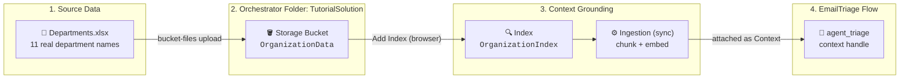
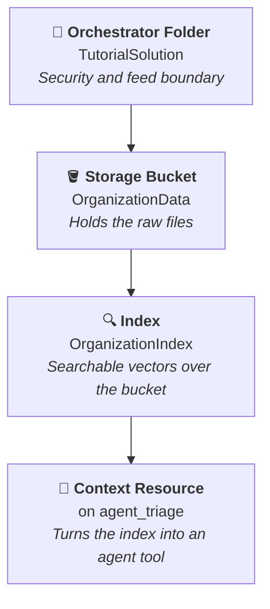
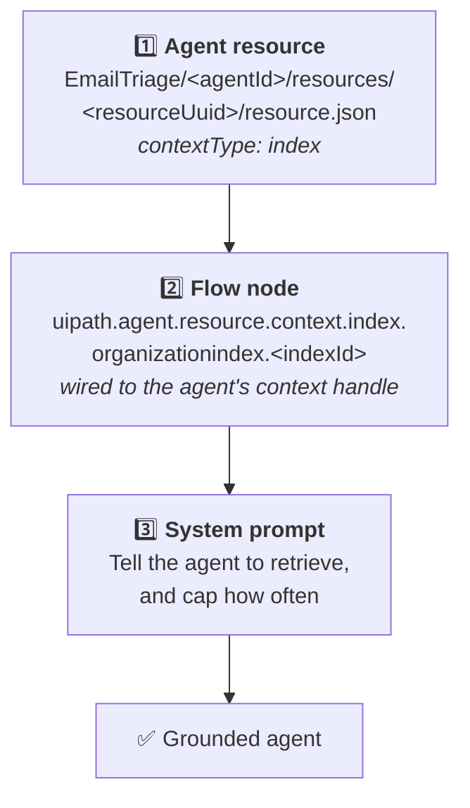

# Chapter 06: Storage Buckets & Context Grounding Indexes

In Chapter 05, your Triage AI Agent learned to return strongly-typed variables. But look closely at what it classifies into: five department names (`Billing & Refunds`, `Technical Support`, `Account & Access`, `Sales`, `General Inquiry`) that **you invented and hard-coded into the system prompt**. No real company routes tickets that way. Real organizations have their own department taxonomy, it lives in a spreadsheet somebody in Operations maintains, and it changes every quarter.

Hard-coding that list into a prompt means every reorganization becomes a code change. In this chapter you will fix that with **Context Grounding**: you will publish the organization's real department list to an Orchestrator **Storage Bucket**, build a searchable **Index** on top of it, and attach that index to the agent as a **Context resource**. From then on the agent retrieves the live department list at runtime instead of reciting a list you froze into its prompt.



> 💡 **Choose Your Starting Point:**
>
> **Mode 1: 🔄 Reset the Orchestrator Artifacts (Clean Baseline)**
>
> This chapter's reset is different from every previous chapter: it tears down **cloud artifacts**, not local files. Your `EmailTriage` flow is the Chapter 05 end state and must survive untouched. What gets removed is the index, the bucket and the folder, in that order, because each one is nested inside the next.
>
> 💬 *Prompt your AI Coding Agent:*
> ```text
> Prepare a clean baseline for Chapter 06 without touching my flow.
>
> First confirm the Chapter 05 flow is intact: TutorialSolution/EmailTriage must still validate and its Triage AI Agent must still return the four typed outputs category, urgencyScore, requiresEscalation and actionItems, forwarded by the End node. Do not edit, reformat or rebuild the flow.
>
> Then tear down any Orchestrator artifacts left over from an earlier run of this chapter, innermost first. I will delete the OrganizationIndex context grounding index myself in the browser; confirm from the flow registry that it is gone. Then delete the OrganizationData storage bucket including its files, and the TutorialSolution Orchestrator folder. Skip anything that does not exist rather than failing. Finish by showing me that none of the three remain.
> ```
> 💻 *Underlying CLI / Shell Commands:*
> ```bash
> # 1. The Chapter 05 flow must still compile - this is a read-only check
> uip maestro flow validate TutorialSolution/EmailTriage/EmailTriage.flow
>
> # 2. See what is currently provisioned before removing anything
> uip or folders list --limit 200 --output table
> uip or buckets list --folder-path "TutorialSolution" --output table
> uip maestro flow registry pull --force && uip maestro flow registry search "OrganizationIndex" --output json
>
> # 3. Innermost first: the index. Indexes have no CLI in the core tools, so this
> #    step is done in the browser: Orchestrator > TutorialSolution folder > Indexes >
> #    context menu of OrganizationIndex > Delete. Then confirm it is gone:
> uip maestro flow registry pull --force && uip maestro flow registry search "OrganizationIndex" --output json   # expect "Data": []
>
> # 4. Then the bucket - --force is required because it still holds Departments.xlsx
> BUCKET_KEY=$(uip or buckets list --folder-path "TutorialSolution" --limit 200 \
>   --output plain --output-filter "[?Name=='OrganizationData'].Key | [0]")
> uip or buckets delete "$BUCKET_KEY" --folder-path "TutorialSolution" --force
>
> # 5. Finally the folder - it only deletes once it is empty
> uip or folders delete "TutorialSolution" --yes
> ```
>
> *The deletion order is not a style choice. `folders delete` refuses to remove a folder that still contains entities, and `buckets delete` refuses to remove a bucket that still holds files unless you pass `--force`. Deleting outside-in fails at the first step. Once the folder is gone, `uip or buckets list --folder-path "TutorialSolution"` answers with an error rather than an empty list: that is the expected final state.*
>
> > 💡 **Tip:** The Orchestrator folder named `TutorialSolution` and the on-disk solution directory named `TutorialSolution/` are two unrelated things that happen to share a name. Deleting the cloud folder does not touch your local project, and this reset never runs a single command against the flow.
>
>
> ---
>
> **Mode 2: ⚡ 1-Shot Autonomous Fast-Track**
> 💬 *Paste this master prompt into your coding assistant to execute the entire Chapter 06 in one turn:*
> ```text
> Ground the EmailTriage agent in our real organization data:
> 1. In Orchestrator, create a root folder named TutorialSolution that owns its own package feed.
> 2. Inside that folder, create a storage bucket named OrganizationData.
> 3. Upload Data/Departments.xlsx from the tutorial repository into that bucket.
> 4. Stop and tell me to create the index in the browser: in Orchestrator, in the TutorialSolution folder, an index named OrganizationIndex backed by the OrganizationData bucket, then Sync it and wait for the ingestion status to show success. Continue only when I confirm.
> 5. Prove the index is visible to flows: pull the flow node registry and search it for OrganizationIndex, and show me the node type it returns, which carries the index id.
> 6. Attach OrganizationIndex to the Triage AI Agent in EmailTriage as a semantic context resource, and wire it to the agent node's context handle in the flow.
> 7. Rewrite the agent's system prompt so it classifies emails into the departments it retrieves from the index instead of the five hard-coded categories. Cap the number of retrieval calls at 2 and tell it to decide with the evidence it has after that.
> 8. Run a cloud debug of the flow with a billing dispute email, and report the actual returned category, urgencyScore, requiresEscalation and actionItems values from the payload.
> ```
>
> ---
>
> **Mode 3: 📖 Step-by-Step Guided Walkthrough (Recommended for Learning)**
> Proceed through Sections 1 through 10 below, pasting each prompt step-by-step.

---

## 1. Why Ground an Agent At All

An LLM only knows two things: what it learned in training, and what you put in the prompt. Your company's department list is in neither. You have three ways to get it in front of the agent:

| Approach | How it works | Breaks when... |
| :--- | :--- | :--- |
| **Hard-code it in the prompt** | Paste the department names into the system prompt | The org restructures. Every change is an edit, a redeploy and a re-test. |
| **Pass it as a flow input** | Read the spreadsheet upstream, feed it into the agent as a variable | The list grows. 10 departments fit in a prompt, 800 product SKUs do not. |
| **Context Grounding (this chapter)** | Index the source document once, let the agent **retrieve** the relevant slice per request | Nothing here breaks on a reorganization: update the file in the bucket, re-sync, done. |

Context Grounding is UiPath's managed **RAG** (Retrieval-Augmented Generation) service. It chunks your documents, embeds them into a vector index, and gives the agent a semantic search tool over that index. The agent asks a question in natural language and gets back the passages that actually answer it.

### The Four Objects You Are About to Create



Each one lives inside the previous one. The folder is the permission boundary: whoever can read the folder can read the bucket and query the index, which is exactly why we give this tutorial its own folder rather than dumping everything into `Shared`.

---

## 2. What the CLI Can and Cannot Do With Indexes

The `uip` CLI ships as a small core plus installable tools. Folders and buckets live in the `or` (Orchestrator) tool you already have. Context grounding **indexes do not**: the core CLI has no command to create, sync or delete one. UiPath publishes a separate `@uipath/context-grounding-tool`, but it is a wrapper over the UiPath Python SDK and needs a Python runtime with the `uipath` package installed. Installing a second language runtime for one chapter is not worth it, so this tutorial creates the index **in the browser** and does everything around it from the CLI:

| Step | Where | Why |
| :--- | :--- | :--- |
| Folder, bucket, file upload | CLI (`uip or`) | Orchestrator commands, no extra runtime |
| Create the index, sync it, watch ingestion | **Browser** (Orchestrator, Indexes page) | No index commands in the core CLI |
| Prove flows can see the index | CLI (`uip maestro flow registry`) | The flow registry lists every index in the tenant, with its id |
| Attach the index to the agent, debug | CLI | Flow and agent files are CLI territory |

> 💡 **If you already have Python.** `uip tools install "@uipath/context-grounding-tool"`, then `python3 -m pip install uipath` (or `uv tool install uipath`) and `uip context-grounding setup` give you `uip context-grounding create / ingest / retrieve / search / delete`, and every browser step below has a one-command equivalent. It is a fine route for your own machine. It is not the route this tutorial asks a room full of students to take.

---

## 3. Creating the Orchestrator Folder with Its Own Package Feed

A folder is where Orchestrator scopes everything: processes, jobs, assets, queues, buckets and indexes. It also decides **which package feed** the folder publishes to.

| `--feed-type` | Meaning | Use when |
| :--- | :--- | :--- |
| `Processes` (default) | The folder shares the single tenant-wide processes feed | Small tenants where everyone deploys to one place |
| `FolderHierarchy` | The folder gets **its own feed**, inherited by its sub-folders | You want this project's packages isolated from everyone else's |
| `Libraries` | The folder is backed by the tenant libraries feed | Reusable activity libraries, not processes |

We want isolation, so `TutorialSolution` gets `FolderHierarchy`. Omitting `--parent` is what makes it a **root** folder rather than a sub-folder.

### 💬 Prompt Your AI Coding Agent (Recommended)

```text
In Orchestrator, create a root folder named TutorialSolution that owns its own package feed instead of sharing the tenant feed. Then show me the folder's key and confirm its feed type.
```

### 💻 Underlying CLI Commands (What the Agent Executes)

```bash
# 1. Create the root folder with its own folder-scoped package feed
uip or folders create "TutorialSolution" \
  --feed-type FolderHierarchy \
  --description "Coding Agents tutorial - flows, buckets and indexes"

# 2. Confirm it landed at the root and owns its feed
uip or folders get "TutorialSolution" --output json
```

Expected in the `folders get` payload:

```json
{
  "Name": "TutorialSolution",
  "Path": "TutorialSolution",
  "ParentID": "Root",
  "FolderType": "Standard",
  "FeedType": "FolderHierarchy"
}
```

`"ParentID": "Root"` proves it is a root folder. `"FeedType": "FolderHierarchy"` proves it owns its own feed. If you see `"FeedType": "Processes"` you created it with the default and it is sharing the tenant feed.

> ⚠️ **Folder name collisions:** every command in the rest of this chapter targets the folder by the literal path `"TutorialSolution"`. If a folder with that name already exists at the root, `folders create` fails rather than silently reusing it. Run `uip or folders list --limit 200 --output table` first to see what is already there.

---

## 4. Creating the OrganizationData Storage Bucket

A storage bucket is Orchestrator's file store. Buckets are **folder-scoped**, so every bucket command needs `--folder-path` (or `--folder-key`).

### 💬 Prompt Your AI Coding Agent (Recommended)

```text
Inside the TutorialSolution Orchestrator folder, create a storage bucket called OrganizationData for our organizational reference data, and tell me its key.
```

### 💻 Underlying CLI Commands (What the Agent Executes)

```bash
# 1. Create the bucket inside the folder
uip or buckets create "OrganizationData" \
  --folder-path "TutorialSolution" \
  --description "Organizational reference data for agent grounding"

# 2. Read back its key - you need it for the upload in Section 5
uip or buckets list --folder-path "TutorialSolution" --output table
```

The `buckets list` table gives you the `Key` column, a GUID like `6e3b8d15-2a74-4c69-b1e0-9f5c2d8a7b31`. Buckets are addressed by key, never by name, in the file commands.

> ⚠️ **`--output-filter` always needs an explicit `--limit`.** List commands default to `--limit 50`, so the CLI refuses to apply a filter that would silently see only the first page:
> ```text
> --output-filter requires an explicit --limit: this command defaults to --limit 50,
> so the filter would silently apply to only the first 50 records.
> ```
> This bites hardest in shell substitution, where the error lands in a variable and the *next* command fails with a confusing message about an invalid GUID. Pair `--output-filter` with `--limit`, and add `--output plain` when you want the bare value rather than a JSON envelope.

> 💡 **Tip:** Omitting `--storage-provider` gives you the Orchestrator built-in store, which is what you want here. The provider flags (`Azure`, `Amazon`, `S3Compatible`, ...) exist for pointing a bucket at storage your company already owns, and they additionally require a credential store.

---

## 5. Uploading Departments.xlsx to the Bucket

`Departments.xlsx` sits in the **`Data/` folder of the tutorial repository** (next to `README.md`), not inside `TutorialSolution/`. It is the subscription software company's real support routing table: eleven departments, each with a short description of what it handles.

| Department Name | Handles | Human Review |
| :--- | :--- | :--- |
| Billing Operations | Subscription charges, invoices, payment methods, plan renewals and billing cycle questions. | Not required |
| Billing Disputes | Duplicate charges, incorrect or unexpected charges, refund requests and card chargebacks. | Not required |
| Accounts Receivable | Overdue invoices, collections, purchase orders and negotiated payment terms. | Not required |
| Promotions & Discounts | Promo and coupon codes, codes forgotten at checkout, retroactive discounts and loyalty credits. | Not required |
| Technical Support | Product bugs, error messages, crashes, failed exports and performance complaints. | Not required |
| IT Service Desk | Service outages, SSO and SAML authentication failures, API and integration downtime. | Not required |
| Account & Access Management | Password resets, user provisioning and deactivation, role permissions and seat count changes. | Not required |
| Sales | New licenses, tier upgrades, pricing quotes, product demos and contract renewals. | Not required |
| Customer Success | Onboarding, training, adoption reviews and retention outreach for accounts at risk of churn. | Not required |
| Legal & Compliance | Legal threats and lawsuits, solicitor or attorney letters, regulatory and data protection complaints, GDPR erasure demands, subpoenas and contract disputes. | Required |
| Trust & Safety | Phishing attempts, spam, suspicious links, impersonation and fraud reports, plus harassment, abuse or threats directed at staff. | Required |

> 💡 **The third column is not used in this chapter.** `Human Review` is what Chapter 07 reads to decide whether a case must reach a person before any reply goes out. It rides along in the index from now on, which is the point: the same file feeds two chapters, and the second one costs no code change.

### 🎯 Read That Table Against Chapter 05

These eleven departments are the real-world expansion of the five categories your agent currently invents:

| Hard-coded category (Chapter 05) | Real departments it was hiding |
| :--- | :--- |
| `Billing & Refunds` | Billing Operations, **Billing Disputes**, Accounts Receivable, Promotions & Discounts |
| `Technical Support` | Technical Support, IT Service Desk |
| `Account & Access` | Account & Access Management |
| `Sales` | Sales, Customer Success |
| `General Inquiry` | Legal & Compliance, Trust & Safety |

Four separate teams collapse into the single string `Billing & Refunds` today. Worse, a phishing report and a solicitor's letter both land in `General Inquiry`, alongside every other email the five categories could not describe. That lost routing precision is exactly what you are about to win back.

> 💡 **Why the second column matters:** semantic retrieval matches on meaning, not on department names. A customer never writes "this is for Billing Disputes"; they write "I was charged twice". The `Handles` column is what lets the index connect the two. A bare list of names would still index, but it would retrieve far worse.

### 💬 Prompt Your AI Coding Agent (Recommended)

```text
Upload Data/Departments.xlsx from the tutorial repository into the OrganizationData bucket in the TutorialSolution folder, then list the bucket contents to confirm the file arrived with the right size and content type.
```

### 💻 Underlying CLI Commands (What the Agent Executes)

```bash
# Run these from the tutorial repository root, not from inside TutorialSolution/

# 1. Resolve the bucket key into a shell variable
BUCKET_KEY=$(uip or buckets list --folder-path "TutorialSolution" --limit 200 \
  --output plain --output-filter "[?Name=='OrganizationData'].Key | [0]")

# 2. Upload the spreadsheet to the root of the bucket
uip or bucket-files upload "$BUCKET_KEY" "Departments.xlsx" \
  --folder-path "TutorialSolution" \
  --file ./Data/Departments.xlsx

# 3. Verify the file is really there
uip or bucket-files list "$BUCKET_KEY" --folder-path "TutorialSolution" --output table
```

A correct `bucket-files list` looks like this:

```text
FullPath          | ContentType              | Size | LastModified
------------------|--------------------------|------|-------------------------
/Departments.xlsx | application/octet-stream | 5649 | 2026-08-31T19:17:20.000Z
```

> 💡 **`application/octet-stream` is not a problem here.** `--content-type` is documented as auto-detected, and for `.xlsx` the detection lands on the generic `application/octet-stream` rather than the spreadsheet MIME type. It looks wrong and it is not: the LLMV4 extractor sniffs the file itself and ignores the stored content type. Uploading the same file with `--content-type "application/vnd.openxmlformats-officedocument.spreadsheetml.sheet"` produces a retrieval score identical to fifteen decimal places. Set the flag if you want the Orchestrator UI to show a friendly type; skip it if you do not.

> ⚠️ **Two arguments that look alike:** `bucket-files upload` takes the **destination path inside the bucket** as its positional argument and the **local source file** as `--file`. Swapping them uploads nothing useful. The destination path is also how you build folder structure inside a bucket: pass `"reference/Departments.xlsx"` and the bucket grows a `reference/` directory.

---

## 6. Creating the OrganizationIndex in the Browser

The index is where the file becomes searchable. It reads from the bucket, chunks each document, and stores embeddings so an agent can query it semantically. This is the one step of the chapter done in the browser.

### 🖱️ Do This in Orchestrator

1. Open **Orchestrator** in your browser and switch to the **TutorialSolution** folder you created in Section 3.
2. Open the **Indexes** page and select **Add Index**.
3. Under **General Details**, set **Index name** to `OrganizationIndex` and **Description** to `Organizational department taxonomy`. Index names are unique per tenant and cannot contain `(`, `)` or `-`.
4. Under **Data Settings**, choose **Storage Bucket** as the data source, pick the **TutorialSolution** folder and the **OrganizationData** bucket, and leave the file type on **All**.
5. Under **Additional settings**, keep the **Basic** ingestion pattern: the spreadsheet is text, not images.
6. Save. The index appears in the list with no ingestion yet.

> 💡 **Creating an index does not index anything.** The vectors do not exist until the first sync. This is the single most common surprise in this chapter, and it is why Section 7 exists.

> 💡 **Only bucket-backed indexes can be wired into a solution automatically.** Google Drive, OneDrive, Dropbox and Confluence sources have to be hand-authored later. Choosing **Storage Bucket** here is what lets `uip solution resources refresh` in Section 9 do its work.

---

## 7. Syncing the Index and Waiting for It

Ingestion is the step that actually reads the bucket, extracts text, chunks it and embeds it. It is asynchronous, and it has to be repeated every time the source file changes: uploading a new `Departments.xlsx` does **not** update the index by itself.

### 🖱️ Do This in Orchestrator

1. On the **Indexes** page, open the context menu of **OrganizationIndex** and select **Sync**.
2. Watch the index's ingestion status. It goes from queued, through in progress, to a successful state; for one small spreadsheet that is well under a minute. Refresh the page if it does not move.
3. If it reports a failure, open the index to read the reason before doing anything else. A failed ingestion is almost always a file the extractor could not read.

A successful status means ingestion did not crash. It does not yet prove the index returns anything useful. That proof comes in Section 10, when the agent's debug run returns a department name that exists only in the spreadsheet.

---

## 8. Proving the Index Is Visible to Flows

Before attaching anything, confirm from the CLI that the index exists and learn its id. Maestro flows see every context grounding index in the tenant as a node type in the flow registry, and the node type name carries the index id.

### 💬 Prompt Your AI Coding Agent (Recommended)

```text
Pull the Maestro flow node registry and search it for OrganizationIndex. Show me the node type it returns and extract the index id from it.
```

### 💻 Underlying CLI Commands (What the Agent Executes)

```bash
# Pull first: search reads a local cache that expires after 30 minutes
uip maestro flow registry pull --force
uip maestro flow registry search "OrganizationIndex" --output json \
  --output-filter "[*].{NodeType:NodeType,DisplayName:DisplayName,Avail:AvailableOnTenant}"
```

```json
{
  "NodeType": "uipath.agent.resource.context.index.organizationindex.d4c1a7f2-63e8-4b90-a2c5-1e8f7b4d9c03",
  "DisplayName": "OrganizationIndex",
  "Avail": true
}
```

The node type is built from the lowercased index name and the index GUID. Save the GUID: it is the `<indexId>` in Section 9. An empty result right after creating the index means the registry cache is stale: pull again.

---

## 9. Attaching the Index as Context to the Agent

The index exists and answers questions. Now it has to reach the agent. For an **inline agent embedded in a Maestro flow**, that takes three coordinated pieces, and skipping any one of them leaves you with an agent that validates cleanly and retrieves nothing:



1. **The agent resource** declares the context in the agent's own definition.
2. **The flow node** is what makes it real at runtime. An inline agent's `resource.json` is never reached on its own; the flow graph is the source of truth, so the index must appear as a node connected to the `agent_triage` node's **`context` handle** (the port on the bottom of the agent card).
3. **The system prompt** has to actually tell the model to use it. A wired-up index that the prompt never mentions is dead weight.

> ⚠️ **The resource folder is named by a UUID, not by the resource name.** For an **inline** agent, the path is `<FlowProject>/<agentId>/resources/<resourceUuid>/resource.json`, and that fresh UUID has to appear in three places at once: the directory name, the `id` field inside `resource.json`, and the flow node's `inputs.source`. Human-readable folder names such as `resources/OrganizationContext/` are the *standalone* agent convention and are silently ignored here.

### 💬 Prompt Your AI Coding Agent (Recommended)

```text
Attach the OrganizationIndex from the TutorialSolution folder to the Triage AI Agent in TutorialSolution/EmailTriage as a semantic context resource named OrganizationContext, with a dynamic query, a result count of 3 and no threshold. Wire it into the flow as a context node connected to the agent node's context handle.

Then rewrite the agent's system prompt so that instead of classifying into the five hard-coded categories, it looks up the real department list in OrganizationContext and returns one of the retrieved department names as 'category'. Call the context at most 2 times per email, and after the last call decide with the evidence already retrieved. If the retrieved list does not cover the email's topic, fall back to the closest match and still return all four output fields.

Finally, refresh and validate the inline agent and the flow, and refresh the solution resources.
```

### 💻 Underlying CLI Commands (What the Agent Executes)

```bash
cd ./TutorialSolution

# 1. Confirm the context node exists in the tenant registry
#    (pull first - search reads a local cache that expires after 30 minutes)
uip maestro flow registry pull --force
uip maestro flow registry search "OrganizationIndex" --output json

# 2. Add the context node. --source is the resource UUID you generated for
#    resources/<resourceUuid>/resource.json - NOT the index GUID.
uip maestro flow node add EmailTriage/EmailTriage.flow \
  "uipath.agent.resource.context.index.organizationindex.<indexId>" \
  --source "<resourceUuid>" --output json

# 3. Hand-author the edge in EmailTriage.flow: agent_triage port "context"
#    to the new node's port "input". node add does not create edges.

# 4. Format and validate the flow graph with the new context node
uip maestro flow format EmailTriage/EmailTriage.flow
uip maestro flow validate EmailTriage/EmailTriage.flow

# 5. Regenerate the inline agent's derived files, then validate.
#    Run this AFTER the flow edits so the index binding lands in bindings_v2.json.
uip agent refresh EmailTriage/<agentId> --inline-in-flow \
  --bindings-target EmailTriage/bindings_v2.json --output json
uip agent validate EmailTriage/<agentId> --inline-in-flow --output json

# 6. Register the index and its backing bucket as solution resources
uip solution resources refresh --output json
```

The registry search in step 1 is the same one as in Section 8 and returns the exact node type, built from the lowercased index name and the index GUID:

```json
{
  "NodeType": "uipath.agent.resource.context.index.organizationindex.d4c1a7f2-63e8-4b90-a2c5-1e8f7b4d9c03",
  "DisplayName": "OrganizationIndex"
}
```

If the search comes back empty, the registry cache is stale: `uip maestro flow registry pull --force` first, then search again.

> 💡 **Let `node add` write the node; do not hand-author it.** Every `.flow` file caches the full manifest of each node type it uses in a `definitions[]` array, and for a context index that manifest is nearly 400 lines. Hand-write the node instance without it and validation rejects the flow:
> ```text
> [nodes[organizationindex1].type] Node type "uipath.agent.resource.context.index.
> organizationindex.<indexId>:1.0.0" has no matching definition.
> ```
> `uip maestro flow node add` solves both halves at once. It reports `"DefinitionAdded": true` and it resolves every input from the registry for you, so the node lands fully configured:
> ```json
> "inputs": {
>   "indexId": "<indexId>", "indexName": "OrganizationIndex",
>   "folderKey": "<folderKey>", "folderPath": "TutorialSolution",
>   "retrievalMode": "semantic", "threshold": 0, "resultCount": 3,
>   "fileExtension": "All", "source": "<resourceUuid>"
> }
> ```
> Two consequences worth knowing: the CLI names the node itself from the index name (you get `organizationindex1`, not a name you chose), and it does **not** create the edge. Wiring `agent_triage`'s `context` port to the node's `input` port stays a manual `.flow` edit:
> ```json
> {
>   "id": "edge_agent_triage_context_organizationindex1_input",
>   "sourceNodeId": "agent_triage",
>   "sourcePort": "context",
>   "targetNodeId": "organizationindex1",
>   "targetPort": "input"
> }
> ```

> ⚠️ **Order matters: flow edits first, `agent refresh` second.** The refresh reads the flow graph to decide which bindings to emit, so running it before the node and edge exist produces an empty `bindings_v2.json`, and `uip solution resources refresh` then finds nothing to register. A correct run reports `"Resources": 1` and writes an `index` binding:
> ```json
> { "resource": "index", "key": "OrganizationIndex",
>   "value": { "name": { "defaultValue": "OrganizationIndex" },
>              "folderPath": { "defaultValue": "TutorialSolution" } } }
> ```

> ⚙️ **What `uip solution resources refresh` Does Behind the Scenes:**
> 1. Looks the index up in Context Grounding by name and folder path, and reads its data source.
> 2. Confirms the data source is a `StorageBucket` (this is why Section 6 asked you to check that field).
> 3. Finds the backing bucket in Orchestrator and writes `resources/solution_folder/bucket/orchestratorBucket/OrganizationData.json`.
> 4. Writes `resources/solution_folder/index/OrganizationIndex.json` declaring the bucket as a dependency.
> 5. Appends two `debug_overwrites.json` entries (`Reference` type, both pointing at folder `TutorialSolution`) so cloud debug runs bind to the right folder.
>
> Every failure in this chain is a **warning, not an error**: the command completes successfully with an empty resource set. Always read the `Warnings` array in the output rather than trusting the exit code. A correct run reports `"Imported": 1` with `"Warnings": []`.

> ⚠️ **Cap the retrieval calls or the agent will loop itself to death.** Telling a model to "ground your answer in the retrieved guidance" with no call limit makes it re-query the index with slightly different phrasings until the runtime kills it: `AGENT_RUNTIME.TERMINATION_MAX_ITERATIONS`, which surfaces in a flow as a failed node with incident `170002`. Raising `maxIterations` only moves the failure from 5 iterations to 25. The fix belongs in the prompt: state a hard cap ("call OrganizationContext at most 2 times"), state what to do afterwards ("decide with the evidence you already have"), and state a fallback for uncovered topics.

---

## 10. Testing the Grounded Flow

Run the flow and check whether grounding actually changed the answer. Use a billing dispute, because that is exactly where the eleven real departments disagree with the five hard-coded ones.

### 💬 Prompt Your AI Coding Agent (Recommended)

```text
Debug and test the grounded EmailTriage flow in Studio Web using test input emailBody: "Hi, I was charged twice for my subscription this morning ($120 x 2). I need an immediate refund for the duplicate charge or I will cancel my account!"

Then report three things from the run payload: what the agent node actually received as input, what it produced as output, and what the flow returned at root level. I want the real values, not a status.
```

### 💻 Underlying CLI Command (What the Agent Executes)

```bash
cd ./TutorialSolution
uip maestro flow debug EmailTriage \
  --inputs '{"emailBody": "Hi, I was charged twice for my subscription this morning ($120 x 2). I need an immediate refund for the duplicate charge or I will cancel my account!"}'
```

> 💡 **Running it from the VS Code extension instead?** The **Debug configuration** dialog shows a "Binding overwrites" section listing `OrganizationData`, `OrganizationIndex` and `EmailTriage`. Treat it as a free verification checkpoint: the bucket and index rows should already be pre-filled with the real resources in `TutorialSolution`, which is visible proof that `uip solution resources refresh` did its job in Section 9. Leave **"Deploy resources before debugging"** checked for this run - you changed the bindings in Section 9, so the Debug-folder deployment left over from Chapter 05 knows nothing about the index. Unchecking it is a later convenience for re-running unchanged code against different inputs.

### 10.1 The Three Checks That Actually Prove Grounding Worked

A `"finalStatus": "Completed"` proves nothing here. An LLM handed an empty retrieval result will confidently invent a department name that looks exactly like a real answer. Inspect the payload:

| # | Where to look | What proves success |
| :-: | :--- | :--- |
| **1** | The `agent_triage` element's `inputs.JobArguments` | Contains the real email text, not `{}` and not a literal `{{ ... }}` token |
| **2** | The `agent_triage` element's `outputs` | `category` is one of the **eleven** names from `Departments.xlsx`, with the correct types on the other three fields |
| **3** | `variables.globals` | All four outputs non-null at flow level, and every `<nodeId>.error` global is `null` |

> 🎯 **The single observation that proves the chapter worked:** the returned `category` must be a string that exists **only in `Departments.xlsx`** and in no prompt you have ever written. Two verified examples: the duplicate-charge email above comes back as `"category": "Billing Disputes"`, and the email *"I recently placed an order and forgot to enter my discount code at checkout"* comes back as `"category": "Promotions & Discounts"`. Under Chapter 05's hard-coded list both could only ever have returned `"Billing & Refunds"`, and the specialist teams would never have seen them. If you still get one of the old five names, the index is not reaching the model: either the context node is not wired to the `context` handle, or the rewritten system prompt never told the agent to retrieve.

> ⚠️ **Where to find the payload depends on how you ran it.** A CLI `uip maestro flow debug` prints the run payload directly, and `variables.elements` is an **array** of `{ elementId, inputs, outputs }` - look up `agent_triage` by matching `elementId`, not by indexing `variables.elements.agent_triage`. For a run started from the VS Code extension or Studio Web, fetch it afterwards instead:
> ```bash
> # Find the instance, then read its per-element executions
> uip maestro flow instance list -f <folderKey> --limit 10 --output table
> uip maestro flow instance element-executions <instanceId> -f <folderKey> --output json
> ```
> `element-executions` gives you each element's status plus the agent node's `JobKey`; pass that key to `uip or jobs get <jobKey>` to read the agent's real `Input` and `Output`. Note that `uip maestro flow instance global-variables` commonly returns `404 Global variables blob not found` for debug instances - that is expected, not a failure, so verify at the agent-job level instead.

### 10.2 Keeping the Index Fresh

Grounding is only as current as the last sync. When Operations adds a department:

### 💬 Prompt Your AI Coding Agent (Recommended)

```text
I updated Departments.xlsx. Re-upload it to the OrganizationData bucket and confirm the new file is in the bucket. Then remind me to Sync the OrganizationIndex in Orchestrator and wait for ingestion to complete.
```

### 💻 Underlying CLI Commands (What the Agent Executes)

```bash
uip or bucket-files upload "$BUCKET_KEY" "Departments.xlsx" \
  --folder-path "TutorialSolution" --file ./Data/Departments.xlsx
uip or bucket-files list "$BUCKET_KEY" --folder-path "TutorialSolution" --output table
```

Then **Sync** the index on the Indexes page, as in Section 7.

No flow edit, no redeploy, no re-test of the agent. That is the whole point of grounding: the knowledge and the logic have separate lifecycles.

---

## 11. Summary Checklist

- [x] Understood why hard-coding organizational knowledge into a prompt does not survive contact with a real company.
- [x] Learned that indexes have no core CLI, and split the work: Orchestrator objects from the CLI, the index in the browser.
- [x] Created a **root** Orchestrator folder (`TutorialSolution`) owning its own package feed (`--feed-type FolderHierarchy`).
- [x] Created the `OrganizationData` storage bucket inside that folder and confirmed it is folder-scoped.
- [x] Uploaded `Departments.xlsx` from the repository's `Data/` folder and verified its size and content type in the bucket.
- [x] Created the `OrganizationIndex` over the bucket in Orchestrator, and learned that **creating an index does not ingest anything**.
- [x] Synced it, waited for a successful ingestion, and found its id in the flow registry.
- [x] Attached the index to the inline agent through all three required pieces: the agent resource, the flow context node on the `context` handle, and the system prompt.
- [x] Capped retrieval calls in the prompt to avoid `AGENT_RUNTIME.TERMINATION_MAX_ITERATIONS`.
- [x] Verified grounding by the returned `category` value, not by a `Completed` status.

---

## 🔗 Navigation Links
- ⬅️ [Back to Chapter 05: Variables, Schemas & Complex Data](./05-VariablesAndSchemas.md)
- 🏠 [Return to Main README](../README.md)
- ➡️ [Proceed to Chapter 07: Human in the Loop](./07-HumanInTheLoop.md)
