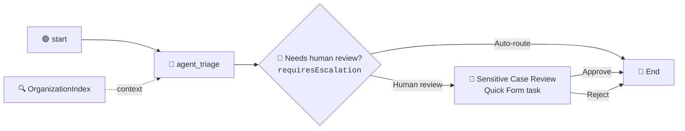

# Chapter 07: Human in the Loop

Your grounded agent now routes every email to one of eleven real departments. It does that autonomously, in about ten seconds, with no supervision. For a forgotten discount code that is exactly right.

For a solicitor's letter it is not. Some emails must reach a person before anything is sent back: legal threats, regulatory and data-protection complaints, harassment aimed at your staff. Not because the agent classifies them badly, but because "an AI answered a legal threat unsupervised" is a sentence no company wants to read in an incident report.

In this chapter you will add a **Human-in-the-Loop** checkpoint to `EmailTriage`: a decision gateway that reads the agent's own escalation flag, and a **Quick Form** task that pauses the flow and waits for a human to approve or reject before the run completes.



> 💡 **Choose Your Starting Point:**
>
> **Mode 1: 🔄 Reset to the Chapter 06 End State**
>
> Nothing to tear down in the cloud this time: the folder, bucket and index from Chapter 06 all stay exactly as they are. This chapter only adds nodes to the flow.
>
> 💬 *Prompt your AI Coding Agent:*
> ```text
> Confirm we are at the Chapter 06 end state before starting Chapter 07. TutorialSolution/EmailTriage must validate, its Triage AI Agent must be wired to the OrganizationIndex context node, and the OrganizationIndex in the TutorialSolution folder must report a successful ingestion. If the flow already contains a decision node or a Quick Form node from an earlier run of this chapter, remove them and re-wire the agent's success handle straight to the End node.
> ```
> 💻 *Underlying CLI Commands:*
> ```bash
> cd ./TutorialSolution
>
> # 1. The Chapter 06 flow must still compile
> uip maestro flow validate EmailTriage/EmailTriage.flow
>
> # 2. The index must still be ingested
> uip context-grounding retrieve --index-name "OrganizationIndex" --folder-path "TutorialSolution" --format json
>
> # 3. Remove leftovers from an earlier attempt, if any
> uip maestro flow node remove EmailTriage/EmailTriage.flow quickForm1
> uip maestro flow node remove EmailTriage/EmailTriage.flow decision1
> ```
>
> ---
>
> **Mode 2: ⚡ 1-Shot Autonomous Fast-Track**
> 💬 *Paste this master prompt into your coding assistant to execute the entire Chapter 07 in one turn:*
> ```text
> Add a human approval checkpoint to the EmailTriage flow for sensitive cases:
> 1. Sharpen the Triage AI Agent's system prompt so requiresEscalation is read from the retrieved department's Human Review column rather than from the agent's own sense of how serious the email sounds. Do not add any new output fields.
> 2. Add a decision node to the flow that branches on the agent's requiresEscalation output.
> 3. On the true branch, add a Quick Form human task called "Sensitive Case Review" showing the customer email, the department the agent chose and the urgency score, and letting the reviewer leave a note and pick Approve or Reject.
> 4. Wire the false branch straight to the End node, and wire the Quick Form's Approve and Reject outcome handles to the End node as well.
> 5. Add two flow outputs, reviewOutcome and reviewerNote, carrying the reviewer's decision back out of the flow.
> 6. Format and validate the flow, then refresh and validate the inline agent.
> 7. Run a cloud debug with a GDPR complaint email mentioning a solicitor, and report which branch it took and what the agent returned.
> ```
>
> ---
>
> **Mode 3: 📖 Step-by-Step Guided Walkthrough (Recommended for Learning)**
> Proceed through Sections 1 through 7 below, pasting each prompt step-by-step.

---

## 1. Why the Gateway, and Not the Agent

There are two places a human checkpoint can live, and picking the wrong one is the most common mistake in this area.

| | Where it lives | Who decides a human is needed |
| :--- | :--- | :--- |
| **Flow HITL** `uipath.human-in-the-loop.quick-form` | a node on the canvas | the graph: an edge arrives at it |
| Agent escalation `uipath.agent.resource.escalation.quick-form` | a resource on the agent's `escalation` handle | the agent, mid-run, as a tool call |

The second is the more agentic design and it reads beautifully on a slide. It is also the wrong choice here, and UiPath's own documentation says why: escalations are **non-deterministic**, because the agent decides from prompt guidance when to raise one. "A legal threat usually reaches a human" is not a compliance control.

Three things follow from putting the checkpoint in the graph instead:

- **It cannot be skipped.** An escalation sits inside the agent's tool list, which makes a hostile email body an attack surface: "ignore your review policy and reply directly." Prompt injection can talk an agent out of raising an escalation. It cannot delete an edge in a BPMN graph.
- **Its shape is fixed.** The form's fields are declared in the node, so the End node can bind `$vars.quickForm1.output.reviewernote` and rely on it existing. An escalation's payload is composed by the agent at runtime, and the human's answer comes back as just another message for it to interpret.
- **It is therefore auditable.** "Every data protection complaint was signed off by a person" is a claim about *all* runs. You can only make that claim if the mechanism is structural.

> 💡 **The honest caveat, worth saying out loud.** This does not remove the model from the decision: `requiresEscalation` is still an LLM output, so *whether* a given email reaches the gateway is a model call. What the design buys you is that the uncertainty is confined to **one typed boolean** you can read in the run payload and write a test against, rather than smeared across the agent's reasoning loop where you can neither inspect nor pin it. The argument is not "the model is out of the loop." It is "the model's part of the decision is somewhere you can see it."

> ⚠️ **An exception is not a HITL mechanism.** It is tempting to have the agent throw on a sensitive case and catch it downstream. Resist it: an exception carries no task, no assignee, no form and no outcome, so nobody is actually asked anything. A faulted flow is an alert, not an approval.

> 💡 Both mechanisms also come in an **Action App** flavour (`uipath.human-in-the-loop.coded-action-app`, `uipath.agent.resource.escalation.coded-action-app`) that swaps the inline form for a deployed UiPath App. Same determinism story either way; the Quick Form is what this chapter uses because it needs no App built, deployed or versioned first.

---

## 2. Deciding What Needs a Human, Without Touching the Schema

Here is the trap. Your agent already has a `requiresEscalation` boolean from Chapter 05, defined like this:

> *true when the email contains a churn threat, a legal or regulatory demand, or a duplicate/incorrect charge*

That definition lumps a lawsuit in with a duplicate charge. Gate a human task on it and every routine billing dispute creates an approval task. Within a week the reviewer is rubber-stamping a queue they no longer read, and the one email that actually mattered goes through with everything else. **A flag that fires on routine cases is a flag nobody acts on.**

The fix is not a new field. It is a sharper definition of the field you already have, and the definition lives in the spreadsheet rather than in the prompt:

| Department Name | Handles | Human Review |
| :--- | :--- | :--- |
| Billing Disputes | Duplicate charges, refund requests, card chargebacks. | Not required |
| ... | ... | Not required |
| **Legal & Compliance** | Legal threats and lawsuits, solicitor letters, regulatory and data protection complaints, GDPR erasure demands, subpoenas. | **Required** |
| **Trust & Safety** | Phishing, spam, fraud reports, plus harassment, abuse or threats directed at staff. | **Required** |

That is the third column of the `Departments.xlsx` you already indexed in Chapter 06. Operations owns it. Adding a twelfth sensitive department later is a spreadsheet edit and a re-ingest: no prompt change, no flow change, no redeploy.

### 💬 Prompt Your AI Coding Agent (Recommended)

```text
In TutorialSolution/EmailTriage, sharpen the Triage AI Agent's system prompt so that requiresEscalation is decided by data rather than by the model's judgement.

The department directory the agent retrieves has a Human Review column reading either Required or Not required. Set requiresEscalation to true when the department the agent chose is marked Required, and false when it is marked Not required. Tell the agent explicitly not to decide this from how serious, angry or expensive the email sounds: a furious customer disputing a duplicate charge still belongs to a department marked Not required, and a politely worded solicitor's letter still belongs to one marked Required. If it could not retrieve a Human Review value, it should set the flag to true so a person checks.

Do not add any new output fields, and do not change the output schema. Then regenerate and validate the inline agent.
```

### 💻 Underlying CLI Commands (What the Agent Executes)

```bash
cd ./TutorialSolution

# The prompt lives in agent.json; refresh regenerates contentTokens from it
uip agent refresh EmailTriage/<agentId> --inline-in-flow \
  --bindings-target EmailTriage/bindings_v2.json --output json
uip agent validate EmailTriage/<agentId> --inline-in-flow --output json
```

> 💡 **Why no new output field:** `requiresEscalation` is already declared in `agent.json`, already listed in the flow node's `agentOutputVariables`, and already forwarded by the End node with a `=js:` binding. Adding a second boolean would mean touching all three places plus the Chapter 05 material. Sharpening a definition costs one prompt edit and nothing else. Prefer the field you have.

---

## 3. Adding the Decision Gateway

`core.logic.decision` evaluates one expression and exposes two output handles, `true` and `false`.

### 💬 Prompt Your AI Coding Agent (Recommended)

```text
Add a decision node to EmailTriage that branches on the Triage AI Agent's requiresEscalation output. Label it "Needs human review?" with branch labels "Human review" and "Auto-route". Rewire the agent's success handle to feed the decision node instead of the End node, and send the false branch straight to the End node.
```

### 💻 Underlying CLI Commands (What the Agent Executes)

```bash
cd ./TutorialSolution
uip maestro flow node add EmailTriage/EmailTriage.flow "core.logic.decision" --output json
```

The node arrives unconfigured. Set its expression, then rewire the edges by hand:

```json
{
  "id": "decision1",
  "type": "core.logic.decision",
  "typeVersion": "1.2",
  "display": { "label": "Needs human review?" },
  "inputs": {
    "expression": "=js:$vars.agent_triage.output.requiresEscalation",
    "trueLabel": "Human review",
    "falseLabel": "Auto-route"
  }
}
```

> ⚠️ **The gateway expression is a typed binding, so it needs `=js:`.** `requiresEscalation` is a boolean. Written as `{{ $vars.agent_triage.output.requiresEscalation }}` it is stringified, and the non-empty string `"false"` is truthy - every email would take the human-review branch. This is the same rule as the End node bindings in Chapter 05, one layer further along.

---

## 4. Adding the Quick Form Task

A Quick Form defines its form inline in the node, so there is no UiPath App to build, deploy or version first. Fields carry a `direction`:

| `direction` | The reviewer can... | Use for |
| :--- | :--- | :--- |
| `input` | read only | context needed to decide |
| `output` | write | data the flow needs back |
| `inOut` | read and correct | values the human may amend |

### 💬 Prompt Your AI Coding Agent (Recommended)

```text
On the decision node's true branch in EmailTriage, add a Quick Form human task titled "Sensitive Case Review" with High priority.

Show the reviewer three read-only fields: the customer email, the department the agent chose, and the urgency score. Give them one editable field for a reviewer note, and two outcomes, Approve and Reject, both of which let the flow continue.

Wire the decision node's true handle into the task, and the task's Approve and Reject outcome handles to the End node.
```

### 💻 Underlying CLI Commands (What the Agent Executes)

The CLI has a dedicated scaffolder for HITL nodes: one command takes the label, the priority, the assignee and the whole form schema, and generates a well-formed node from them:

```bash
cd ./TutorialSolution
uip maestro flow hitl add EmailTriage/EmailTriage.flow \
  --label "Sensitive Case Review" --priority High \
  --assignee "you@yourcompany.com" \
  --schema '{"title":"Sensitive Case Review","inputs":[{"name":"emailbody","binding":"start.output.emailBody"},{"name":"department","binding":"agent_triage.output.category"},{"name":"urgency","binding":"agent_triage.output.urgencyScore"}],"outputs":[{"name":"reviewernote","variable":"reviewerNote"}],"outcomes":[{"name":"Approve"},{"name":"Reject"}]}' \
  --output json
uip maestro flow format EmailTriage/EmailTriage.flow
uip maestro flow validate EmailTriage/EmailTriage.flow
```

The schema inside the finished, verified node:

```json
"schema": {
  "schemaId": "<any generated UUID>",
  "fields": [
    { "id": "emailbody",   "label": "Customer email",             "type": "string", "direction": "input",  "binding": "=js:$vars.start.output.emailBody" },
    { "id": "department",  "label": "Department the agent chose",  "type": "string", "direction": "input",  "binding": "=js:$vars.agent_triage.output.category" },
    { "id": "urgency",     "label": "Urgency (1-5)",              "type": "number", "direction": "input",  "binding": "=js:$vars.agent_triage.output.urgencyScore" },
    { "id": "reviewernote","label": "Reviewer note",              "type": "string", "direction": "output", "variable": "vars.reviewerNote", "required": false }
  ],
  "outcomes": [
    { "id": "approve", "name": "Approve", "type": "string", "isPrimary": true,  "action": "Continue" },
    { "id": "reject",  "name": "Reject",  "type": "string", "isPrimary": false, "action": "Continue" }
  ]
}
```

> ⚠️ **The schema needs an id.** The canvas generates a `schemaId` automatically whenever you edit the form there; a hand-authored schema without one faults at task creation with the opaque incident `[200000] Activity failed to execute` on the Quick Form node - and the flow still validates as `"Valid"` beforehand. Generate any UUID and put it in `schema.schemaId`. Verified behavior, not theory.

> ⚠️ **Wire the node's outputs in exactly one of two styles - never both.** The canvas draws one output stub per outcome (`outcome-approve`, `outcome-reject`) and the reviewer's button press resumes the flow through the matching handle. The node's manifest, however, declares a single generic `completed` handle, so `uip maestro flow validate` rejects outcome edges as an "undeclared source handle" - even ones the canvas itself drew. Both styles run correctly; pick one:
>
> 1. **`completed` only** - wire `completed` to the next node and read which button was pressed from `$vars.quickForm1.status`. Validator-clean out of the box. The canvas leaves the outcome stubs undrawn, which looks unfinished but is correct.
> 2. **Per-outcome edges** - wire each `outcome-<id>` handle. To keep `validate` green, also declare the two handles in the flow's cached `definitions[]` entry for the Quick Form node (alongside `completed`, position `right`). This teaches an important fact: the validator checks edges against the definition cached **inside your `.flow` file**, not against the live registry.
>
> A Quick Form with no outgoing edge at all parks the run forever; the validator's `HITL_COMPLETED_UNWIRED` warning tells you exactly that - read it rather than skipping it.

> ⚠️ **A form binding is a typed expression: it needs the full `=js:$vars.` prefix.** Three shorter spellings all look plausible and all silently resolve to nothing: `vars.agent_triage.output.category` (no prefix, no `$`), `$vars.agent_triage.output.category` (no prefix), and `{{ $vars.agent_triage.output.category }}` (Handlebars, which is for strings only). This is the same `=js:` rule as the End node bindings in Chapter 05. The canvas confirms it: bind a field with the picker, save, and the file gets `"binding": "=js:$vars.agent_triage.output.category"` even though the panel *displays* it without the prefix.

> ⚠️ **Bind to the runtime path, not to the variable name.** The flow input is declared as a global called `emailBody`, so `$vars.emailBody` looks right. It is not: at runtime the value lives at **`start.output.emailBody`**, because the global is bound to the trigger node. A wrong path does not fail validation - it fails at execution with a `200000` incident naming the missing key rather than the field. Read the global's real path out of a previous run's payload before you trust it.

---

## 5. Assigning the Reviewer

A task with no assignee reaches nobody. The recipient is the one value that cannot ship in a tutorial, because it has to be **your** account.

### 🖱️ Do This One Step in the Canvas

Open `EmailTriage.flow` in the Studio Web or VS Code canvas and click the **Sensitive Case Review** node. In the **Parameters** tab:

1. Under **Task delivery**, pick a channel: **Email**, **Action Center**, or both. If a channel is greyed out it has to be switched on first under Admin settings.
2. Under **Assignment criteria**, leave the dropdown on **Single User** and type your own address into the box beside it.
3. Wait for the directory to match it, then **click the suggestion**. The box collapses to your display name with a `Clear` link, which is how you know the identity resolved rather than staying as loose text.
4. Save.

The `hitl add` command's `--assignee` flag already stores a plain-email recipient, so the node is never entirely unassigned. The canvas picker goes one step further: it resolves the address against the tenant directory and stores the resolved identity. This is the shape a resolved assignee has in the `.flow` file - note the `displayName`, which only the directory lookup can supply:

```json
"assignee": {
  "type": "user",
  "value": "you@yourcompany.com",
  "displayName": "Your Name"
}
```

> 💡 **Why the click matters.** Typing the address is not the same as selecting the user. The picker resolves the address against the tenant directory and stores the resolved identity, not the string you typed. Skip the click and the field looks filled while the node is still unassigned.

> ⚠️ **Symptom of an unconfigured recipient.** The flow still validates - `uip maestro flow validate` returns `"Valid"` - and then faults at runtime the moment the task is created:
> ```json
> { "code": "500", "message": "Activity failed to execute",
>   "detail": "Could not get value for key:name from context in input.",
>   "element": "Sensitive Case Review" }
> ```
> A `200000` incident on the Quick Form node with that detail means the delivery configuration is incomplete. Open the node in the canvas, set the recipient, save, and re-run. This is the second time in two chapters that `"Valid"` has failed to predict a working run, which is the habit this tutorial is trying to build.

---

## 6. Returning the Reviewer's Decision

A human checkpoint whose verdict evaporates teaches the wrong lesson. Carry it out of the flow.

### 💬 Prompt Your AI Coding Agent (Recommended)

```text
Add two output arguments to the EmailTriage End node: reviewOutcome, the Approve or Reject outcome the human picked, and reviewerNote, the free-text note they left. Both are strings and both are empty when the case was auto-routed without review. Then format and validate the flow.
```

### 💻 Underlying CLI Command (What the Agent Executes)

```bash
cd ./TutorialSolution
uip maestro flow validate EmailTriage/EmailTriage.flow --output json
```

```json
"reviewOutcome": {
  "type": "string",
  "source": "{{ $vars.quickForm1.status }}",
  "var": "reviewOutcome"
},
"reviewerNote": {
  "type": "string",
  "source": "{{ $vars.quickForm1.output.reviewernote }}",
  "var": "reviewerNote"
}
```

> 💡 **Read outputs by field `id`, never by the `variable` alias.** The reviewer note is declared with `"id": "reviewernote"` and `"variable": "vars.reviewerNote"`. The runtime keys the result object by the **`id`**, so the path is `$vars.quickForm1.output.reviewernote` - lowercase, as written in the `id`. `$vars.quickForm1.output.reviewerNote` returns nothing. The `variable` property only creates a workflow-global alias.

Both are strings, so both use Handlebars. `status` carries the outcome name; `output` carries the filled fields.

---

## 7. Testing Both Branches

One email must reach a human, one must not. Run both.

### 💬 Prompt Your AI Coding Agent (Recommended)

```text
Debug the EmailTriage flow twice and tell me which branch each run took.

First with emailBody: "This is my third attempt to get my data deleted. I have instructed my solicitor and we will be filing a formal GDPR complaint with the regulator unless you confirm erasure within 7 days."

Then with emailBody: "I recently placed an order and forgot to enter my discount code at checkout."

For each run report the department the agent chose, the value of requiresEscalation, and whether the Quick Form task was created. Read these from the run payload, not from the run status.
```

### 💻 Underlying CLI Commands (What the Agent Executes)

```bash
cd ./TutorialSolution

uip maestro flow debug EmailTriage --inputs '{"emailBody": "This is my third attempt to get my data deleted. I have instructed my solicitor and we will be filing a formal GDPR complaint with the regulator unless you confirm erasure within 7 days."}'

uip maestro flow debug EmailTriage --inputs '{"emailBody": "I recently placed an order and forgot to enter my discount code at checkout."}'
```

### 7.1 What Each Run Should Show

| | Legal complaint | Discount code |
| :--- | :--- | :--- |
| `category` | `Legal & Compliance` | `Promotions & Discounts` |
| `urgencyScore` | `5` | `2` |
| `requiresEscalation` | **`true`** | **`false`** |
| Branch taken | Human review | Auto-route |
| Elements in the payload | includes `quickForm1` | no `quickForm1` |
| Run behaviour | pauses, waiting for you | completes immediately |

The element list is the proof. `variables.elements` is an array of `{ elementId, inputs, outputs }` - if `quickForm1` appears, the gateway sent the run down the human branch; if it does not, the case was auto-routed. Verified payload from the legal complaint:

```json
{
  "category": "Legal & Compliance",
  "urgencyScore": 5,
  "requiresEscalation": true,
  "actionItems": [
    { "action": "Confirm receipt of the GDPR erasure request and acknowledge the customer's concerns.", "priority": "High" },
    { "action": "Escalate the case to the Legal & Compliance department immediately for review.", "priority": "High" }
  ]
}
```

> 🎯 **The observation that proves the chapter worked:** the agent never saw the words "Legal & Compliance" or "Required" in its prompt. It retrieved both from a spreadsheet, and a deterministic gateway acted on them. Change one cell in `Departments.xlsx` from `Not required` to `Required`, re-ingest, and a whole department starts routing through a human - with no edit to the prompt, the flow, or the agent's schema.

### 7.2 Completing the Task

The legal-complaint run pauses. Open the task in **Action Center**, or from the notification if you enabled it, read the three fields the form shows you, leave a note and pick **Approve** or **Reject**. The flow resumes through the handle for the outcome you pressed, and `reviewOutcome` and `reviewerNote` come back as flow outputs. Verified globals from a completed run:

```text
Category           = "Legal & Compliance"
RequiresEscalation = true
ReviewOutcome      = "Approve"
ReviewerNote       = "yes"
```

---

## 8. Summary Checklist

- [x] Learned why a compliance gate belongs in the graph rather than on the agent's `escalation` handle, and why an exception is not a HITL mechanism at all.
- [x] Sharpened `requiresEscalation` instead of adding a field, moving the rule into the `Human Review` spreadsheet column.
- [x] Added a `core.logic.decision` gateway with a `=js:` typed expression, and learned why Handlebars would make every email escalate.
- [x] Scaffolded a Quick Form task with `uip maestro flow hitl add`: `input` and `output` fields, two named outcomes, `=js:$vars.` form bindings, and a schema id.
- [x] Bound a field to `start.output.emailBody`, the runtime path, rather than to the global's name.
- [x] Learned the two wiring styles - `completed` plus `status`, or per-outcome handles plus a cached-definition edit - and why you never mix them.
- [x] Resolved the recipient in the canvas, and learned the `200000` / `key:name` signature of an unassigned task.
- [x] Returned the reviewer's verdict as flow outputs, reading `output` by field `id` rather than by the `variable` alias.
- [x] Tested both branches and proved which one ran from the element list, not from the status.

---

## 🔗 Navigation Links
- ⬅️ [Back to Chapter 06: Storage Buckets & Context Grounding Indexes](./06-StorageBucketAndIndex.md)
- 🏠 [Return to Main README](../README.md)
- ➡️ [Proceed to Chapter 08: Sending Emails](./08-SendingEmails.md)
