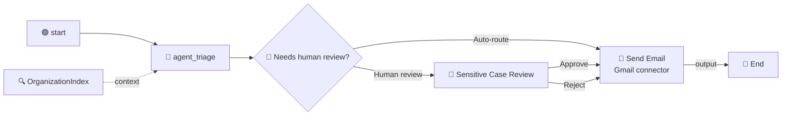

# Chapter 08: Sending Emails

Your flow now reads an email, retrieves the real department directory, classifies against it, and pauses for a human when the case is sensitive. Then it stops and returns a JSON object to whoever called it.

Nobody is waiting for that JSON. The support team is waiting for a message. Until the flow can act on its own conclusion, it is a very well-informed dead end.

This chapter closes the loop. You will connect the flow to **Gmail through Integration Service** and have it send the triage summary automatically, on both branches: immediately for routine cases, and after the human verdict for sensitive ones.



Note where the email node sits: **after** the merge, not on one branch. Both paths converge on it, so there is one place that sends and one thing to change when the message needs editing.

> 💡 **Choose Your Starting Point:**
>
> **Mode 1: 🔄 Reset to the Chapter 07 End State**
>
> 💬 *Prompt your AI Coding Agent:*
> ```text
> Confirm we are at the Chapter 07 end state before starting Chapter 08. TutorialSolution/EmailTriage must validate and must contain the Triage AI Agent, the OrganizationIndex context node, a decision node branching on requiresEscalation, and a Quick Form task on the true branch. If a Gmail send-email node from an earlier run of this chapter is present, remove it and re-wire both branches straight to the End node.
> ```
> 💻 *Underlying CLI Commands:*
> ```bash
> cd ./TutorialSolution
> uip maestro flow validate EmailTriage/EmailTriage.flow
> uip maestro flow node list EmailTriage/EmailTriage.flow --output json
> uip maestro flow node remove EmailTriage/EmailTriage.flow sendEmail1
> ```
>
> ---
>
> **Mode 2: ⚡ 1-Shot Autonomous Fast-Track**
> 💬 *Paste this master prompt into your coding assistant to execute the entire Chapter 08 in one turn:*
> ```text
> Make the EmailTriage flow act on its own triage result by sending a notification email:
> 1. Find the Gmail connection available in my tenant and tell me which folder it lives in.
> 2. Add a Gmail Send Email node to the flow, placed after both branches merge, so it runs for auto-routed cases and for cases that went through human review.
> 3. Address the email to me. Subject line: the department and the urgency score. Body: the department, the urgency, whether human review was required, the review outcome, and the original customer email.
> 4. Wire the decision node's false branch and the Quick Form's Approve and Reject outcome handles all into the email node, and the email node's output into the End node.
> 5. Format and validate the flow.
> 6. Run a cloud debug with a forgotten discount code email and confirm from the payload that the email node returned a real message id and that no error was recorded.
> ```
>
> ---
>
> **Mode 3: 📖 Step-by-Step Guided Walkthrough (Recommended for Learning)**
> Proceed through Sections 1 through 6 below, pasting each prompt step-by-step.

---

## 1. Integration Service: Connections, Not Credentials

Every previous node in this flow ran inside UiPath. This one reaches outside, and that changes how credentials work.

You will not put a Gmail password or an API key anywhere in this project. The credential lives in an **Integration Service connection** - a tenant-level object someone authorizes once, in a browser, against their Google account. Your flow references it by GUID. Rotate the credential and the flow never notices; hand the project to a colleague and they swap in their own connection.

| Approach | Where the secret lives | What happens at handover |
| :--- | :--- | :--- |
| Hard-coded key in a flow variable | in your `.flow` file, in git | the secret is now in everyone's clone forever |
| Manual HTTP node with a bearer token | in a flow input or asset | you rebuild OAuth refresh by hand |
| **Connector + IS connection (this chapter)** | in Integration Service | swap the connection GUID; nothing else changes |

> ⚠️ **A raw credential in a flow variable is the tell.** If you find yourself declaring an `apiKey` or `gmailToken` input to make an integration work, stop and look for a connector first. A connector-backed flow never carries the secret.

---

## 2. Finding the Connection

### 💬 Prompt Your AI Coding Agent (Recommended)

```text
Find the Gmail connection available in my UiPath tenant. Show me its id, which folder it lives in, and whether it is enabled. Then show me the Gmail send email node type from the flow registry.
```

### 💻 Underlying CLI Commands (What the Agent Executes)

```bash
# 1. Find the connection - --all-folders is mandatory, connections are folder-scoped
uip is connections list "uipath-google-gmail" --all-folders --output json

# 2. Confirm the node type exists and is enabled on this tenant
uip maestro flow registry pull --force
uip maestro flow registry search "send email" --output json \
  --output-filter "[*].{NodeType:NodeType,DisplayName:DisplayName,Avail:AvailableOnTenant}"
```

The connection carries the two GUIDs the node needs:

```json
{
  "Id": "3f2a91c4-8b6d-4e07-9a51-c2d84f7e6b10",
  "Name": "GMail",
  "ConnectorKey": "uipath-google-gmail",
  "State": "Enabled",
  "Folder": "your.name@example.com's workspace",
  "FolderKey": "a81d4c62-97b3-4f28-8e05-6b1f9d3c7a44"
}
```

> ⚠️ **Never guess the connector key from the brand name.** The registry key is `uipath-google-gmail`, not `gmail`. A guessed key returns an empty list, which reads exactly like "no connection exists" and sends you off to create one you already have. Search the registry for the node type first, then take the key from it. The same trap applies to `uip is connections list` without `--all-folders`: connections are folder-scoped, and an unscoped query silently misses them.

> 💡 **No Gmail connection yet?** Create one in Integration Service in the browser (Gmail, sign in, authorize), then re-run the list. The tutorial uses Gmail because most people can authorize one in a minute; `uipath-microsoft-outlook365.send-email`, `uipath-amazon-ses.send-email` and several others expose the same node shape, so everything below transfers.

---

## 3. Adding and Configuring the Node

Here is the part that differs from every node you have added so far.

Most Maestro nodes are **user-owned**: you write their JSON directly. Connector nodes are **CLI-owned**. Their configuration lives in an `inputs.detail` envelope that the validator rejects when hand-authored, so they are added with `node add` and configured with `node configure`. Hand-editing them breaks them.

### 💬 Prompt Your AI Coding Agent (Recommended)

```text
Add a Gmail Send Email node to EmailTriage and configure it with my Gmail connection.

Address it to me. The subject should be "[Triage]" followed by the department the agent chose and the urgency score. The body should list the department, the urgency, whether human review was required and what the reviewer decided, then the original customer email underneath.
```

### 💻 Underlying CLI Commands (What the Agent Executes)

```bash
cd ./TutorialSolution

uip maestro flow node add EmailTriage/EmailTriage.flow \
  "uipath.connector.uipath-google-gmail.send-email" --output json

uip maestro flow node configure EmailTriage/EmailTriage.flow sendEmail1 --detail '{
  "connectionId": "<CONNECTION_ID>",
  "folderKey": "<FOLDER_KEY>",
  "method": "POST",
  "endpoint": "/SendEmail",
  "bodyParameters": {
    "To": "you@example.com",
    "Subject": "[Triage] {{ $vars.agent_triage.output.category }} - urgency {{ $vars.agent_triage.output.urgencyScore }}",
    "Body": "A new customer email has been triaged.\n\nDepartment: {{ $vars.agent_triage.output.category }}\nUrgency: {{ $vars.agent_triage.output.urgencyScore }}\nHuman review: {{ $vars.agent_triage.output.requiresEscalation }}\nReview outcome: {{ $vars.quickForm1.status }}\n\nOriginal email:\n{{ $vars.start.output.emailBody }}"
  }
}' --output json
```

A successful configure reports what it wrote:

```json
{ "NodeId": "sendEmail1", "BindingsCreated": 2, "DetailPopulated": true }
```

`BindingsCreated: 2` is the connection and folder being registered as flow bindings - the same mechanism that let Chapter 06's index become a solution resource.

> 💡 **Where `method` and `endpoint` come from.** Not from guesswork. `uip maestro flow registry get "<nodeType>"` returns a `connectorMethodInfo` block giving `"method": "POST"` and `"reference": "/SendEmail"`. To see the fields the request accepts, ask Integration Service directly:
> ```bash
> uip is resources describe "uipath-google-gmail" "SendEmail" \
>   --operation Create --connection-id <CONNECTION_ID> --output json
> ```
> Its `RequestFields` array is the authoritative list: `To` (the only required one), `Subject`, `Body`, `CC`, `BCC`, `ReplyTo`, `Importance`.

> ⚠️ **All four `bodyParameters` values here are strings, so all four use Handlebars.** `{{ $vars.agent_triage.output.urgencyScore }}` is correct even though `urgencyScore` is a number - it is being interpolated into a subject line, and a subject line is text. The `=js:` form from Chapter 05 is for fields that must stay typed. Same paths, different wrapper, chosen by the destination field's type rather than the source value's.

---

## 4. Wiring It After the Merge

The email node goes where both branches meet. That means moving two existing edges rather than adding a new terminal step.

### 💬 Prompt Your AI Coding Agent (Recommended)

```text
Rewire EmailTriage so both paths run through the email node: the decision node's false branch and the Quick Form's Approve and Reject outcome handles should all feed the Send Email node, and the Send Email node's output should feed the End node. Then format and validate the flow.
```

### 💻 Underlying CLI Commands (What the Agent Executes)

```bash
cd ./TutorialSolution
uip maestro flow format EmailTriage/EmailTriage.flow
uip maestro flow validate EmailTriage/EmailTriage.flow
```

The final edge list:

```text
start        output     -> agent_triage
agent_triage success    -> decision1
agent_triage context    -> organizationindex1
decision1    true       -> quickForm1
decision1    false      -> sendEmail1
quickForm1   outcome-approve -> sendEmail1
quickForm1   outcome-reject  -> sendEmail1
sendEmail1   output     -> end1
```

> 💡 **A connector node has two output handles, `output` and `error`.** Wiring only `output` means a Gmail failure faults the flow. That is the right default here: if the notification does not go out, the team never learns about the case, and a silent success would be worse than a visible failure. Wire `error` when you have a real fallback, not to make red disappear.

---

## 5. Testing the Auto-Route Branch

Use the discount-code email. It is not sensitive, so it skips the human task and goes straight to sending, which makes it the fastest way to prove the connector works.

### 💬 Prompt Your AI Coding Agent (Recommended)

```text
Debug the EmailTriage flow with emailBody: "I recently placed an order and forgot to enter my discount code at checkout."

Then confirm from the run payload that the email node actually sent: I want the message id it returned and the value of its error output, not just the run status. Also tell me which elements ran.
```

### 💻 Underlying CLI Command (What the Agent Executes)

```bash
cd ./TutorialSolution
uip maestro flow debug EmailTriage \
  --inputs '{"emailBody": "I recently placed an order and forgot to enter my discount code at checkout."}'
```

### 5.1 What Proves It Worked

A verified run:

```json
{
  "finalStatus": "Completed",
  "elements": ["start", "agent_triage", "sendEmail1", "end1"],
  "globals": {
    "category": "Promotions & Discounts",
    "requiresEscalation": false,
    "sendEmail1.output": {
      "threadId": "1a059b52db1d48a6",
      "id": "1a059b52db1d48a6",
      "labelIds": ["UNREAD", "SENT", "INBOX"]
    },
    "sendEmail1.error": null
  }
}
```

Three things to read, in order:

| # | Check | Why it matters |
| :-: | :--- | :--- |
| **1** | `elements` contains `sendEmail1` but **not** `quickForm1` | the gateway took the auto-route branch, as a non-sensitive case should |
| **2** | `sendEmail1.output.id` is a real message id and `labelIds` contains `SENT` | Gmail accepted and sent it - this is the difference between "the node ran" and "an email exists" |
| **3** | `sendEmail1.error` is `null` | no swallowed failure |

Then check your inbox. That is the only check that cannot be faked by a green status.

> ⚠️ **A `Completed` status does not mean an email was sent.** Every chapter in this tutorial has made the same point from a different angle: Chapter 04 with empty `JobArguments`, Chapter 05 with `null` typed outputs, Chapter 06 with an ungrounded category, Chapter 07 with a task nobody was assigned. Here the tell is a `sendEmail1.output` with no `id`. Read the payload.

### 5.2 Testing the Human-Review Branch

The legal complaint takes the long path: agent, gateway, human task, and only then the email.

### 💬 Prompt Your AI Coding Agent (Recommended)

```text
Debug EmailTriage with emailBody: "This is my third attempt to get my data deleted. I have instructed my solicitor and we will be filing a formal GDPR complaint with the regulator unless you confirm erasure within 7 days."

Tell me which elements ran and where the run is waiting.
```

### 💻 Underlying CLI Command (What the Agent Executes)

```bash
cd ./TutorialSolution
uip maestro flow debug EmailTriage \
  --inputs '{"emailBody": "This is my third attempt to get my data deleted. I have instructed my solicitor and we will be filing a formal GDPR complaint with the regulator unless you confirm erasure within 7 days."}'
```

This run pauses at the Quick Form. Approve or reject the task in Action Center, and the email goes out afterwards with `Review outcome` filled in from `{{ $vars.quickForm1.status }}` - empty on the auto-routed path, `Approve` or `Reject` here. One template, both branches, no duplicated node.

---

## 6. Where to Take It Next

The flow is now autonomous end to end: it reads, retrieves, classifies, escalates when the data says to, and acts. Two natural extensions, both of which reuse what you already built:

- **Route to the department's real mailbox.** Add a fourth column to `Departments.xlsx` holding each department's address, re-ingest, have the agent return it, and bind `To` to that output instead of a fixed address. Same lesson as Chapter 07's `Human Review` column: routing rules belong in data.
- **Let the agent draft the reply.** Add a `draftReply` string to the agent's output schema, show it to the reviewer in the Quick Form so a human approves the wording, then send that instead of a template. This is the point where the Quick Form stops being an approval gate and becomes an editing step.

---

## 7. Summary Checklist

- [x] Understood why an Integration Service connection beats a credential in a flow variable.
- [x] Found the Gmail connection with `uip is connections list --all-folders`, and learned that the connector key comes from the registry rather than the brand name.
- [x] Learned that connector nodes are **CLI-owned**: `node add` then `node configure`, never hand-authored JSON.
- [x] Read `method` and `endpoint` from `connectorMethodInfo`, and the request fields from `uip is resources describe`.
- [x] Interpolated a number into a subject line with Handlebars, and understood why `=js:` is wrong there.
- [x] Placed the email node after the branch merge so one template serves both paths.
- [x] Verified the send by its returned message id and `SENT` label, not by the run status.

---

## 🔗 Navigation Links
- ⬅️ [Back to Chapter 07: Human in the Loop](./07-HumanInTheLoop.md)
- 🏠 [Return to Main README](../README.md)
- ➡️ [Proceed to Chapter 09: Receiving Emails](./09-ReceivingEmails.md)
