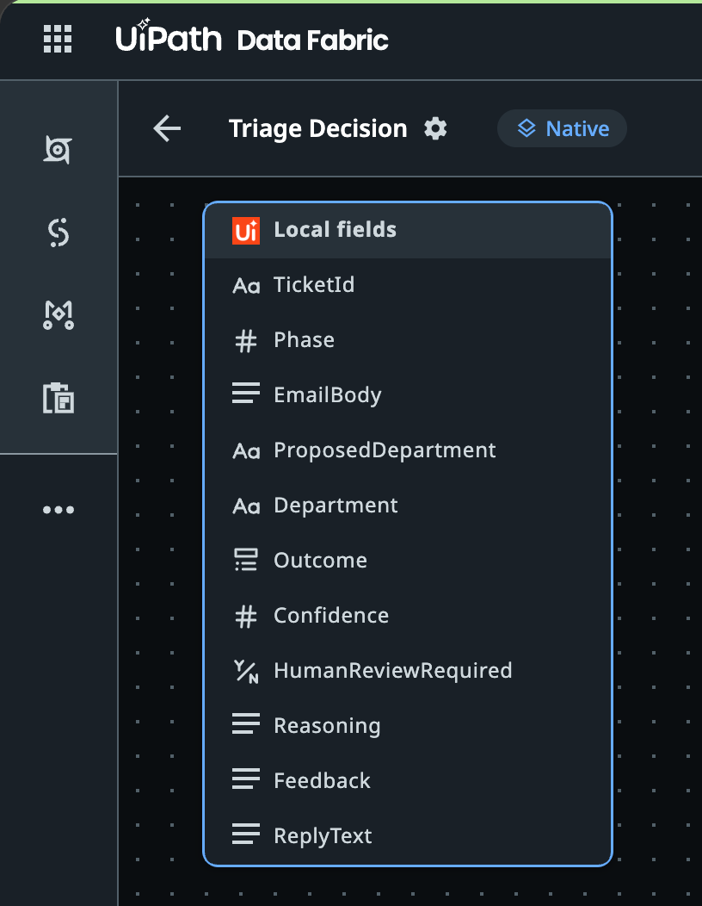
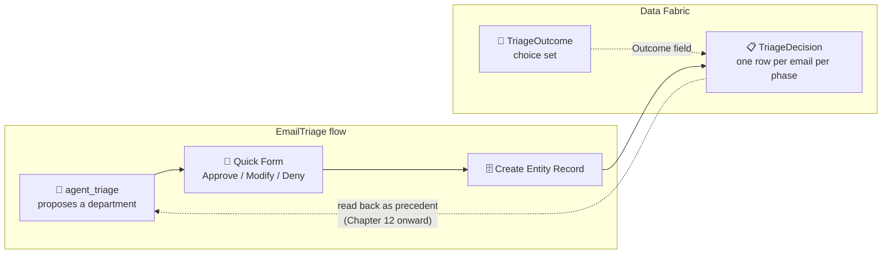

# Chapter 09: Data Fabric - Recording Every Triage Decision

Chapters 03 to 07 built a triage flow that classifies an email, asks a human when the department demands it, and returns the reviewer's verdict as flow outputs. Then the run ends, and the verdict is gone. The next email starts from zero. A reviewer who corrects the same mistake ten times has taught the process nothing.

In this chapter you give the process a memory. Every decision the flow makes - by the agent alone or by a human - is written to a **Data Fabric entity** named `TriageDecision`. Parts 4 to 6 of this tutorial (Chapters 10 to 14) are built on that table: the agent reads earlier decisions back as precedent, a scoreboard counts how often a human had to step in, and the count goes down from one version of the flow to the next.

## What You Are Going to Build

Nothing changes in the flow yet. This chapter creates two objects in Data Fabric: the `TriageOutcome` choice set and the `TriageDecision` entity with these eleven fields, as Data Fabric shows them when the chapter is done.





> 💡 **Choose Your Starting Point:**
>
> **Mode 1: 🔄 Reset the Data Fabric Artifacts (Clean Baseline)**
>
> This chapter creates two tenant-level Data Fabric objects and nothing else: the `TriageOutcome` choice set and the `TriageDecision` entity. The reset removes both so the chapter can be repeated from scratch. Your `EmailTriage` flow is not touched.
>
> 💬 *Prompt your AI Coding Agent:*
> ```text
> Prepare a clean baseline for Chapter 09. If a Data Fabric entity named TriageDecision exists, delete it, and if a choice set named TriageOutcome exists, delete it too. Delete the entity before the choice set, because the entity's Outcome field references the choice set. Skip anything that does not exist rather than failing, and finish by listing entities and choice sets so I can see that neither remains. Do not touch any other entity, and do not touch the EmailTriage flow.
> ```
> 💻 *Underlying CLI / Shell Commands:*
> ```bash
> # 1. See what exists before removing anything
> uip df entities list --output table
> uip df choice-sets list --output table
>
> # 2. The entity first - it references the choice set
> ENTITY_ID=$(uip df entities list --output plain \
>   --output-filter "[?Name=='TriageDecision'].Id | [0]")
> uip df entities delete "$ENTITY_ID" --yes --reason "Chapter 09 reset: clean baseline"
>
> # 3. Then the choice set
> CHOICE_SET_ID=$(uip df choice-sets list --output plain \
>   --output-filter "[?Name=='TriageOutcome'].Id | [0]")
> uip df choice-sets delete "$CHOICE_SET_ID" --yes --reason "Chapter 09 reset: clean baseline"
> ```
>
> *Both deletes refuse to run without `--yes` and a `--reason`: they are irreversible, the reason is recorded, and `entities delete` takes the records with it. In this chapter the entity is empty, so nothing is lost. From Chapter 10 on, it holds the evidence for the whole learning loop: reset the entity only when you mean to restart the loop.*
>
> > 💡 **Tip:** Neither `--yes` nor `--reason` is listed by `uip df entities delete --help` or `uip df choice-sets delete --help`; the command only asks for them when you run it without. That is why the block above carries both. And a reset changes every id: the choice set and the entity you create next get **new** ids, so the `<CHOICE_SET_ID>` in Section 5 must come from *this* run of Section 4, never from an earlier one.
>
> ---
>
> **Mode 2: ⚡ 1-Shot Autonomous Fast-Track**
> 💬 *Paste this master prompt into your coding assistant to execute the entire Chapter 09 in one turn:*
> ```text
> Give the EmailTriage process a memory of its decisions in Data Fabric:
> 1. Create a tenant-level choice set named TriageOutcome with exactly five values: Auto, Approved, Modified, Denied, AutoResolved.
> 2. Create a tenant-level entity named TriageDecision with these fields: TicketId (text, 20), Phase (whole number 1 to 3), EmailBody (multiline text, 10000), ProposedDepartment (text, 200), Department (text, 200), Outcome (single choice from TriageOutcome), Confidence (decimal), HumanReviewRequired (boolean), Reasoning (multiline text, 10000), Feedback (multiline text, 2000), ReplyText (multiline text, 5000). Mark TicketId, Phase, EmailBody, ProposedDepartment, Department and Outcome as required.
> 3. Read the entity schema back and show me every field with its type, length and required flag, so I can compare it with the list above.
> 4. Insert one test record for ticket T00 at phase 0 with Outcome Approved, list the records to prove the write worked, then delete that test record and confirm the entity is empty again.
> 5. Finish with the checkpoint: record an empty commit in TutorialSolution's own git repository with the message "Chapter 09 done: TriageOutcome and TriageDecision created in the tenant" and move the tag ch09-done to it.
> ```
>
> ---
>
> **Mode 3: 📖 Step-by-Step Guided Walkthrough (Recommended for Learning)**
> Proceed through Sections 1 through 8 below, pasting each prompt step-by-step.

---

## 1. Why a Table, and Not a Log

The Quick Form in Chapter 07 already tells you what the reviewer decided. The job log tells you too. So why write it somewhere else?

Because from Chapter 12 on the decision is **read back by the agent** on the next run. A log is written to be read by people, after the fact. A Data Fabric entity is written to be queried by a process, at runtime, with a filter: "show me every earlier email that a human routed to Legal & Compliance". Chapter 08 explains what the agent does with that answer. This chapter makes sure the answer exists.

| Store | Who reads it | Filterable by department, phase, outcome? | Survives the run? |
| :--- | :--- | :--- | :--- |
| Flow outputs | The caller of the flow | No | No |
| Job log | People, in Orchestrator | Text search only | Yes |
| **Data Fabric entity** | **The agent, the scoreboard, a Coded App** | **Yes** | **Yes** |

Data Fabric is UiPath's managed record store: entities with typed fields, choice sets for enumerations, relationships between entities, and a query API that Integration Service exposes to flows and to agents as a tool. You create the schema once; every process on the tenant can write to it and read from it.

---

## 2. Naming the Entity

The obvious name for this table is something like "approvals": the reviewer approves the agent's proposal, and you record it. That name would be wrong in two ways, and the reasons are worth a minute because they shape the whole schema.

- **Most rows will not involve a human.** From Chapter 12 on, the agent routes routine emails on its own and still writes a row. Those rows record an *absence* of human approval.
- **A denial is not an approval.** When the reviewer clicks Deny, that decision must be recorded too - it is the strongest signal the loop can learn from.

What the table actually holds is *every decision the process made about an email, whoever made it*. So the entity is called **`TriageDecision`**, singular, as Data Fabric entities conventionally are. One entity serves all three phases; a `Phase` column says which phase of the design (1, 2 or 3) wrote the row. Do not create `TriageDecisionV1`, `V2`, `V3`: the scoreboard in Chapter 11 is one query grouped by `Phase`, and three tables would turn it into three queries and a spreadsheet.

---

## 3. The Attributes, and Why Each One Exists

Two fields carry the core of the design, and they are easy to confuse:

- **`Confidence`** is the *agent's* number: how sure it is that the proposed department is right, 0 to 100.
- **`Outcome`** is the *verdict* on that proposal: what happened to it, and who decided.

One is an opinion, the other is what was done with it. Both are written on every row.

| Field | Type | Required | Written by | Why it exists |
| :--- | :--- | :--- | :--- | :--- |
| `TicketId` | Text (20) | yes | the batch runner | The same test emails are run in every phase. Without a stable key you cannot compare ticket T04 in phase 1 with T04 in phase 2. |
| `Phase` | Decimal, 0 places | yes | the flow input | Which phase of the design wrote the row: `1`, `2` or `3` (Chapter 08). The scoreboard groups by this. |
| `EmailBody` | Multiline text (10000) | yes | the trigger | The input the decision was made on, kept verbatim so a precedent can be compared with a new email. |
| `ProposedDepartment` | Text (200) | yes | the agent | What the agent suggested, always, even when a human overrode it. |
| `Department` | Text (200) | yes | the writing branch | The *final* department. Equals `ProposedDepartment` unless the reviewer chose Modify. |
| `Outcome` | Single choice (`TriageOutcome`) | yes | the writing branch | `Auto`, `Approved`, `Modified`, `Denied` or `AutoResolved`. See the table below. |
| `Confidence` | Decimal | no | the agent | The agent's 0 to 100 estimate. Recorded from the first version, used as a gate from the second. |
| `HumanReviewRequired` | Boolean | no | the agent | The `Human Review` column of the department directory, copied at decision time. Makes the compliance floor from Chapter 07 visible in the data. |
| `Reasoning` | Multiline text (10000) | no | the agent | Why the agent chose the department, including which precedent it relied on. |
| `Feedback` | Multiline text (2000) | no | the reviewer | Free text entered on Modify or Deny. This is the field the loop learns from. |
| `ReplyText` | Multiline text (5000) | no | the agent (Chapter 14) | The answer the agent sent when it resolved the email without routing it. Empty until then. |

The `Outcome` values, and what each one means for the learning loop:

| Outcome | Who decided | Meaning for later runs |
| :--- | :--- | :--- |
| `Approved` | human | Confirms the agent's proposal. Good evidence. |
| `Modified` | human | Corrects the proposal. **The strongest evidence**: a later run must follow the correction. |
| `Denied` | human | The email should not have been routed at all. Also evidence. |
| `Auto` | the gate | The agent routed it alone. **Not evidence**: nobody checked. |
| `AutoResolved` | the gate | The agent answered the email itself (Chapter 14). Not evidence either. |

> 💡 **Why `Auto` is not evidence.** If the agent could cite its own unreviewed routings as precedent, it would talk itself into ever higher confidence with no human ever in the loop. The rule that only `Approved` and `Modified` rows count as precedent is what keeps the autonomy *earned*. Chapter 08 builds on exactly this distinction.

Two fields you might expect and will not find: a reviewer name, because the system field `CreatedBy` records the flow's identity rather than the person who actioned the task (add `ReviewedBy` yourself if you need it), and a timestamp, because `CreateTime` is a system field on every entity.

---

## 4. Creating the Outcome Choice Set

Data Fabric enumerations are **choice sets**: named lists of values that a `CHOICE_SET_SINGLE` field references by id. The choice set must exist before the entity, because the entity definition needs its id.

### 💬 Prompt Your AI Coding Agent (Recommended)

```text
Create a tenant-level Data Fabric choice set named TriageOutcome, display name "Triage Outcome", with exactly these five values in this order: Auto, Approved, Modified, Denied, AutoResolved. Then list the values back so I can confirm all five are there, and tell me the choice set id because the entity in the next step references it.
```

### 💻 Underlying CLI Commands (What the Agent Executes)

```bash
# 1. Create the choice set - the returned ID is the choiceSetId for the entity field
uip df choice-sets create TriageOutcome \
  --display-name "Triage Outcome" \
  --description "What happened to the agent's routing proposal" --output json

# 2. Add the five values - <CHOICE_SET_ID> is the ID returned above
uip df choice-set-values create <CHOICE_SET_ID> Auto --display-name "Auto"
uip df choice-set-values create <CHOICE_SET_ID> Approved --display-name "Approved"
uip df choice-set-values create <CHOICE_SET_ID> Modified --display-name "Modified"
uip df choice-set-values create <CHOICE_SET_ID> Denied --display-name "Denied"
uip df choice-set-values create <CHOICE_SET_ID> AutoResolved --display-name "Auto Resolved"

# 3. Read them back
uip df choice-sets list-values <CHOICE_SET_ID> --limit 100 --output table \
  --output-filter "Items[*].{Order:NumberId,Name:Name,Display:DisplayName}"
```

> 💡 **Tip:** A choice set is tenant-level unless you pass `--folder-key`. Keep both the choice set and the entity at tenant level for this tutorial: the flow runs in one folder during debug and in another after deployment (Appendix A2), and a folder-scoped entity is only visible in its own folder.

---

## 5. Creating the TriageDecision Entity

The entity definition is a JSON document with a `fields` array. The CLI accepts it inline with `--body` or from a file with `--file`; for eleven fields a file is easier to review, and it can live in the repository next to the chapter.

### 💬 Prompt Your AI Coding Agent (Recommended)

```text
Create a tenant-level Data Fabric entity named TriageDecision, display name "Triage Decision", with these fields:

- TicketId: text, max length 20, required
- Phase: whole number (decimal with 0 decimal places), required
- EmailBody: multiline text, max length 10000, required
- ProposedDepartment: text, max length 200, required
- Department: text, max length 200, required
- Outcome: single choice from the TriageOutcome choice set, required
- Confidence: decimal with 2 decimal places
- HumanReviewRequired: boolean
- Reasoning: multiline text, max length 10000
- Feedback: multiline text, max length 2000
- ReplyText: multiline text, max length 5000

Write the definition to a file named triage-decision.entity.json in the repository root first, then create the entity from that file. Report the entity id.
```

### 💻 Underlying CLI Commands (What the Agent Executes)

```bash
# 1. The definition file - <CHOICE_SET_ID> comes from Section 4
cat > triage-decision.entity.json <<'EOF'
{
  "displayName": "Triage Decision",
  "description": "One row per email per phase: what the agent proposed, what was decided, and by whom",
  "fields": [
    { "fieldName": "TicketId",            "type": "STRING",            "lengthLimit": 20,    "isRequired": true },
    { "fieldName": "Phase",               "type": "DECIMAL",           "decimalPrecision": 0, "isRequired": true },
    { "fieldName": "EmailBody",           "type": "MULTILINE_TEXT",    "lengthLimit": 10000, "isRequired": true },
    { "fieldName": "ProposedDepartment",  "type": "STRING",            "lengthLimit": 200,   "isRequired": true },
    { "fieldName": "Department",          "type": "STRING",            "lengthLimit": 200,   "isRequired": true },
    { "fieldName": "Outcome",             "type": "CHOICE_SET_SINGLE", "choiceSetId": "<CHOICE_SET_ID>", "isRequired": true },
    { "fieldName": "Confidence",          "type": "DECIMAL",           "decimalPrecision": 2 },
    { "fieldName": "HumanReviewRequired", "type": "BOOLEAN" },
    { "fieldName": "Reasoning",           "type": "MULTILINE_TEXT",    "lengthLimit": 10000 },
    { "fieldName": "Feedback",            "type": "MULTILINE_TEXT",    "lengthLimit": 2000 },
    { "fieldName": "ReplyText",           "type": "MULTILINE_TEXT",    "lengthLimit": 5000 }
  ]
}
EOF

# 2. Create the entity from the file
uip df entities create TriageDecision --file triage-decision.entity.json --output json
```

> ⚠️ **Field names are permanent.** Data Fabric lets you add and remove fields later with `uip df entities update`, but removing a field deletes its data and the command demands `--yes` plus a `--reason`. Renaming is remove-plus-add. Get the names right now: every flow node in Chapters 10 to 14 binds to them by name.

> 💡 **Two things the CLI will refuse, and why the definition above looks the way it does.** Both are verified behavior, not style:
> - **`Version` is a reserved name.** So are `Id`, `CreatedBy`, `CreateTime`, `UpdatedBy`, `UpdateTime` and `RecordOwner`, case-insensitively: the platform owns them as system fields. The create call fails with `Field name 'Version' is reserved`. The column is called `Phase` instead, which also says what it means: which of the three phases of Chapter 08 wrote the row.
> - **`INTEGER` is accepted by the server but broken in the UI.** The CLI rejects it with a clear message: the Data Fabric UI cannot render, filter or edit an `INTEGER` column (the same applies to `BIG_INTEGER`, `FLOAT`, `DOUBLE`, `UUID` and `DATETIME`). A whole number is a `DECIMAL` with `decimalPrecision: 0`.

---

## 6. Verifying the Schema

`entities create` returning an id proves the request was accepted, not that the schema is what you asked for. Read it back and compare field by field. The `--output-filter` expression below is JMESPath, the same filter language every `uip` command accepts; it flattens the nested `FieldDataType` object into one row per field.

### 💬 Prompt Your AI Coding Agent (Recommended)

```text
Read the TriageDecision entity schema back from Data Fabric and show me a table with one row per field: name, type, length limit, decimal precision, required flag, and whether it is a system field. Then compare it against the eleven fields I specified and tell me explicitly if anything differs: a missing field, a wrong type, a wrong length, or a wrong required flag.
```

### 💻 Underlying CLI Command (What the Agent Executes)

```bash
ENTITY_ID=$(uip df entities list --output plain \
  --output-filter "[?Name=='TriageDecision'].Id | [0]")

uip df entities get "$ENTITY_ID" --output table \
  --output-filter "Fields[*].{Name:Name,DisplayName:DisplayName,Type:FieldDataType.Name,LengthLimit:FieldDataType.LengthLimit,Precision:FieldDataType.DecimalPrecision,Required:IsRequired,System:IsSystemField}"
```

You should see your eleven fields plus six system fields (`Id`, `CreateTime`, `CreatedBy`, `UpdateTime`, `UpdatedBy`, `RecordOwner`). The `Outcome` row shows type `CHOICE_SET_SINGLE`; `Confidence` shows `DECIMAL` with precision `2`.

---

## 7. A Round Trip From the CLI

Before any flow writes to the entity, prove that a record can be written and read back from the command line. This is also the pattern the scoreboard in Chapter 11 uses to query decisions, so it is worth seeing once in isolation.

### 💬 Prompt Your AI Coding Agent (Recommended)

```text
Insert one test record into TriageDecision: TicketId T00, Phase 0, EmailBody "Test record from Chapter 09", ProposedDepartment and Department both "Billing Operations", Outcome Approved, Confidence 80, HumanReviewRequired false. List the records to prove it is there and show me the Outcome value as stored. Then delete that record by id and list again to prove the entity is empty.
```

### 💻 Underlying CLI Commands (What the Agent Executes)

```bash
# 0. Resolve the entity id here as well, so this block does not depend on Section 6's shell
ENTITY_ID=$(uip df entities list --output plain \
  --output-filter "[?Name=='TriageDecision'].Id | [0]")

# 1. Insert, and capture the new record's Id - Outcome takes the choice value's
#    NumberId (Approved = 1), not its name
RECORD_ID=$(uip df records insert "$ENTITY_ID" --body '{
  "TicketId": "T00",
  "Phase": 0,
  "EmailBody": "Test record from Chapter 09",
  "ProposedDepartment": "Billing Operations",
  "Department": "Billing Operations",
  "Outcome": 1,
  "Confidence": 80,
  "HumanReviewRequired": false
}' --output plain --output-filter "Id")
echo "inserted record: $RECORD_ID"

# 2. Read back
uip df records list "$ENTITY_ID" --limit 100 --output table \
  --output-filter "Items[*].{Ticket:TicketId,Phase:Phase,Dept:Department,Outcome:Outcome,Conf:Confidence}"

# 3. Clean up with the captured id, then prove the entity is empty: this must print 0
uip df records delete "$ENTITY_ID" "$RECORD_ID" --yes --reason "Chapter 09 round-trip test record"
uip df records list "$ENTITY_ID" --limit 100 --output plain --output-filter "length(Items)"
```

The last command must print `0`. If it prints `1`, the delete did not run: repeat step 3 before moving on, because Chapter 10 starts from an empty entity and a stray test row would be the first "precedent" the agent ever sees.

> 💡 **Phase `0` is reserved for tests.** Real rows carry phase `1`, `2` or `3`. The scoreboard in Chapter 11 counts only those, so a test row that slips through can never change a result - but do not rely on that: delete it.

> ⚠️ **A choice value is a number on the wire.** `Outcome` is written as the value's `NumberId` from Section 4 (`Auto` = 0, `Approved` = 1, `Modified` = 2, `Denied` = 3, `AutoResolved` = 4) and comes back the same way: the record above lists `"Outcome": 1`, not `"Approved"`. Writing the name fails with `Single choiceset value Approved is not integer`. Every flow node in Chapter 10 that writes `Outcome`, and the scoreboard in Chapter 11 that reads it, works with these numbers. Verified behavior.

> 💡 **Tip:** `records list` returns a page of up to 100 rows and a cursor. The scoreboard never needs more than that for a tutorial batch, but a production loop would filter with `records query` rather than paging through everything - the agent tool in Chapter 12 does exactly that.

---

## 8. 📌 Checkpoint: Chapter 09 Done

Nothing in `TutorialSolution/` changed in this chapter: the choice set and the entity live in the tenant. The checkpoint is still worth recording, as an empty commit in the solution's own repository, so that the tag exists and names the state. This is the state **Part 4** starts from: the Chapter 07 flow plus an empty `TriageDecision` entity.

### 💬 Prompt Your AI Coding Agent (Recommended)
```text
Record an empty commit in TutorialSolution's own git repository (nothing on disk changed in this chapter) with the message "Chapter 09 done: TriageOutcome and TriageDecision created in the tenant" and move the tag ch09-done to that commit.
```

### 💻 Underlying CLI Commands (What the Agent Executes)
```bash
git -C TutorialSolution add -A
git -C TutorialSolution commit -q --allow-empty -m "Chapter 09 done: TriageOutcome and TriageDecision created in the tenant"
git -C TutorialSolution tag -f ch09-done
```

---

## 9. Summary Checklist

- [x] Understood why the learning loop needs a **queryable table**, not a log: the agent reads decisions back at runtime.
- [x] Named the entity `TriageDecision` because most rows record no human and a denial is not an approval; one entity for all phases, with a `Phase` column.
- [x] Learned the difference between **`Confidence`** (the agent's opinion) and **`Outcome`** (the verdict on it), and why `Auto` rows are never evidence.
- [x] Created the `TriageOutcome` choice set and the `TriageDecision` entity with eleven fields via `uip df`, with the definition kept in the repository.
- [x] Verified the schema field by field with a JMESPath filter, and proved a write-read-delete round trip from the CLI.

---

## 🔗 Navigation Links
- ⬅️ [Back to Chapter 08: The Three-Phase Triage Design](./08-Triage3PhaseDesign.md)
- 🏠 [Return to Main README](../README.md)
- ➡️ [Proceed to Chapter 10: V1 - Every Review Becomes a Row](./10-V1-WriteBack.md)
