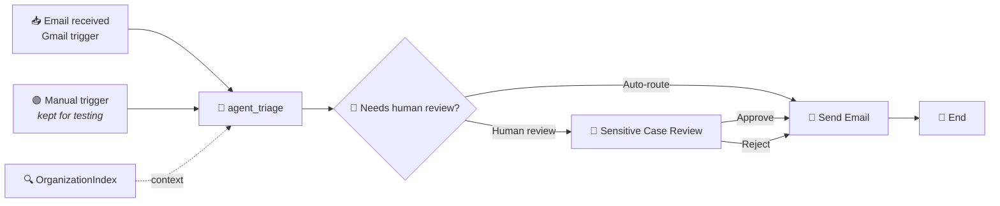

# Chapter 09: Receiving Emails

Your flow now does the whole job: it reads a customer email, grounds itself in the real department directory, classifies, stops for a human when the case is sensitive, and sends the result on. Everything except start by itself.

Somebody still has to press the button. `core.trigger.manual` is exactly what its name says - a human, or an API caller, kicking off each run. That is perfect for building and testing, and useless in production. Support mailboxes do not wait to be polled by a person.

In this chapter you will give `EmailTriage` a real front door: a **Gmail connector trigger** that watches an inbox and starts a flow run for every message that arrives.



Two entry points, one flow. That is deliberate, and Section 4 is about the one thing it breaks.

> 💡 **Choose Your Starting Point:**
>
> **Mode 1: 🔄 Reset to the Chapter 08 End State**
>
> 💬 *Prompt your AI Coding Agent:*
> ```text
> Confirm we are at the Chapter 08 end state before starting Chapter 09. TutorialSolution/EmailTriage must validate and must contain the manual trigger, the Triage AI Agent with its OrganizationIndex context, the decision node, the Quick Form task and the Gmail Send Email node. If an email-received trigger node from an earlier run of this chapter is present, remove it and restore the agent's input binding to the manual trigger only.
> ```
> 💻 *Underlying CLI Commands:*
> ```bash
> cd ./TutorialSolution
> uip maestro flow validate EmailTriage/EmailTriage.flow
> uip maestro flow node list EmailTriage/EmailTriage.flow --output json
> uip maestro flow node remove EmailTriage/EmailTriage.flow emailReceived1
> ```
>
> ---
>
> **Mode 2: ⚡ 1-Shot Autonomous Fast-Track**
> 💬 *Paste this master prompt into your coding assistant to execute the entire Chapter 09 in one turn:*
> ```text
> Give the EmailTriage flow a real front door so it starts by itself when a customer emails us:
> 1. Find the Gmail "Email Received" trigger node type in the flow registry and confirm it is enabled on my tenant.
> 2. Add it to the flow using my existing Gmail connection, polling the INBOX label.
> 3. Wire the trigger's output into the Triage AI Agent, keeping the manual trigger in place so I can still debug with typed input.
> 4. Give the agent a second input bound to the trigger's email body, and update its user prompt so it uses whichever of the two sources is non-empty.
> 5. Make every binding tolerate the other entry point not having fired. Both agent input bindings must use optional chaining, or the run faults the moment one trigger is absent.
> 6. Format and validate the flow, refresh and validate the inline agent, then run a cloud debug through the manual trigger to prove the existing path still works.
> ```
>
> ---
>
> **Mode 3: 📖 Step-by-Step Guided Walkthrough (Recommended for Learning)**
> Proceed through Sections 1 through 6 below, pasting each prompt step-by-step.

---

## 1. Triggers Are Entry Points, Not Nodes

A trigger is not "the first node". In BPMN terms it is a **start event**, and a flow may have several. Look at what the registry says about the Gmail trigger:

```json
"model": {
  "type": "bpmn:StartEvent",
  "entryPointId": true,
  "serviceType": "Intsvc.EventTrigger",
  "eventDefinition": "bpmn:MessageEventDefinition"
}
```

`entryPointId: true` is the same marker `core.trigger.manual` carries. Adding the Gmail trigger does not replace your manual one; it gives the flow a second independent way to begin. Each run starts from exactly one of them.

That is why this chapter keeps both. The manual trigger is how you will keep debugging with `--inputs` for the rest of the tutorial; the Gmail trigger is how the flow will run in production. Deleting the manual trigger to "clean up" costs you every test you have written.

| | Manual trigger | Gmail trigger |
| :--- | :--- | :--- |
| Node type | `core.trigger.manual` | `uipath.connector.trigger.uipath-google-gmail.email-received` |
| Starts a run when | you call it, with typed inputs | a message lands in the watched label |
| Works in `flow debug` | yes | **no** - see Section 6 |
| Belongs in production | no | yes |

---

## 2. Finding the Trigger

### 💬 Prompt Your AI Coding Agent (Recommended)

```text
Find the Gmail "Email Received" trigger in the flow registry, confirm it is available on my tenant, and show me its event mode and the fields it returns for each email.
```

### 💻 Underlying CLI Commands (What the Agent Executes)

```bash
cd ./TutorialSolution

# 1. Find it. Trigger types are uipath.connector.trigger.*, distinct from
#    the uipath.connector.* activities used in Chapter 08.
uip maestro flow registry search "gmail" --output json \
  --output-filter "[*].{NodeType:NodeType,DisplayName:DisplayName,Avail:AvailableOnTenant}"

# 2. Inspect it. Trigger nodes need --connection-id or the lookup fails.
uip maestro flow registry get \
  "uipath.connector.trigger.uipath-google-gmail.email-received" \
  --connection-id <CONNECTION_ID> --output json
```

> ⚠️ **`registry get` on a trigger without `--connection-id` fails outright:**
> ```text
> Error retrieving node
> Trigger nodes require --connection-id for IS enrichment. Provide it with --connection-id <id>.
> ```
> Activities do not need it; triggers do, because Integration Service has to enrich the manifest with what your specific connection can actually watch. Reuse the connection GUID you found in Chapter 08.

The enriched manifest answers the two questions that matter:

- **`eventMode: "polling"`** - Gmail is polled rather than pushed, so expect latency measured in minutes, not milliseconds.
- **`eventParameters`** requires `ParentFolders[*].ID`, the label to watch. For Gmail the inbox label is literally `INBOX`.

It also lists 24 output fields per email. The ones you will use:

| Field | Contents |
| :--- | :--- |
| `Body` | the message text - this is the one the agent needs |
| `Subject` | subject line |
| `From.Email`, `From.Name` | the sender |
| `ID`, `ThreadID` | Gmail identifiers, useful for replying in-thread |
| `HasAttachments` | boolean |

---

## 3. Adding and Configuring the Trigger

Triggers are **CLI-owned**, exactly like the connector activity in Chapter 08: `node add`, then `node configure --detail`. The `detail` shape differs though - triggers take `eventMode` and `eventParameters` where activities took `method`, `endpoint` and `bodyParameters`.

### 💬 Prompt Your AI Coding Agent (Recommended)

```text
Add the Gmail Email Received trigger to EmailTriage using my existing Gmail connection, set to poll the INBOX label, and label the node "Email received".
```

### 💻 Underlying CLI Commands (What the Agent Executes)

```bash
cd ./TutorialSolution

uip maestro flow node add EmailTriage/EmailTriage.flow \
  "uipath.connector.trigger.uipath-google-gmail.email-received" --output json

uip maestro flow node configure EmailTriage/EmailTriage.flow emailReceived1 --detail '{
  "connectionId": "<CONNECTION_ID>",
  "folderKey": "<FOLDER_KEY>",
  "eventMode": "polling",
  "eventParameters": { "ParentFolders[*].ID": "INBOX" }
}' --output json
```

A successful configure reports four bindings rather than Chapter 08's two - the connection, the folder, and the trigger's own event registration:

```json
{ "NodeId": "emailReceived1", "BindingsCreated": 4, "DetailPopulated": true }
```

Then wire its single `output` handle into the agent:

```json
{
  "id": "edge_emailReceived1_output_agent_triage_input",
  "sourceNodeId": "emailReceived1",
  "sourcePort": "output",
  "targetNodeId": "agent_triage",
  "targetPort": "input"
}
```

---

## 4. The Problem With Two Entry Points

This is the part worth slowing down for, because the failure is loud, immediate, and completely non-obvious the first time.

The agent takes its email text from `$vars.start.output.emailBody`. Add a second input bound to `$vars.emailReceived1.output.Body` and the flow validates cleanly - then faults on the very first manual run:

```text
[400300] Error evaluating expression in activity inputs (element agent_triage)
Failed to evaluate expression =js:vars.emailReceived1.output.Body
Error: Cannot read property 'Body' of null
```

Read it carefully. Nothing is misspelled and no path is wrong. The trigger simply **did not fire** on this run, so `emailReceived1.output` is `null`, and reading `.Body` off `null` throws.

This is the tax on multiple entry points: **every binding must tolerate the other entry point being absent.** The fix is optional chaining, on both bindings, not just the new one:

```json
"agentInputVariables": [
  {
    "id": "start__output__emailBody",
    "type": "string",
    "binding": "=$vars.start?.output?.emailBody"
  },
  {
    "id": "emailReceived1__output__Body",
    "type": "string",
    "binding": "=$vars.emailReceived1?.output?.Body"
  }
]
```

> 💡 **Why both.** It is tempting to guard only the new binding, since the manual trigger is "the one that always works". It is not: on a real inbound email the manual trigger is the absent one, and an unguarded `$vars.start.output.emailBody` throws exactly the same way in production - where nobody is watching a debug console. Guard every binding that reads from a trigger the moment a flow has more than one.

> ⚠️ **`validate` cannot catch this.** `uip maestro flow validate` returns `"Valid"` for the unguarded version, because the expression is syntactically fine and the null only exists at runtime. Third time this tutorial has made the same point, and the last: a green validate is a spell-check, not a test.

### 💬 Prompt Your AI Coding Agent (Recommended)

```text
Wire the Gmail trigger into the Triage AI Agent in EmailTriage, keeping the manual trigger working:
- Add a second agent input bound to the trigger's Body field.
- Make both agent input bindings use optional chaining so that whichever trigger did not fire evaluates to nothing instead of throwing.
- Add the new input to the agent's inputSchema, and rewrite the user prompt so it uses whichever of the two sources has content and ignores the empty one.
Then format and validate the flow, and refresh and validate the inline agent.
```

### 💻 Underlying CLI Commands (What the Agent Executes)

```bash
cd ./TutorialSolution

uip maestro flow format EmailTriage/EmailTriage.flow
uip maestro flow validate EmailTriage/EmailTriage.flow

uip agent refresh EmailTriage/<agentId> --inline-in-flow \
  --bindings-target EmailTriage/bindings_v2.json --output json
uip agent validate EmailTriage/<agentId> --inline-in-flow --output json
```

---

## 5. Teaching the Agent to Read Either Source

The agent now receives two inputs and exactly one of them has content. Say so in the prompt rather than hoping the model works it out:

```text
Triage the following customer email.

Exactly one of the two sources below carries content, depending on whether this run was
started manually for testing or by an inbound email. Use whichever one is non-empty and
ignore the other. If both are empty, follow the empty-email rule in your instructions.

Manually supplied email:
{{input.start__output__emailBody}}

Inbound email body:
{{input.emailReceived1__output__Body}}
```

The matching `inputSchema` entry:

```json
"emailReceived1__output__Body": {
  "type": "string",
  "description": "Bound from the Gmail trigger's email body"
}
```

> 💡 **The three-part rule from Chapter 04 still holds, and now applies twice.** Every flow value reaching an inline agent needs all three: the flow node's `agentInputVariables[].binding` for delivery, a matching `inputSchema` key for the contract, and an `{{input.<key>}}` token for resolution. Miss the schema entry and the token renders empty while everything reports `Valid`. Run `uip agent refresh` afterwards so `contentTokens` regenerates - never hand-write them. A correct refresh leaves two `variable` tokens in the user message:
> ```text
> input.start__output__emailBody
> input.emailReceived1__output__Body
> ```

---

## 6. Testing: What You Can and Cannot Prove Locally

Here is the honest constraint of this chapter. **A connector trigger does not fire during `uip maestro flow debug`.** Debug starts a run directly; it does not stand up a polling subscription against your mailbox. The trigger only becomes live once the flow is deployed as a process, which is Chapter 10.

So this chapter has two kinds of test.

### 6.1 The regression test you can run now

Prove that adding the trigger did not break the path you already had.

### 💬 Prompt Your AI Coding Agent (Recommended)

```text
Debug EmailTriage through the manual trigger with emailBody: "I recently placed an order and forgot to enter my discount code at checkout."

Confirm from the payload that the run completed, which elements ran, what category came back, and that the email node still returned a real message id.
```

### 💻 Underlying CLI Command (What the Agent Executes)

```bash
cd ./TutorialSolution
uip maestro flow debug EmailTriage \
  --inputs '{"emailBody": "I recently placed an order and forgot to enter my discount code at checkout."}'
```

A healthy result, with the trigger present but not fired:

```json
{
  "finalStatus": "Completed",
  "elements": ["start", "agent_triage", "sendEmail1", "end1"],
  "globals": {
    "category": "Promotions & Discounts",
    "sendEmail1.output": { "id": "1a059bdaad599a7e" }
  }
}
```

`emailReceived1` is absent from `elements` - correct, it did not fire - and nothing threw. That is the whole point of Section 4's optional chaining, demonstrated.

### 6.2 The end-to-end test after deployment

Once Chapter 10 deploys the flow, the trigger goes live and the real test is simply to **send an email to the watched inbox and wait**. Polling means minutes, not seconds.

### 💬 Prompt Your AI Coding Agent (Recommended)

```text
I have sent a test email to the watched inbox. List the most recent EmailTriage flow instances and tell me whether one started on its own, without me triggering it. For that instance, show me what the agent received as input.
```

### 💻 Underlying CLI Commands (What the Agent Executes)

```bash
uip maestro flow instance list -f <folderKey> --limit 10 --output table

uip maestro flow instance element-executions <instanceId> -f <folderKey> --output json
```

An instance whose `Source` is not `Studio Web Debug`, that you did not start, is the proof. Its `elements` should contain `emailReceived1`, and the agent's input should carry your test message rather than an empty string.

> 💡 **Watch what you point it at.** `INBOX` means every message, including newsletters, notifications and the triage summaries Chapter 08 sends to that same address - which will happily trigger the flow again on its own output. For anything beyond a demo, watch a dedicated label such as `support`, and set up a Gmail filter that routes real customer mail into it. The `filterFields` in the trigger manifest (`To[*].Email`, `CC[*].Email`, `HasAttachments`) let you narrow further at the trigger itself.

---

## 7. Summary Checklist

- [x] Understood that a trigger is a BPMN **start event** with `entryPointId: true`, and that a flow may have several.
- [x] Kept the manual trigger for testing while adding the Gmail trigger for production.
- [x] Learned that `registry get` on a trigger **requires `--connection-id`** while activities do not.
- [x] Configured a trigger with `eventMode` and `eventParameters`, not the `method` / `endpoint` / `bodyParameters` shape used by activities.
- [x] Hit `400300 Cannot read property 'Body' of null` and understood why two entry points break unguarded bindings.
- [x] Applied optional chaining to **every** trigger-sourced binding, not only the new one.
- [x] Wired a second agent input through all three required parts: binding, `inputSchema` key, and `{{input.…}}` token.
- [x] Proved the manual path still works with the trigger present, and understood why the trigger itself cannot be tested until Chapter 10.

---

## 🔗 Navigation Links
- ⬅️ [Back to Chapter 08: Sending Emails](./08-SendingEmails.md)
- 🏠 [Return to Main README](../README.md)
- ➡️ [Proceed to Chapter 10: Deployment](./10-Deployment.md)
