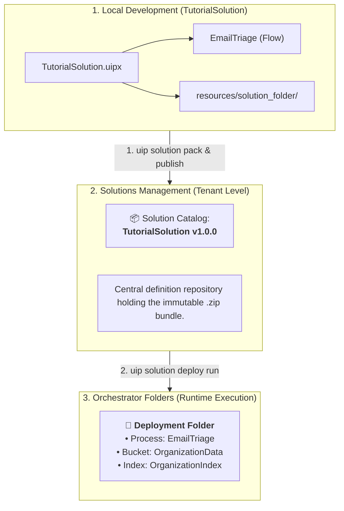

# Chapter 10: Deployment

When building automations using **UiPath Solutions**, you publish and deploy entire systems (flows, inline agents, and the cloud resources they depend on) together as one unified bundle - not process by process. 

In this chapter, you will learn where and how your **`TutorialSolution`** is represented inside **UiPath Automation Cloud** and **Orchestrator**, and how to package and deploy it via CLI.

> 💡 **Choose Your Starting Point:**
>
> **Mode 1: 🔄 Reset Solution (Clean State)**
> 💬 *Prompt your AI Coding Agent:*
> ```text
> Clean and verify that TutorialSolution contains the EmailTriage project ready for packaging.
> ```
>
> ---
>
> **Mode 2: ⚡ 1-Shot Autonomous Fast-Track**
> 💬 *Paste this master prompt into your coding assistant to execute the entire Chapter 10 in one turn:*
> ```text
> Perform the complete Chapter 10 deployment:
> 1. Pack TutorialSolution into a deployable solution zip package version 1.0.0.
> 2. Publish dist/TutorialSolution.1.0.0.zip to the tenant solution feed and list the available packages.
> 3. Deploy the TutorialSolution package version 1.0.0 as a new deployment under the 'Shared' parent folder, and track the deployment until it finishes.
> 4. List the provisioned processes in the deployment folder to verify runtime deployment.
> ```
>
> ---
>
> **Mode 3: 📖 Step-by-Step Guided Walkthrough (Recommended for Learning)**
> Proceed through Sections 1 through 4 below, pasting each prompt step-by-step.



---

## 1. Solutions Management vs. Orchestrator: The Separation of Concerns

A critical architectural distinction in modern UiPath Cloud:

| Layer | Where to Find in Cloud UI | Primary Responsibility |
| :--- | :--- | :--- |
| **Solutions Management** | Left Navigation ➔ **Solutions** | The **Tenant-Level Catalog**. Stores packaged solution versions (`.zip`), dependencies, resource schemas, and variable contracts. |
| **Orchestrator** | Left Navigation ➔ **Orchestrator** | The **Execution Engine**. Holds specific runtime instances inside Folders (Processes, Triggers, Jobs, Assets, Queues, Logs). |

---

## 2. Packaging the Solution

From the root of `TutorialSolution`, pack the entire system - the `EmailTriage` flow with its inline agent, plus the declared bucket and index resources - into a deployable `.zip` archive:

### 💬 Prompt Your AI Coding Agent (Recommended)
```text
Pack TutorialSolution into a deployable solution zip package version 1.0.0.
```

### 💻 Underlying CLI Command (What the Agent Executes)
```bash
# <solutionPath> <output-path>: pack the solution directory into ./dist
uip solution pack . ./dist --version 1.0.0
```

> **What happens under the hood:**
> The CLI reads `TutorialSolution.uipx`, packs each registered project (`EmailTriage`), gathers declarative resource definitions from `resources/solution_folder/`, and outputs `dist/TutorialSolution.1.0.0.zip`.

---

## 3. Publishing to the Solution Feed

Publish the packaged solution archive to your tenant's solution feed, where Solutions Management picks it up:

### 💬 Prompt Your AI Coding Agent (Recommended)
```text
Publish dist/TutorialSolution.1.0.0.zip to the tenant solution feed and list the packages so I can confirm the version arrived.
```

### 💻 Underlying CLI Commands (What the Agent Executes)

```bash
# 1. Publish the packed .zip to the tenant solution feed
uip solution publish ./dist/TutorialSolution.1.0.0.zip

# 2. Confirm the package and version are in the catalog
uip solution packages list --limit 50
```

> ⚠️ **`publish`, not `upload`.** `uip solution upload` is a different command for a different destination: it pushes your **source** solution to Studio Web for browser-based editing, and force-uploading over an existing Studio Web solution wipes its version history. The deployment chain is always `pack` then `publish` then `deploy run`.

---

## 4. Deploying into an Orchestrator Folder

Once the package is in the catalog, deploy an active instance of it. A deployment creates its **own new Orchestrator folder** (named by `--folder-name`) under the parent you choose, and provisions every resource the solution declares into it:

### 💬 Prompt Your AI Coding Agent (Recommended)
```text
Deploy the TutorialSolution package version 1.0.0 as a deployment named TutorialSolutionProd, creating its folder under the Shared parent folder. Track the deployment until it reports success, then list the provisioned runtime processes in the new folder.
```

### 💻 Underlying CLI Commands (What the Agent Executes)

```bash
# 1. Deploy: creates folder Shared/TutorialSolutionProd and activates by default
uip solution deploy run \
  --name "TutorialSolutionProd" \
  --package-name "TutorialSolution" \
  --package-version "1.0.0" \
  --folder-name "TutorialSolutionProd" \
  --parent-folder-path "Shared"

# 2. deploy run returns a pipeline deployment id - poll it to completion
uip solution deploy status <pipeline-deployment-id>

# 3. List the processes provisioned into the new folder
uip or processes list --folder-path "Shared/TutorialSolutionProd"
```

> 💡 **This is the moment the Chapter 09 trigger goes live.** A deployed process brings its connector triggers with it: from now on an email arriving in the watched inbox starts a run on its own. Send one and watch `uip maestro flow instance list` for an instance you did not start - the end-to-end test Section 6.2 of Chapter 09 promised.

---

## 5. Summary Checklist

- [x] Understood the architectural boundary between **Solutions Management** (Catalog) and **Orchestrator** (Execution).
- [x] Packaged `TutorialSolution` - the flow, its inline agent, and its declared resources - into a `.zip` bundle using `uip solution pack`.
- [x] Published the bundle to the tenant solution feed using `uip solution publish`, and learned why `upload` is not the deployment command.
- [x] Deployed with `uip solution deploy run`, tracked it with `deploy status`, and verified the provisioned processes in the new folder.

---

## 🔗 Navigation Links
- ⬅️ [Back to Chapter 09: Receiving Emails](./09-ReceivingEmails.md)
- 🏠 [Return to Main README](../README.md)
