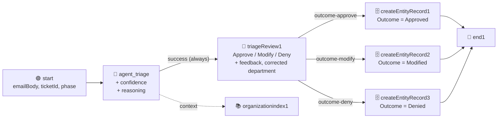

# Chapter 10: V1 - Every Review Becomes a Row

Part 4: V1 - Cold Start

Chapter 08 decided what the first phase is for: **produce evidence**. Every email goes to a reviewer, and every verdict is written to `TriageDecision`. This chapter builds exactly that on top of the Chapter 07 flow. Nothing in it is clever. Its whole value is that at the end, a human decision leaves a row behind that a later version of the flow can read.



Three things change against Chapter 07, and one thing goes away:

| | Chapter 07 | Chapter 10 (V1) |
| :--- | :--- | :--- |
| Flow inputs | `emailBody` | `emailBody`, `ticketId`, `phase` |
| Agent outputs | `category`, `urgencyScore`, `requiresEscalation`, `actionItems` | plus `confidence` (number) and `reasoning` (string) |
| Who reviews | only cases where `requiresEscalation` is true | **everyone** |
| Quick Form | Approve / Reject, one note | Approve / Modify / Deny, a feedback note and a corrected department |
| After the form | End | a Data Fabric write, then End |
| The gateway | branches on `requiresEscalation` | **removed for now.** It comes back in Chapter 12 with a richer expression. |

> 💡 **Why remove the Chapter 07 gateway rather than keep it?** In V1 every email is reviewed, so a gate that sends *some* emails to review has nothing to decide. Keeping it with a hard-coded `true` would teach students to leave dead logic in a graph. Chapter 12 puts a decision node back in the same place, with the confidence rule and the Human Review floor in one visible expression. The Chapter 07 lesson (the gate lives in the graph, not in the prompt) is not lost; it is applied twice.

> 💡 **Choose Your Starting Point:**
>
> **Mode 1: 🔄 Reset to the Chapter 07 End State**
>
> 💬 *Prompt your AI Coding Agent:*
> ```text
> Prepare a clean baseline for Chapter 10. First confirm the Chapter 07 end state: TutorialSolution/EmailTriage must validate, its Triage AI Agent must be wired to the OrganizationIndex context node, and the OrganizationIndex in the TutorialSolution folder must report a successful ingestion. Then confirm the Chapter 09 entity: TriageDecision must exist and hold no rows with Phase 1; delete any that are there. If the flow already contains Create Entity Record nodes from an earlier run of this chapter, remove them and their edges.
> ```
> 💻 *Underlying CLI Commands:*
> ```bash
> cd ./TutorialSolution
>
> # 1. The Chapter 07 flow must still compile and the index must still be ingested
> uip maestro flow validate EmailTriage/EmailTriage.flow
> uip maestro flow registry pull --force && uip maestro flow registry search "OrganizationIndex" --output json   # the index must be listed; check its Sync status in Orchestrator
>
> # 2. The entity exists - and Phase 1 rows from an earlier run are deleted one by one
> ENTITY_ID=$(uip df entities list --output plain --output-filter "[?Name=='TriageDecision'].Id | [0]")
> for ID in $(uip df records list "$ENTITY_ID" --limit 100 --output plain --output-filter "Items[?Phase==\`1\`].Id"); do
>   uip df records delete "$ENTITY_ID" "$ID" --yes --reason "Chapter 10 reset: Phase 1 rows"
> done
> uip df records list "$ENTITY_ID" --limit 100 --output plain --output-filter "length(Items[?Phase==\`1\`])"   # must print 0
>
> # 3. Remove write nodes left over from an earlier attempt, if any
> uip maestro flow node remove EmailTriage/EmailTriage.flow createEntityRecord1
> uip maestro flow node remove EmailTriage/EmailTriage.flow createEntityRecord2
> uip maestro flow node remove EmailTriage/EmailTriage.flow createEntityRecord3
> ```
>
> ---
>
> **Mode 2: ⚡ 1-Shot Autonomous Fast-Track**
> 💬 *Paste this master prompt into your coding assistant to execute the entire Chapter 10 in one turn:*
> ```text
> Turn the EmailTriage flow into phase 1 of the three-phase design: every email is reviewed by a human, and every verdict is written to the TriageDecision entity.
> 1. Add two flow inputs on the Start trigger: ticketId (string) and phase (number).
> 2. Add two typed outputs to the Triage AI Agent: confidence (number, 0 to 100) and reasoning (string). Extend the system prompt with numbered confidence rules applied in order: first, at most 50 when the chosen department has Human Review = Required, whatever the match quality; otherwise 75 to 85 when exactly one department fits, 50 to 74 when two fit or the email mixes topics, below 50 when nothing fits; and never above 85 in any case because no human precedent exists yet. The reasoning must name the Handles text that matched and the rule number that set the confidence.
> 3. Remove the decision node and wire the agent's success handle straight into a new Quick Form titled "Triage Review", replacing the Chapter 07 form. Show the reviewer the email, ticket id, department, urgency, confidence and reasoning as read-only fields. Give them a feedback note and a corrected department as editable fields, and three outcomes: Approve, Modify and Deny.
> 4. Find the UiPath Data Fabric connection in my tenant. Add three Create Entity Record connector nodes writing to TriageDecision, one per outcome, each wired from the matching outcome handle and into the End node. Approve writes the agent's department with Outcome 1; Modify writes the reviewer's corrected department as Department, the agent's as ProposedDepartment, the feedback, and Outcome 2; Deny writes the agent's department, the feedback, and Outcome 3. All three write TicketId, Phase, EmailBody, Confidence, HumanReviewRequired and Reasoning.
> 5. Keep the reviewOutcome and reviewerNote flow outputs, reviewerNote now carrying the feedback field.
> 6. Format and validate the flow, refresh and validate the inline agent.
> 7. Run a cloud debug with ticketId T01, phase 1, and the body of ticket T01 from Data/TriageBatch.csv. Tell me when the task is waiting in Action Center. After I approve it, prove the write from the entity: list the TriageDecision rows with Phase 1 and show the row for T01 with its Department, Outcome and Confidence.
> ```
>
> ---
>
> **Mode 3: 📖 Step-by-Step Guided Walkthrough (Recommended for Learning)**
> Proceed through Sections 1 through 7 below, pasting each prompt step-by-step.

---

## 1. Two More Flow Inputs

The flow needs to know which ticket it is handling and which phase of the design is running, because both end up in the row. Neither is something the agent should invent.

### 💬 Prompt Your AI Coding Agent (Recommended)

```text
In TutorialSolution/EmailTriage, add two flow input arguments on the Start trigger next to emailBody: ticketId (string) and phase (number). Then validate the flow.
```

### 💻 Underlying CLI Command (What the Agent Executes)

```bash
cd ./TutorialSolution
uip maestro flow validate EmailTriage/EmailTriage.flow --output json
```

The inputs are two more entries in `variables.globals`, each bound to the trigger node like `emailBody` already is:

```json
{ "id": "ticketId", "direction": "in", "type": "string", "defaultValue": "", "triggerNodeId": "start" },
{ "id": "phase",    "direction": "in", "type": "number", "defaultValue": 1,  "triggerNodeId": "start" }
```

> 💡 **The runtime path is `$vars.start.output.phase`,** not `$vars.phase`, for the same reason Chapter 07 gave for `emailBody`: the global is bound to the trigger node. Every binding below uses the `start.output.` form.

---

## 2. Teaching the Agent to Say How Sure It Is

Chapter 08 explained why a self-reported percentage is worthless. The agent gets two new outputs, and the prompt prescribes the number instead of asking for a feeling.

### 💬 Prompt Your AI Coding Agent (Recommended)

```text
In TutorialSolution/EmailTriage, add two typed outputs to the Triage AI Agent and forward both through the End node:
- confidence (number): how sure the agent is that category is the right department, from 0 to 100.
- reasoning (string): two to four sentences naming the Handles text from the retrieved directory that matched, and which confidence rule applied.

Extend the system prompt with these confidence rules, stated as numbered rules applied in order rather than as a judgement:
1. If the chosen department has Human Review = Required, confidence is at most 50. This rule wins over every rule below, however well the Handles text matches.
2. Otherwise 75 to 85 when exactly one department's Handles text covers the request.
3. Otherwise 50 to 74 when two departments fit about equally, or the email mixes several topics.
4. Below 50 when no department fits.
5. Never above 85 in any case: there is no human precedent yet to justify more.

Keep the existing four outputs and their meaning unchanged. Then refresh and validate the inline agent and validate the flow.
```

### 💻 Underlying CLI Commands (What the Agent Executes)

```bash
cd ./TutorialSolution

# The schema and the prompt live in agent.json; refresh regenerates contentTokens from it
uip agent refresh EmailTriage/<agentId> --inline-in-flow \
  --bindings-target EmailTriage/bindings_v2.json --output json
uip agent validate EmailTriage/<agentId> --inline-in-flow --output json
uip maestro flow validate EmailTriage/EmailTriage.flow --output json
```

The three places that must agree, as in Chapter 05: `outputSchema.properties` in `agent.json`, the node's `agentOutputVariables` in the flow, and the End node outputs:

```json
"agentOutputVariables": [
  { "id": "category", "type": "string" },
  { "id": "urgencyScore", "type": "number" },
  { "id": "requiresEscalation", "type": "boolean" },
  { "id": "actionItems", "type": "array" },
  { "id": "confidence", "type": "number" },
  { "id": "reasoning", "type": "string" }
]
```

> ⚠️ **Put the Required rule first, and say it wins.** Verified with gpt-4o: as a bullet among equals ("never above 50 when Required") the rule is ignored, and a GDPR letter routed to Legal & Compliance came back at 85 with a reasoning that cited only the matching Handles text. Numbered and placed first, with "this rule wins over every rule below", the same email drops to 50 or less. Language models apply the rule they read first; put the floor there.

> 💡 **Why the cap at 85 is written into the V1 prompt.** It looks pointless now: nothing reads the number in V1. It matters in Chapter 12, when the gate opens at 90. A V1 row with confidence 97 would let the V2 agent cite "97" as if it had been earned. Capping V1 at 85 keeps every V1 row honest: it says "one department fit, nobody had checked yet".

---

## 3. The Review Form, Rebuilt for Three Verdicts

The Chapter 07 form asked one question: is this sensitive case acceptable? The V1 form asks a different one: **is the agent's proposal right, and if not, what is?** That needs a third button and a second editable field.

### 💬 Prompt Your AI Coding Agent (Recommended)

```text
In TutorialSolution/EmailTriage, remove the decision node and the Chapter 07 Quick Form. Add a new Quick Form human task titled "Triage Review" with Normal priority, wired directly from the Triage AI Agent's success handle so every email reaches it.

Read-only fields: the customer email, the ticket id, the department the agent proposed, the urgency score, the confidence and the reasoning.
Editable fields: a feedback note, and a corrected department the reviewer fills in only when they pick Modify.
Outcomes: Approve, Modify and Deny, all of which let the flow continue.

Declare the three outcome handles in the flow's cached definition for the Quick Form so per-outcome edges validate. Assign the task to me. Format and validate the flow.
```

### 💻 Underlying CLI Commands (What the Agent Executes)

```bash
cd ./TutorialSolution

# 1. Out with the gateway and the Chapter 07 form (edges attached to them go too)
uip maestro flow node remove EmailTriage/EmailTriage.flow decision1
uip maestro flow node remove EmailTriage/EmailTriage.flow sensitiveCaseReview1

# 2. Scaffold the new form in one command
uip maestro flow hitl add EmailTriage/EmailTriage.flow \
  --label "Triage Review" --priority Medium \
  --assignee "you@yourcompany.com" \
  --schema '{"title":"Triage Review","inputs":[{"name":"emailbody","binding":"start.output.emailBody"},{"name":"ticketid","binding":"start.output.ticketId"},{"name":"department","binding":"agent_triage.output.category"},{"name":"urgency","binding":"agent_triage.output.urgencyScore"},{"name":"confidence","binding":"agent_triage.output.confidence"},{"name":"reasoning","binding":"agent_triage.output.reasoning"}],"outputs":[{"name":"feedback","variable":"feedback"},{"name":"correcteddepartment","variable":"correctedDepartment"}],"outcomes":[{"name":"Approve"},{"name":"Modify"},{"name":"Deny"}]}' \
  --output json

# 3. Wire the agent straight into the form (the edge to the End node is replaced in Section 4)
uip maestro flow edge add EmailTriage/EmailTriage.flow agent_triage triageReview1 --source-port success

uip maestro flow format EmailTriage/EmailTriage.flow
uip maestro flow validate EmailTriage/EmailTriage.flow
```

The per-outcome handles are `outcome-approve`, `outcome-modify` and `outcome-deny`. As in Chapter 07, they have to be declared in the flow's cached `definitions[]` entry for `uipath.human-in-the-loop.quick-form` (right side, next to `completed`), or the validator rejects the edges as undeclared. The assignee follows the Chapter 07 rule too: the canvas picker resolves it to `{ "type": "user", "value": "...", "displayName": "..." }`, and a `user` assignee without `displayName` faults at task creation.

> ⚠️ **Field ids are lowercase and the runtime keys the result by id.** The corrected department is read back as `$vars.triageReview1.output.correcteddepartment`, the feedback as `$vars.triageReview1.output.feedback`. Chapter 07's warning applies unchanged: the `variable` alias is not the path.

---

## 4. Writing the Row: One Connector Node per Verdict

Here is the heart of the chapter. Data Fabric is reached from a flow through the **UiPath Data Fabric connector** in Integration Service, and connector nodes are CLI-owned: `node add`, then `node configure`, exactly as the Gmail node in Chapter 13 will be. The entity, the fields and the values all go into one `--detail` envelope.

Three nodes, because the three verdicts write different things:

| Node | Wired from | `Department` | `ProposedDepartment` | `Outcome` | `Feedback` |
| :--- | :--- | :--- | :--- | :--- | :--- |
| `createEntityRecord1` | `outcome-approve` | the agent's `category` | the agent's `category` | `1` (Approved) | empty |
| `createEntityRecord2` | `outcome-modify` | the reviewer's `correcteddepartment` | the agent's `category` | `2` (Modified) | the reviewer's `feedback` |
| `createEntityRecord3` | `outcome-deny` | the agent's `category` | the agent's `category` | `3` (Denied) | the reviewer's `feedback` |

All three write `TicketId`, `Phase`, `EmailBody`, `Confidence`, `HumanReviewRequired` and `Reasoning` from the same sources.

### 💬 Prompt Your AI Coding Agent (Recommended)

```text
In TutorialSolution/EmailTriage, find the UiPath Data Fabric connection in my tenant (search the registry for the Create Entity Record connector node first, then list connections for that connector key across all folders).

Add three Create Entity Record connector nodes writing to the TriageDecision entity, configured with that connection:
- createEntityRecord1, wired from the Quick Form's Approve outcome: Department and ProposedDepartment are the agent's category, Outcome is 1.
- createEntityRecord2, wired from Modify: Department is the reviewer's corrected department, ProposedDepartment is the agent's category, Feedback is the reviewer's note, Outcome is 2.
- createEntityRecord3, wired from Deny: Department and ProposedDepartment are the agent's category, Feedback is the reviewer's note, Outcome is 3.
All three write TicketId and Phase from the flow inputs, EmailBody, Confidence and Reasoning from the agent, and HumanReviewRequired from the agent's requiresEscalation. Numbers and booleans must be typed bindings, not text.

Wire each write node's output into the End node. Format and validate the flow.
```

### 💻 Underlying CLI Commands (What the Agent Executes)

```bash
cd ./TutorialSolution

# 1. The node type and the connection - never guess the connector key from the product name
uip maestro flow registry search "Create Entity Record" --output json \
  --output-filter "[?contains(NodeType,'uipath.connector.')].{NodeType:NodeType,Avail:AvailableOnTenant}"
uip is connections list "uipath-uipath-dataservice" --all-folders --output json \
  --output-filter "[?State=='Enabled'].{Id:Id,Folder:Folder,FolderKey:FolderKey}"

# 2. Three nodes of the same type; the CLI numbers them 1, 2, 3 in order
for i in 1 2 3; do
  uip maestro flow node add EmailTriage/EmailTriage.flow \
    "uipath.connector.uipath-uipath-dataservice.create-entity-record" --output json
done

# 3. Configure the Approve write (Modify and Deny differ only in the body, see below)
uip maestro flow node configure EmailTriage/EmailTriage.flow createEntityRecord1 --detail '{
  "connectionId": "<CONNECTION_ID>",
  "folderKey": "<CONNECTION_FOLDER_KEY>",
  "method": "POST",
  "endpoint": "/v2/{entityName}/CreateEntityRecord",
  "pathParameters": { "entityName": "TriageDecision" },
  "bodyParameters": {
    "TicketId": "{{ $vars.start.output.ticketId }}",
    "Phase": "=js:$vars.start.output.phase",
    "EmailBody": "{{ $vars.start.output.emailBody }}",
    "ProposedDepartment": "{{ $vars.agent_triage.output.category }}",
    "Department": "{{ $vars.agent_triage.output.category }}",
    "Outcome": 1,
    "Confidence": "=js:$vars.agent_triage.output.confidence",
    "HumanReviewRequired": "=js:$vars.agent_triage.output.requiresEscalation",
    "Reasoning": "{{ $vars.agent_triage.output.reasoning }}"
  }
}' --output json

# 4. Wire each verdict to its write node, and each write node to the End node
uip maestro flow edge add EmailTriage/EmailTriage.flow triageReview1 createEntityRecord1 --source-port outcome-approve
uip maestro flow edge add EmailTriage/EmailTriage.flow triageReview1 createEntityRecord2 --source-port outcome-modify
uip maestro flow edge add EmailTriage/EmailTriage.flow triageReview1 createEntityRecord3 --source-port outcome-deny
for i in 1 2 3; do
  uip maestro flow edge add EmailTriage/EmailTriage.flow createEntityRecord$i end1
done

uip maestro flow format EmailTriage/EmailTriage.flow
uip maestro flow validate EmailTriage/EmailTriage.flow
```

The Modify body swaps two values and adds the feedback:

```json
"Department": "{{ $vars.triageReview1.output.correcteddepartment }}",
"ProposedDepartment": "{{ $vars.agent_triage.output.category }}",
"Feedback": "{{ $vars.triageReview1.output.feedback }}",
"Outcome": 2
```

and the Deny body keeps the agent's department, adds the feedback, and writes `"Outcome": 3`.

> 💡 **Where `endpoint` and the field names come from.** `uip maestro flow registry get` on the node type reports `"path": "/v2/{entityName}/CreateEntityRecord"` under `connectorMethodInfo`, and `uip is resources describe uipath-uipath-dataservice CreateEntityRecordCurated --operation Create --connection-id <id> -f entityName=TriageDecision` returns the entity's fields as `RequestFields`. They are the Chapter 09 attributes, with `Outcome` typed `integer`: the choice value's `NumberId`, exactly as in the Chapter 09 round trip.

> ⚠️ **Two binding syntaxes in one body, by field type.** `TicketId`, `EmailBody` and the department names are text, so they use Handlebars. `Phase`, `Confidence` and `HumanReviewRequired` are a number, a number and a boolean, so they use `=js:`. Write `"Phase": "{{ $vars.start.output.phase }}"` and the entity receives a string where it expects a number. This is the Chapter 05 rule again, now on the way *out* of the flow.

> 💡 **Why the connector node and not the canvas's own "Create entity record".** Studio Web's palette has a native Data Fabric node (`core.datafabric.create`). It relies on an entity binding that only the canvas can create; added from the CLI it validates, runs, and writes nothing. The connector node carries its own connection binding, so the CLI can build it end to end. Both write the same row.

---

## 5. Carrying the Verdict Out

The Chapter 07 outputs stay, with one change of source: the note is now the feedback field.

### 💬 Prompt Your AI Coding Agent (Recommended)

```text
In TutorialSolution/EmailTriage, keep the reviewOutcome and reviewerNote flow outputs. reviewOutcome is still the Quick Form status (Approve, Modify or Deny); reviewerNote now carries the feedback field of the new form. Add the agent's confidence and reasoning as flow outputs too. Validate the flow.
```

### 💻 Underlying CLI Command (What the Agent Executes)

```bash
cd ./TutorialSolution
uip maestro flow validate EmailTriage/EmailTriage.flow --output json
```

```json
"reviewOutcome": { "type": "string", "source": "{{ $vars.triageReview1.status }}" },
"reviewerNote":  { "type": "string", "source": "{{ $vars.triageReview1.output.feedback }}" },
"confidence":    { "type": "number", "source": "=js:$vars.agent_triage.output.confidence" },
"reasoning":     { "type": "string", "source": "{{ $vars.agent_triage.output.reasoning }}" }
```

---

## 6. Testing: One Email, One Row

Chapter 07 warned that a debug run pauses at the form and the CLI goes quiet. It does that again here, once per email. The test is one email through Approve, then the same email through Modify, and the proof is in the entity, not in the run.

### 💬 Prompt Your AI Coding Agent (Recommended)

```text
Run a cloud debug of TutorialSolution/EmailTriage with ticketId "T01", phase 1, and as emailBody the Body column of ticket T01 in Data/TriageBatch.csv. Tell me as soon as the run is waiting on the Triage Review task.

When it completes, report three things: the agent's JobArguments contained the real email, the agent returned a confidence of at most 85 with a reasoning that names a Handles text, and the write node's response carries a record Id. Then list the TriageDecision rows with Phase 1 and show me the T01 row: Department, Outcome and Confidence.
```

### 💻 Underlying CLI Commands (What the Agent Executes)

```bash
cd ./TutorialSolution

# 1. Start the run - it pauses at the form until the task is actioned in Action Center
uip maestro flow debug EmailTriage --inputs '{
  "ticketId": "T01",
  "phase": 1,
  "emailBody": "Hello, our auditor has asked for copies of all invoices from the last quarter. I only have the email receipts and cannot find the PDF versions anywhere. Could you tell me where I can download them for our account? Thanks, Anna"
}' --output json

# 2. The row is the proof
ENTITY_ID=$(uip df entities list --output plain --output-filter "[?Name=='TriageDecision'].Id | [0]")
uip df records list "$ENTITY_ID" --limit 100 --output table \
  --output-filter "Items[?Phase==\`1\`].{Ticket:TicketId,Dept:Department,Proposed:ProposedDepartment,Outcome:Outcome,Conf:Confidence,Feedback:Feedback}"
```

Press **Approve** in Action Center for the first run. Then run the same command again and press **Modify**, type `Accounts Receivable` as the corrected department and a one-line reason as feedback. The table should now show two `T01` rows: one with `Outcome 1`, one with `Outcome 2` whose `Dept` differs from its `Proposed`.

### ✅ The Checks That Prove the Chapter Worked

| Check | Where to look | What proves success |
| :--- | :--- | :--- |
| **1. The agent got the email** | `variables.elements`, entry `agent_triage`, `inputs.JobArguments` | `start__output__emailBody` is the invoice text |
| **2. The agent obeyed the rubric** | same entry, `outputs` | `confidence` is a number of at most 85; `reasoning` names a Handles text |
| **3. The write happened** | entry `createEntityRecord1` (or 2, 3), `outputs.response` | an `Id` GUID and the field values you sent |
| **4. The row exists** | `uip df records list` | the `T01` row with the right `Outcome` |
| **5. Nothing faulted** | `variables.globals` | every `<node>.error` is `null` |

> ⚠️ **Check 3 is the one people skip.** A connector node that faults reports `"Completed"` on the flow only if you wired its error handle; otherwise the run itself fails and the reason is in the incident. But a connector node whose body bindings resolved to `null` completes happily and writes a row full of empty fields. Read `inputs.body` on the write element and confirm every value is real before you trust the row.

> 💡 **Reattaching to a run you lost.** The debug command waits while the task is open. If the terminal is closed, the run continues without it. `uip maestro flow instance list --folder-key <key> --limit 5` finds the instance, `uip maestro flow debug-instance variables <instanceId>` reads its payload, and the entity check works regardless.

### 🧹 Leave the Entity Clean

The two test rows are Phase 1 rows and would count on the scoreboard. Delete them before Chapter 11 runs the real batch:

```bash
ENTITY_ID=$(uip df entities list --output plain --output-filter "[?Name=='TriageDecision'].Id | [0]")
for ID in $(uip df records list "$ENTITY_ID" --limit 100 --output plain --output-filter "Items[?Phase==\`1\`].Id"); do
  uip df records delete "$ENTITY_ID" "$ID" --yes --reason "Chapter 10 test rows"
done
uip df records list "$ENTITY_ID" --limit 100 --output plain --output-filter "length(Items[?Phase==\`1\`])"   # must print 0
```

---

## 7. Summary Checklist

- [x] Added `ticketId` and `phase` as flow inputs, bound to the trigger node.
- [x] Gave the agent `confidence` and `reasoning`, with the number prescribed by rules and capped at 85 while no precedent exists.
- [x] Replaced the sensitive-case form with a three-verdict Triage Review that every email reaches.
- [x] Built three Data Fabric writes as CLI-owned connector nodes, one per verdict, with typed bindings for numbers and booleans.
- [x] Proved a write by reading the row back from the entity, and understood why a connector node's `Completed` proves nothing on its own.
- [x] Left the entity empty of Phase 1 rows, ready for the batch.

---

## 🔗 Navigation Links
- ⬅️ [Back to Chapter 09: Data Fabric - Recording Every Triage Decision](./09-DataFabric.md)
- 🏠 [Return to Main README](../README.md)
- ➡️ [Proceed to Chapter 11: The Batch Runner and the Scoreboard](./11-BatchRunnerAndScoreboard.md)
