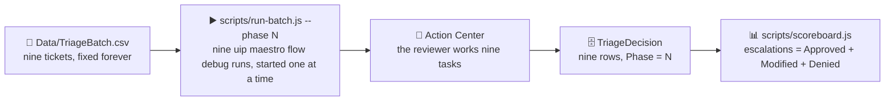

# Chapter 11: The Batch Runner and the Scoreboard

Part 4: V1 - Cold Start

Chapter 10 proved that one email leaves one row. This chapter runs the nine emails from Chapter 08 through the V1 flow, has the reviewer work the nine tasks once, and reads the first number off the scoreboard: **9 of 9 escalated**. The same runner and the same scoreboard are reused unchanged at the end of Chapters 12 and 14, which is the point: the curve is only meaningful if the batch and the measurement never change between phases.



> 💡 **Choose Your Starting Point:**
>
> **Mode 1: 🔄 Reset to the Chapter 10 End State**
>
> 💬 *Prompt your AI Coding Agent:*
> ```text
> Prepare a clean baseline for Chapter 11. Confirm TutorialSolution/EmailTriage validates and contains the Triage Review form and the three Create Entity Record nodes from Chapter 10. Then delete every TriageDecision row whose Phase is 1 and confirm none remain, so the batch starts from an empty phase.
> ```
> 💻 *Underlying CLI Commands:*
> ```bash
> cd ./TutorialSolution
> uip maestro flow validate EmailTriage/EmailTriage.flow
> uip maestro flow node list EmailTriage/EmailTriage.flow --output json --output-filter "[*].Id"
> cd ..
>
> ENTITY_ID=$(uip df entities list --output plain --output-filter "[?Name=='TriageDecision'].Id | [0]")
> for ID in $(uip df records list "$ENTITY_ID" --limit 100 --output plain --output-filter "Items[?Phase==\`1\`].Id"); do
>   uip df records delete "$ENTITY_ID" "$ID" --yes --reason "Chapter 11 reset: Phase 1 rows"
> done
> uip df records list "$ENTITY_ID" --limit 100 --output plain --output-filter "length(Items[?Phase==\`1\`])"   # must print 0
> ```
>
> ---
>
> **Mode 2: ⚡ 1-Shot Autonomous Fast-Track**
> 💬 *Paste this master prompt into your coding assistant to execute the entire Chapter 11 in one turn:*
> ```text
> Run the phase 1 batch of the triage lab and read the scoreboard:
> 1. Show me the nine tickets in Data/TriageBatch.csv as a table of TicketId and Subject. Never send the Kind column to the flow.
> 2. Run node scripts/run-batch.js --phase 1 from the repository root. It starts nine cloud debug runs of TutorialSolution/EmailTriage, one upload at a time, and each run pauses on a Triage Review task. Tell me when the nine tasks are waiting in Action Center and stop until I say the review is done.
> 3. When the runner returns, show me its summary table and check that all nine runs completed and that every category came from the department directory.
> 4. Run node scripts/scoreboard.js --phase 1 and report the escalation count. It must read 9 of 9: in phase 1 every email is reviewed.
> ```
>
> ---
>
> **Mode 3: 📖 Step-by-Step Guided Walkthrough (Recommended for Learning)**
> Proceed through Sections 1 through 6 below, pasting each prompt step-by-step.

---

## 1. The Batch Is Data, Not Prose

The nine emails live in `Data/TriageBatch.csv`, next to the department directory. Five columns:

| Column | Used by | Meaning |
| :--- | :--- | :--- |
| `TicketId` | the flow (`ticketId` input) | `T01` to `T09`, the key every row in `TriageDecision` carries |
| `Kind` | **you**, never the flow | `routine`, `ambiguous` or `required`: what Chapter 08 expects of the ticket |
| `From` | Chapter 14 | the address the V3 reply goes to |
| `Subject` | Chapter 14 | the reply's subject line |
| `Body` | the flow (`emailBody` input) | the customer's text |

### 💬 Prompt Your AI Coding Agent (Recommended)

```text
Show me the nine tickets in Data/TriageBatch.csv as a table of TicketId, Kind and Subject, and tell me how many of each Kind there are.
```

### 💻 Underlying CLI Command (What the Agent Executes)

```bash
node -e "
const fs=require('fs');const rows=fs.readFileSync('Data/TriageBatch.csv','utf8').split(/\r?\n/).slice(1).filter(Boolean);
for(const r of rows){const m=r.match(/^(T\d+),(\w+),([^,]+),(\"[^\"]*\"|[^,]+),/);if(m)console.log(m[1],m[2].padEnd(10),m[4].replace(/\"/g,''));}"
```

> ⚠️ **The `Kind` column is the answer key.** It tells the reviewer what to expect; it must never reach the agent. The runner passes only `ticketId`, `phase` and `emailBody` into the flow. If you ever build your own runner, keep that contract.

> 💡 **Never change the batch between phases.** Chapter 08 said it and it bears repeating: if the emails change, the curve measures the emails, not the flow. Fix a typo before phase 1 or live with it.

---

## 2. How the Runner Works

`scripts/run-batch.js` is a page of Node with no dependencies. For every ticket it starts

```bash
uip maestro flow debug EmailTriage --inputs '{"ticketId":"T01","phase":1,"emailBody":"..."}' --output json
```

from inside `TutorialSolution/`, and waits for all of them. The runs are **started one at a time**: the script watches the instance list of your personal workspace and uploads the next ticket as soon as the previous one has an instance, about a minute apart. The runs themselves overlap, so all nine tasks end up waiting in Action Center together. When the reviewer actions the last task, the last run completes and the script prints one summary line per ticket. Every payload is saved under `TutorialSolution/.batch-runs/phase1/<TicketId>.json`, so the Rule 5 checks from Chapter 10 can be done on any ticket afterwards.

> ⚠️ **Why not all nine at once.** Tried, and eight of nine failed. Every `flow debug` uploads the project to the same debug package in Studio Web before it runs, and two uploads in flight at the same moment collide: `Overwrite failed (500): The database operation was expected to affect 1 row(s), but actually affected 0 row(s)`, an optimistic-concurrency error. One upload at a time is the rule for any script that drives `flow debug`.

Why a script and not a flow with a loop node? A loop flow would have to invoke `EmailTriage` as a published sub-process, which means packaging and deploying it before the batch can run, and every later chapter's edit would need a redeploy before the next measurement. The debug command runs the flow exactly as it is on disk. The script is the batch runner a coding agent would write for itself.

### 💬 Prompt Your AI Coding Agent (Recommended)

```text
Read scripts/run-batch.js and explain in five lines what it sends to the flow, how many runs it starts at once, where it stores the payloads and when it returns. Do not run it yet.
```

### 💻 Underlying CLI Command (What the Agent Executes)

```bash
node scripts/run-batch.js --help 2>/dev/null || sed -n 1,20p scripts/run-batch.js
```

---

## 3. Running Phase 1

### 💬 Prompt Your AI Coding Agent (Recommended)

```text
Run the phase 1 batch: node scripts/run-batch.js --phase 1 from the repository root. It starts nine cloud debug runs of TutorialSolution/EmailTriage, one upload at a time, and each one pauses on a Triage Review task. Tell me as soon as the nine tasks are waiting in Action Center, then wait for the runner to return while I review them.
```

### 💻 Underlying CLI Command (What the Agent Executes)

```bash
node scripts/run-batch.js --phase 1
```

```text
Phase 1: starting 9 run(s) of EmailTriage, one upload at a time. Each run waits on its Triage Review task until it is actioned in Action Center.
Personal workspace folder: <your workspace key>
  T01: instance c2493ecf-... started
  T02: instance 45612432-... started
  ...
All 9 run(s) started after 550 s. Review the tasks in Action Center; the summary prints when the last run completes.
```

Each upload takes about a minute, so the ninth **Triage Review** task appears in your Action Center inbox roughly nine minutes after the start. You can begin reviewing as soon as the first one shows up. The command keeps waiting until the last task is actioned.

> ⚠️ **`flow debug` stops waiting after ten minutes unless told otherwise.** The command polls the run for 600 seconds by default, then returns `Debug polling timed out after 600s` as a failure while the run itself keeps waiting on its task. A reviewer who takes a coffee break turns every open ticket into a red line in the summary. The runner therefore passes `--timeout 43200`; do the same whenever you start a run that pauses on a form.

> 💡 **Reattaching.** If the terminal dies while tasks are open, the runs continue. `uip maestro flow instance list --folder-key <your workspace key> --limit 10` lists them, and the scoreboard reads the entity regardless of who was watching. Only the summary table is lost.

---

## 4. Reviewing Nine Tasks the Way the Design Expects

This is the human part, and in phase 1 it is the whole point. Work the tasks in Action Center with the `Kind` column beside you:

| Tickets | What you see | What to press |
| :--- | :--- | :--- |
| `T01` to `T05` (routine) | one department clearly fits, confidence 75 to 85 | **Approve** |
| `T06`, `T07` (ambiguous) | the agent had to pick between two departments, confidence 50 to 74 | **Modify**: type the department you consider right in *Corrected department*, and one sentence in *Feedback* saying why |
| `T08`, `T09` (Required) | Legal & Compliance or Trust & Safety, confidence at most 50 | **Approve** |

For the two ambiguous tickets, pick a department **different from the agent's proposal** if you can defend it: `T06` (SSO broken since a release) is IT Service Desk if you read it as an authentication outage and Technical Support if you read it as a product bug; `T07` (renewal price, considering leaving) is Sales if you read it as a pricing negotiation and Customer Success if you read it as churn risk. The disagreement is the lesson. A `Modified` row is the strongest precedent the V2 agent gets, and the `Feedback` text is what it reads.

> 💡 **Deny is for a proposal that is wrong and you cannot fix from the form**, for example an email that is not a support request at all. The batch contains none on purpose, so the phase 1 scoreboard shows Denied 0. Use it if you disagree with that reading of an email.

> ⚠️ **Nothing is written until you press a button.** A task left pending is a run left running and a row that does not exist. If the runner returns with fewer than nine `Completed` lines, look for the task you skipped.

---

## 5. Reading the Runner's Summary

When the last task is actioned, the runner prints:

```text
Ticket  | Status     | Category                     | Conf  | Outcome   | Error
------------------------------------------------------------------------------------------
T01     | Completed  | Billing Operations           | 85    | Approve   |
T02     | Completed  | Technical Support            | 85    | Approve   |
...
T06     | Completed  | Technical Support            | 65    | Modify    |
...
T08     | Completed  | Legal & Compliance           | 45    | Approve   |
T09     | Completed  | Trust & Safety               | 45    | Approve   |

Payloads: TutorialSolution/.batch-runs/phase1/<TicketId>.json   (494 s wall clock)
```

### 💬 Prompt Your AI Coding Agent (Recommended)

```text
Check the phase 1 batch from the saved payloads under TutorialSolution/.batch-runs/phase1: every run must be Completed, every category must be one of the eleven names in Data/Departments.xlsx, no confidence may exceed 85, both Required tickets must have requiresEscalation true, and every write node must show a record Id in its response. List anything that breaks a rule.
```

### 💻 Underlying CLI Command (What the Agent Executes)

```bash
node -e "
const fs=require('fs');const dir='TutorialSolution/.batch-runs/phase1';
for(const f of fs.readdirSync(dir).sort()){const t=fs.readFileSync(dir+'/'+f,'utf8').split(/\r?\n/);const i=t.findIndex(l=>l.trim()==='{');
const D=JSON.parse(t.slice(i).join('\n')).Data;const g=D.variables.globals;
const w=D.variables.elements.find(e=>e.elementId.startsWith('createEntityRecord'));
console.log(f.padEnd(9),D.finalStatus.padEnd(10),String(g.category).padEnd(26),String(g.confidence).padEnd(4),String(g.requiresEscalation).padEnd(6),w&&w.outputs&&w.outputs.response?w.outputs.response.Id:'NO ROW');}"
```

Three things to read off the table, in this order: **every status is `Completed`**, **every confidence is at most 85** (the cap from Chapter 10 held), and **every ticket has a record id** (the write happened). The category column is the agent's opinion; whether it was right is the reviewer's business, and it is already in the entity.

---

## 6. The Scoreboard

Everything reduces to one count per phase. `scripts/scoreboard.js` lists the entity and counts rows by `Outcome`:

```text
escalations(phase) = Approved + Modified + Denied
```

### 💬 Prompt Your AI Coding Agent (Recommended)

```text
Run node scripts/scoreboard.js --phase 1 and report the escalation count for phase 1. Then show me the two Modified rows with their proposed department, corrected department and feedback.
```

### 💻 Underlying CLI Commands (What the Agent Executes)

```bash
node scripts/scoreboard.js --phase 1

# The same count without the script: one JMESPath expression over the entity
ENTITY_ID=$(uip df entities list --output plain --output-filter "[?Name=='TriageDecision'].Id | [0]")
uip df records list "$ENTITY_ID" --limit 1000 --output json --output-filter \
  "{Phase: '1', Approved: length(Items[?Phase==\`1\` && Outcome==\`1\`]), Modified: length(Items[?Phase==\`1\` && Outcome==\`2\`]), Denied: length(Items[?Phase==\`1\` && Outcome==\`3\`]), Auto: length(Items[?Phase==\`1\` && Outcome==\`0\`]), AutoResolved: length(Items[?Phase==\`1\` && Outcome==\`4\`])}"
```

```text
Phase  | Rows  | Auto  | Approved  | Modified  | Denied  | AutoResolved  | Escalations
------------------------------------------------------------------------------------
1      | 9     | 0     | 7         | 2         | 0       | 0             | 9 of 9
```

**9 of 9.** That is the number V1 was built to produce, and it is not a bad number: seven of the nine proposals were right, and the two that were not now carry a human's correction and reason. Chapter 12 turns those rows into precedent and runs the same nine emails again.

> 💡 **Late to the workshop?** The nine phase 1 rows can be inserted instead of reviewed. `Data/TriageDecision-Phase1.json` is an export of a real phase 1 run, one object per row with exactly the fields the entity takes. Nine inserts put Chapter 12 at the same starting point as everyone else's:
> ```bash
> ENTITY_ID=$(uip df entities list --output plain --output-filter "[?Name=='TriageDecision'].Id | [0]")
> node -e "for (const r of require('./Data/TriageDecision-Phase1.json')) process.stdout.write(JSON.stringify(r) + '\n')" | \
>   while read -r ROW; do uip df records insert "$ENTITY_ID" --body "$ROW" --output plain --output-filter "TicketId"; done
> node scripts/scoreboard.js --phase 1
> ```
> `uip df records import --file <csv>` looks like the obvious route and is not: on this tenant it reported `InsertedRecords: 0` for every CSV variant tried (choice value as name or number, either boolean spelling, with or without the choice column) and pointed at an error file that only the Data Fabric UI can open. Per-row inserts are slower and work.

---

## 7. Summary Checklist

- [x] Understood the batch file: five columns, `Kind` for the reviewer only, fixed across all phases.
- [x] Ran nine cloud debug runs with `scripts/run-batch.js`, started one at a time, and saw nine tasks in Action Center.
- [x] Reviewed the tasks as the design expects: Approve the routine and the Required ones, Modify the ambiguous ones with a corrected department and feedback.
- [x] Checked the payloads: all Completed, confidence capped at 85, every write returned a record id.
- [x] Read the scoreboard: 9 of 9, with the two Modified rows that V2 will learn from.

---

## 🔗 Navigation Links
- ⬅️ [Back to Chapter 10: V1 - Every Review Becomes a Row](./10-V1-WriteBack.md)
- 🏠 [Return to Main README](../README.md)
- ➡️ [Proceed to Chapter 12: V2 - The Precedent Tool and the Decision Gate](./12-V2-EarnedTrust.md)
