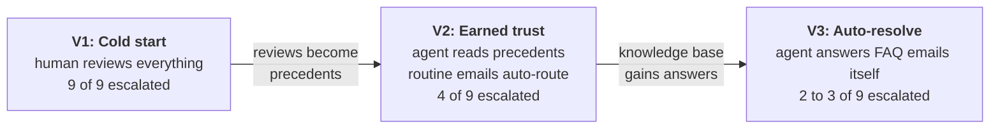

# Chapter 12: The Three-Phase Triage Design

Chapter 11 gave the process a table to remember its decisions in. This chapter explains what to do with that memory. It is a design chapter: there is nothing to build here, and no prompt to paste. Read it once before Chapter 13, and come back to it whenever a later chapter's choice seems arbitrary. Every one of them is decided here.

The idea in one sentence: **an agentic process gets better when human decisions flow back into it, and the amount of autonomy it is allowed should grow only as far as those decisions justify.** You will build the same triage flow three times. Each version is trusted a little more than the last, and each time the trust is backed by rows in `TriageDecision`, not by a threshold somebody liked.



---

## 1. No Model Is Trained Here

A common misreading of "the agent learns from feedback" is that the reviewer's clicks retrain the language model. They do not, and nothing in this tutorial changes a model weight. What changes is the **context** the model reasons over on each run:

- **Static facts** stay in the Context Grounding index from Chapter 06: which departments exist, what each handles, which ones demand human review.
- **Experience** accumulates in the `TriageDecision` entity from Chapter 11: which emails a human confirmed, which ones a human corrected, and why.
- **Policy** lives in the flow graph: a decision node decides when the agent may act alone, and the rule for that is a visible expression, not a feeling inside a prompt.

The model is the same in all three versions. It gets better because it is shown more, and it is allowed to do more because the table proves it has earned it.

| Kind of memory | Where it lives | Changes when | Read by the agent as |
| :--- | :--- | :--- | :--- |
| Facts about the organization | `OrganizationIndex` (Chapter 06) | Operations edits the spreadsheet | Context resource |
| Human decisions about emails | `TriageDecision` (Chapter 11) | Every review in Action Center | Tool call (Chapter 15) |
| The autonomy policy | The flow's decision node | You edit the flow between versions | Not read: enforced |

---

## 2. Two Fields That Carry the Design

Before the phases, two fields from Chapter 11 need to be in front of you, because the whole design is the interplay between them.

- **`Confidence`** is the agent's own number: how sure it is that the proposed department is right. The agent produces it on every run in every version.
- **`Outcome`** is the verdict on that proposal, written by whichever branch of the flow finishes the run: `Approved`, `Modified` or `Denied` by a human, `Auto` or `AutoResolved` by the gate.

The precedent rule the agent follows from V2 on: a `Modified` row is binding, an `Approved` row confirms, an `Auto` row is not evidence at all. Nobody checked it.

A confidence number an LLM makes up on its own is not calibrated: ask for "confidence in percent" and you get 95 to 98 for everything. So the agent's prompt does not ask for a feeling, it states rules:

| Situation | Confidence the prompt prescribes |
| :--- | :--- |
| Exactly one department fits **and** a human precedent exists for it | 95 to 100 |
| Exactly one department fits, no precedent yet | 75 to 85 |
| Two departments fit, or the email mixes topics, or precedents disagree | 50 to 74 |
| Nothing fits | below 50 |
| The chosen department has `Human Review = Required` | never above 50 |

Read the second row again. Without a human precedent the number never exceeds 85, and the gate you will build opens at 90. That single rule is what makes one flow behave as V1 when the table is empty and as V2 once it is not.

---

## 3. Phase V1: Cold Start

```text
start > agent (context grounding) > quick form (always)
  Approve  > write { Department = agent's, Confidence, Outcome = Approved }
  Modify   > write { Department = reviewer's, ProposedDepartment = agent's, Confidence, Outcome = Modified, Feedback }
  Deny     > write { Department = agent's, Confidence, Outcome = Denied, Feedback }
```

In V1 **every email goes to a human**. The agent still runs, grounded on the department directory, and its proposal is pre-filled in the Quick Form; the reviewer mostly clicks Approve. There is no decision node. `Confidence` is recorded on every row and used by nothing.

This feels wasteful if you think V1's job is routing. It is not. **V1's job is to produce evidence.** A new colleague may be right nine times out of ten from day one, and their manager still signs off on everything for the first weeks, not because the work is wrong but because nobody has yet *seen* that it is right. The sign-offs are what earn the autonomy. After V1 you hold nine rows that say "the agent proposed X, a human confirmed X" or "a human corrected it to Y, because ...". That table is the only thing that lets V2 relax the gate defensibly.

Two things make V1 feel purposeful instead of artificial:

1. **The agent being right is the good outcome.** The scoreboard for V1 should read "9 reviews, 7 approved as proposed, 2 corrected". A high approval rate is the evidence that justifies V2. If the agent were wrong half the time, V2 could not relax anything.
2. **The two corrections are where the reviewer actually works.** Their `Feedback` text is the payload the loop learns from. A batch of only clean emails gives you nine rubber stamps and nothing to mine, so the batch is composed deliberately (Section 6).

**What you build:** Chapter 13 extends the Chapter 07 flow with a `Feedback` field on the Quick Form and a Data Fabric write on every outcome, including Deny. Chapter 14 builds the batch runner that feeds the nine emails through it.

---

## 4. Phase V2: Earned Trust

```text
start > agent (context grounding + Data Fabric tool) > Confidence > 90 AND Human Review != Required ?
  yes  > write { ..., Outcome = Auto }
  no   > quick form > Approve / Modify / Deny > write (as in V1)
```

V2 changes two things. The agent gets a second source: the `TriageDecision` entity, attached as a **tool** the agent calls before deciding, so it sees the V1 rows as precedent. And a **decision node** appears: an email is routed without a human only when the confidence rule from Section 2 produced 90 or more, which by construction requires a human precedent, *and* the department is not one that demands human review.

That second condition is the compliance floor from Chapter 07, and it belongs in the decision expression where everyone can read it, not only inside the prompt. Legal & Compliance and Trust & Safety never auto-route, in any version. It is why the escalation count in V3 is not zero, and it is the same lesson Chapter 07 taught with a spreadsheet column: the gate lives in the graph, not in the agent.

Nothing else changes. Same flow, same tickets, same reviewer. Routine emails that were approved in V1 now go straight through; the ambiguous ones and the Required ones still reach the form. Expected: 4 of 9.

**What you build:** Chapter 15 attaches the `Query Entity Records` tool to the agent, rewrites the prompt with the precedent and confidence rules, and adds the decision node. The chapter ends by proving from the execution trace, not from the output, that the tool was actually called.

---

## 5. Phase V3: Auto-Resolve

```text
start > agent (context grounding incl. FAQ + Data Fabric tool) >
  canAutoResolve AND Confidence > 90 AND Human Review != Required ? send reply email > write { ..., Outcome = AutoResolved }
  Confidence > 90 AND Human Review != Required                    ? write { ..., Outcome = Auto }
  otherwise                                                        > quick form > ... > write
```

V3 is the only version that adds a branch. For some emails the agent no longer *routes*: it *answers*. A customer asking when their subscription renews does not need a department, they need the renewal date. Three additions make that possible:

1. **Knowledge to answer from.** The index today holds only the department directory; it can route but it cannot answer. V3 adds a short FAQ document to the `OrganizationData` bucket and re-ingests the index.
2. **Two new agent outputs:** `canAutoResolve` (boolean) and `replyText` (string). The prompt rule: `true` only when the FAQ contains a direct answer to the *whole* request; `false` the moment the email also asks for an action - a refund, a reset, a deactivation.
3. **A reply node** on the new branch: the Gmail send node from Chapter 08, carrying `replyText`.

Expected: 2 to 3 of 9. The two Required emails are the floor and never go below it. The third is a planted miss: an email that looks like an FAQ question but also asks for something to be done. The agent answers it, and it should not have. That miss is the closing lesson of the whole tutorial, and you leave it in: **the review loop is never switched off.** Autonomy is extended in steps, each step is checked, and the check is never retired.

**What you build:** Chapter 16.

---

## 6. The Batch: Nine Emails, Chosen Backwards From the Curve

The escalation curve is not a property of the flow alone. It is a property of the flow *and the emails you send through it*. Nine clean textbook emails, one per department, produce a flat line: everything routes fine in V2 and there is nothing to learn. So the batch is composed to make each phase do its job:

| Count | Kind | Example | V1 | V2 | V3 |
| :--- | :--- | :--- | :--- | :--- | :--- |
| 5 | Routine, unambiguous | "Could you send me a copy of last month's invoice?" | review | auto | auto, or resolved from the FAQ |
| 2 | Ambiguous, spans two departments | "We were charged twice, and our lawyer says this breaches the contract." | review, corrected | review | review |
| 2 | `Human Review = Required` | A solicitor's letter. A phishing report. | review | review | review |

Reading the columns: **V1 9, V2 4, V3 2 plus the planted miss.** The two ambiguous emails are where the reviewer's `Feedback` comes from in V1; the two Required ones are the floor in every column.

The same nine emails, with the same `TicketId` values, run against every version. Never change the batch between versions: if the emails change, the curve measures the emails, not the flow.

> 💡 **Keep the test emails out of the index.** The department directory spreadsheet has an example email per department. Those examples are useful as few-shot material, but if the file that contains them is in the bucket behind `OrganizationIndex`, the agent retrieves the answer key: a test email that matches an indexed example word for word scores 98 every time, and the curve is meaningless. Index the directory only, and keep the batch separate from the examples.

---

## 7. The Scoreboard

Everything above reduces to one query. For each version, count rows in `TriageDecision` by `Outcome`:

```text
escalations(version) = Approved + Modified + Denied
```

`Auto` and `AutoResolved` are the rows no human touched. The result of Part 2 is this count for V1, V2 and V3, side by side, together with the planted miss and the two Required rows that never moved. Chapter 17 builds it from `uip df records` and a filter; a Coded App version is an optional extra.

---

## 8. The Road Ahead

| Chapter | Builds | Proves |
| :--- | :--- | :--- |
| 13 | V1: `Feedback` field, write on every outcome | Nine rows land in `TriageDecision`, every `Outcome` set |
| 14 | The batch runner: a loop over nine emails invoking the flow | All nine tasks appear in Action Center; the reviewer works them once |
| 15 | V2: Data Fabric tool, precedent prompt, decision node | Trace shows the tool call; escalations drop to 4 |
| 16 | V3: FAQ in the index, `canAutoResolve`, reply branch | Escalations drop to 2, plus the planted miss |
| 17 | The scoreboard | One query, three numbers |

---

## 9. Summary Checklist

- [x] Understood that nothing is trained: the model is constant, its **context** grows and its **permitted autonomy** grows with it.
- [x] Learned the three memories and where each lives: facts in the index, experience in the entity, policy in the graph.
- [x] Learned the difference between `Confidence` (the agent's opinion, prescribed by rules) and `Outcome` (the verdict), and why `Auto` rows are never precedent.
- [x] Can describe each phase in one line: V1 reviews everything to produce evidence, V2 auto-routes where evidence exists, V3 answers where the knowledge base allows.
- [x] Know why the escalation count never reaches zero, and why the planted miss stays in.
- [x] Know that the batch is fixed across versions and composed deliberately: five routine, two ambiguous, two Required.

---

## 🔗 Navigation Links
- ⬅️ [Back to Chapter 11: Data Fabric - Recording Every Triage Decision](./11-DataFabric.md)
- 🏠 [Return to Main README](../README.md)
