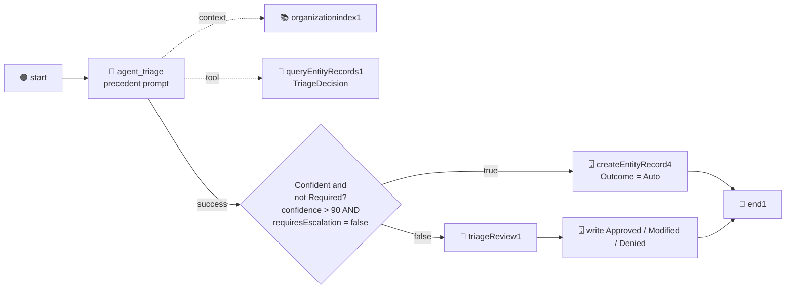

# Chapter 12: V2 - The Precedent Tool and the Decision Gate

Part 5: V2 - Earned Trust

Phase 1 left nine rows in `TriageDecision`, seven of them saying "the agent was right" and two saying "a human chose differently, and here is why". This chapter lets the agent read those rows before it decides, and puts a gate back into the graph that opens only when a human has already confirmed a similar case. Same flow, same nine emails, same reviewer. The scoreboard should drop from 9 to 4.



Three additions, nothing removed:

| Addition | Node | What it does |
| :--- | :--- | :--- |
| The precedent tool | `queryEntityRecords1`, wired to the agent's `tool` handle | Lets the agent query `TriageDecision` at runtime |
| The precedent prompt | the agent's `agent.json` | Tells the agent to call the tool, what counts as precedent, and how confidence is earned |
| The gate | `decision1`, plus `createEntityRecord4` on its true branch | Auto-routes when confidence is above 90 and the department is not Required; writes an `Auto` row |

> 💡 **Choose Your Starting Point:**
>
> **Mode 1: 🔄 Reset to the Chapter 11 End State**
>
> 💬 *Prompt your AI Coding Agent:*
> ```text
> Prepare a clean baseline for Chapter 12. TutorialSolution/EmailTriage must validate and be at the Chapter 10 shape: every email reaches the Triage Review form, and there is no decision node and no Query Entity Records tool node. If a decision node, a Query Entity Records tool node or a fourth Create Entity Record node exists from an earlier attempt, remove them and wire the agent's success handle straight into the Triage Review form again. TriageDecision must hold the nine Phase 1 rows and no Phase 2 rows; delete any Phase 2 rows. Do not touch the Phase 1 rows.
> ```
> 💻 *Underlying CLI Commands:*
> ```bash
> cd ./TutorialSolution
> uip maestro flow node remove EmailTriage/EmailTriage.flow decision1
> uip maestro flow node remove EmailTriage/EmailTriage.flow queryEntityRecords1
> uip maestro flow node remove EmailTriage/EmailTriage.flow createEntityRecord4
> uip maestro flow edge add EmailTriage/EmailTriage.flow agent_triage triageReview1 --source-port success
> uip maestro flow validate EmailTriage/EmailTriage.flow
> cd ..
>
> ENTITY_ID=$(uip df entities list --output plain --output-filter "[?Name=='TriageDecision'].Id | [0]")
> for ID in $(uip df records list "$ENTITY_ID" --limit 100 --output plain --output-filter "Items[?Phase==\`2\`].Id"); do
>   uip df records delete "$ENTITY_ID" "$ID" --yes --reason "Chapter 12 reset: Phase 2 rows"
> done
> node scripts/scoreboard.js   # Phase 1 must still read 9 of 9, Phase 2 must be empty
> ```
>
> ---
>
> **Mode 2: ⚡ 1-Shot Autonomous Fast-Track**
> 💬 *Paste this master prompt into your coding assistant to execute the entire Chapter 12 in one turn:*
> ```text
> Turn the EmailTriage flow into phase 2 of the three-phase design: the agent reads earlier human decisions as precedent, and confident routine emails are routed without a review.
> 1. Attach the UiPath Data Fabric "Query Entity Records" connector as a tool of the Triage AI Agent, bound to the TriageDecision entity with the same connection as the write nodes. Leave the query expression to the agent, sort by CreateTime, and remove the underscore-prefixed sort parameter from the materialised tool resource after the final agent refresh, because the agent runtime faults on it.
> 2. Rewrite the agent's system prompt: before deciding, call the tool once without a filter (the table is small) and read every reviewed row; treat rows with Outcome 1 as confirmation and Outcome 2 as a binding correction, and treat a row whose ProposedDepartment is the department it is considering but whose Department differs as a correction that applies to it; ignore Outcome 0 and 4 rows; name the precedent's TicketId in the reasoning. Replace the confidence rules with the numbered rules from Chapter 08: at most 50 when Human Review is Required, 95 to 100 with a reviewed precedent, 95 to 100 for a mixed-topic email with two agreeing precedents, 75 to 85 with no precedent, 50 to 74 when ambiguous, never above 85 without a precedent.
> 3. Add a decision node between the agent and the Triage Review form with the expression: confidence greater than 90 AND requiresEscalation is false. Its false branch goes to the form. Its true branch goes to a new Create Entity Record node that writes the same fields as the Approve write but with Outcome 0, then to the End node.
> 4. Format and validate the flow, refresh and validate the inline agent.
> 5. Run a cloud debug with ticketId T01, phase 2 and the T01 body from Data/TriageBatch.csv. It must complete without creating a task, the reasoning must cite ticket T01 as precedent, and TriageDecision must gain a Phase 2 row with Outcome 0. Delete that test row afterwards.
> 6. Run node scripts/run-batch.js --phase 2, tell me when the tasks are waiting, and after I have reviewed them run node scripts/scoreboard.js. Phase 2 must read 4 of 9.
> ```
>
> ---
>
> **Mode 3: 📖 Step-by-Step Guided Walkthrough (Recommended for Learning)**
> Proceed through Sections 1 through 6 below, pasting each prompt step-by-step.

---

## 1. Attaching the Entity as a Tool

An inline agent's `context` handle only accepts Context Grounding indexes. Data Fabric reaches the agent through the other handle: **`tool`**. The Data Fabric connector's "Query Entity Records" activity exists in the registry twice, once as a flow activity and once as an agent tool, and the tool variant is what goes here.

### 💬 Prompt Your AI Coding Agent (Recommended)

```text
In TutorialSolution/EmailTriage, attach the UiPath Data Fabric "Query Entity Records" connector to the Triage AI Agent as a tool. Search the registry for the agent-tool variant of the node type first. Bind it to the TriageDecision entity with the same connection the Create Entity Record nodes use, sort by CreateTime, and leave the query expression to the agent. Give the tool a description that tells the agent what the rows are. Wire it to the agent's tool handle, format and validate the flow, then refresh and validate the inline agent so the tool becomes an agent resource.
```

### 💻 Underlying CLI Commands (What the Agent Executes)

```bash
cd ./TutorialSolution

# 1. The tool variant of the node type (agent-tool tag), and the connection
uip maestro flow registry search "Query Entity Records" --output json \
  --output-filter "[?contains(NodeType,'agent.resource.tool')].{NodeType:NodeType,Avail:AvailableOnTenant}"
uip is connections list "uipath-uipath-dataservice" --all-folders --output json \
  --output-filter "[?State=='Enabled'].{Id:Id,FolderKey:FolderKey}"

# 2. Tool nodes need a resource id: mint one and pass it as --source
RESOURCE_ID=$(node -e "console.log(require('crypto').randomUUID())")
uip maestro flow node add EmailTriage/EmailTriage.flow \
  "uipath.agent.resource.tool.connector.uipath-uipath-dataservice.query-entity-records" \
  --source "$RESOURCE_ID" --output json

# 3. Configure it like any connector node
uip maestro flow node configure EmailTriage/EmailTriage.flow queryEntityRecords1 --detail '{
  "connectionId": "<CONNECTION_ID>",
  "folderKey": "<CONNECTION_FOLDER_KEY>",
  "method": "POST",
  "endpoint": "/v2/{entityName}/qer",
  "pathParameters": { "entityName": "TriageDecision" },
  "queryParameters": { "limit": 100, "expansionLevel": 1, "isAscending": false, "start": 0 },
  "bodyParameters": {}
}' --output json

# 4. Wire it to the agent's tool handle (hand-authored edge, as for the context node)
#    { "id": "edge_agent_triage_tool_queryEntityRecords1_input", "sourceNodeId": "agent_triage",
#      "sourcePort": "tool", "targetNodeId": "queryEntityRecords1", "targetPort": "input" }

uip maestro flow format EmailTriage/EmailTriage.flow
uip maestro flow validate EmailTriage/EmailTriage.flow

# 5. The refresh turns the tool node into resources/<RESOURCE_ID>/resource.json
uip agent refresh EmailTriage/<agentId> --inline-in-flow \
  --bindings-target EmailTriage/bindings_v2.json --output json
uip agent validate EmailTriage/<agentId> --inline-in-flow --output json
```

The refresh reports `"Resources": 2` (the index from Chapter 06 and the new tool) and writes `resource.json` with `$resourceType: "tool"`, `type: "integration"`, the entity name as a static path parameter and the query expression as a prompt-driven one.

> ⚠️ **One parameter has to go, and the refresh keeps putting it back.** The connector's schema includes a body field named `_sortFieldName`. The configure step writes it into the node and every `uip agent refresh` writes it into the tool resource, and the agent runtime cannot handle a parameter whose name starts with an underscore: the agent faults before its first LLM call with `AGENT_RUNTIME.UNEXPECTED_ERROR ... 'DynamicType_0' object has no attribute '_sortFieldName'`. Verified three times, with the parameter prompt-driven, static and absent from the node. The fix is a file edit **after the last refresh**: delete `_sortFieldName` from `properties.parameters` and from `inputSchema.properties` in `resources/<RESOURCE_ID>/resource.json`, and keep the node's `bodyParameters` empty. Then validate the agent again. If you refresh later for another reason, repeat the edit.

> 💡 **The tool's `description` is prompt text.** The agent sees the node's `display.description` as the tool's description. Write it for the model: "Earlier triage decisions from the TriageDecision entity. Outcome 1 rows were confirmed by a human, Outcome 2 corrected, Outcome 3 denied; Outcome 0 and 4 rows were never reviewed."

---

## 2. The Precedent Prompt

The tool exists; now the agent has to want to use it, know what the rows mean, and earn its confidence from them. This is the prompt Chapter 08 described, written out.

### 💬 Prompt Your AI Coding Agent (Recommended)

```text
Rewrite the Triage AI Agent's system prompt in TutorialSolution/EmailTriage for phase 2. Keep the department retrieval and the requiresEscalation rule from Chapter 07 unchanged, and add two sections.

PRECEDENTS: before deciding, call the Query Entity Records tool once on the TriageDecision entity without a query expression, so every row comes back (the table is small). Do not filter by department: a correction moves a row away from the department it was proposed for, and a filtered query would hide exactly the rows that matter. Every row is an earlier email this process routed. Outcome 1 rows were confirmed by a human, Outcome 2 rows were corrected (Department is the human's choice, ProposedDepartment was the agent's), Outcome 3 denied. Outcome 0 and 4 rows were never reviewed and are not precedent. If a reviewed row describes a similar request, follow its Department even if the agent would have chosen differently; an Outcome 2 row is binding, an Outcome 1 row confirms. A reviewed row whose ProposedDepartment is the department under consideration but whose Department is different is a correction of that very choice and binds the agent to the corrected department. The reasoning must name the precedent's TicketId and quote a short excerpt of its EmailBody, or say that no similar reviewed row exists.

CONFIDENCE: first decide which numbered rule applies and name it in the reasoning, then set confidence inside that rule's range. Rules, applied in order: 1. at most 50 when the chosen department has Human Review = Required, whatever else applies; 2. 95 to 100 when exactly one department fits and a human-confirmed (Outcome 1) precedent exists for a similar request with that department; 3. 95 to 100 when two or more reviewed rows for a similar request agree on the department, for example a correction that a later confirmation agreed with; 4. 50 to 74 when the only precedent is a single Outcome 2 correction: follow the corrected department, but the routing is contested until a human confirms it once; 5. 75 to 85 when exactly one department fits and no precedent exists; 6. 50 to 74 when two departments fit, the email mixes topics, or the precedents disagree; 7. below 50 when nothing fits; never above 85 without a reviewed precedent. The reasoning names the rule number.

Then refresh and validate the inline agent.
```

### 💻 Underlying CLI Commands (What the Agent Executes)

```bash
cd ./TutorialSolution
uip agent refresh EmailTriage/<agentId> --inline-in-flow \
  --bindings-target EmailTriage/bindings_v2.json --output json
uip agent validate EmailTriage/<agentId> --inline-in-flow --output json
# and then, again, remove _sortFieldName from resources/<RESOURCE_ID>/resource.json
```

Read rule 4 next to rule 2. The same email scores 85 on an empty table and 95 once a human has confirmed a similar case. Nothing about the model changed; the evidence did. That is the whole mechanism of "earned trust", and it is stated in eleven lines of prompt.

> ⚠️ **Never filter the precedent query by the department you are about to choose.** Verified the expensive way: with "query on the department under consideration", T07 (the renewal-price email) asked for Sales rows, got T04's confirmed Sales row, called it a precedent, scored 95 and auto-routed. Its own phase 1 row, proposed Sales and corrected to Customer Success, was sitting in the table under `Department = Customer Success`, and the filter hid it. A correction is, by definition, a row that moved away from the department you are considering. Read the whole table (nine rows, a hundred, it is small) and look for rows whose `ProposedDepartment` matches your candidate.

> 💡 **Why rules 3 and 4 exist.** An email corrected once in phase 1 has exactly one precedent in phase 2, and it is a correction. Rule 4 makes the agent follow it (the form pre-fills the corrected department) but keeps the confidence under 75, so the reviewer sees the case once more and confirms the correction. That second row is what rule 3 needs: in phase 3 the same email auto-routes. Without rule 4, verified the expensive way, the model treats its own correction as a rule 2 precedent, scores 95 and routes on a single unconfirmed verdict. Trust is extended one phase at a time, and each step has a row behind it.

---

## 3. The Gate

Chapter 07 removed nothing from the graph that Chapter 10 did not put back; here the decision node returns, with the richer expression the design chapter promised. Both conditions are readable by anyone who opens the flow: the agent's earned confidence, and the compliance floor from the spreadsheet column.

### 💬 Prompt Your AI Coding Agent (Recommended)

```text
In TutorialSolution/EmailTriage, add a decision node between the Triage AI Agent and the Triage Review form, labelled "Confident and not Required?", with the typed expression: the agent's confidence is greater than 90 AND the agent's requiresEscalation is false. Wire the agent's success handle to the decision node, the false branch to the Triage Review form, and the true branch to a new Create Entity Record connector node that writes the same fields as the Approve write with Outcome 0 (Auto), then on to the End node. Format and validate the flow.
```

### 💻 Underlying CLI Commands (What the Agent Executes)

```bash
cd ./TutorialSolution
uip maestro flow node add EmailTriage/EmailTriage.flow "core.logic.decision" --output json
uip maestro flow node add EmailTriage/EmailTriage.flow \
  "uipath.connector.uipath-uipath-dataservice.create-entity-record" --output json   # becomes createEntityRecord4

uip maestro flow node configure EmailTriage/EmailTriage.flow createEntityRecord4 --detail '{
  "connectionId": "<CONNECTION_ID>", "folderKey": "<CONNECTION_FOLDER_KEY>",
  "method": "POST", "endpoint": "/v2/{entityName}/CreateEntityRecord",
  "pathParameters": { "entityName": "TriageDecision" },
  "bodyParameters": {
    "TicketId": "{{ $vars.start.output.ticketId }}", "Phase": "=js:$vars.start.output.phase",
    "EmailBody": "{{ $vars.start.output.emailBody }}",
    "ProposedDepartment": "{{ $vars.agent_triage.output.category }}", "Department": "{{ $vars.agent_triage.output.category }}",
    "Outcome": 0,
    "Confidence": "=js:$vars.agent_triage.output.confidence",
    "HumanReviewRequired": "=js:$vars.agent_triage.output.requiresEscalation",
    "Reasoning": "{{ $vars.agent_triage.output.reasoning }}"
  }
}' --output json

# Rewire: the agent's success edge now ends at the gate (remove the old edge to the form by hand)
uip maestro flow edge add EmailTriage/EmailTriage.flow agent_triage decision1 --source-port success
uip maestro flow edge add EmailTriage/EmailTriage.flow decision1 createEntityRecord4 --source-port true
uip maestro flow edge add EmailTriage/EmailTriage.flow decision1 triageReview1 --source-port false
uip maestro flow edge add EmailTriage/EmailTriage.flow createEntityRecord4 end1

uip maestro flow format EmailTriage/EmailTriage.flow
uip maestro flow validate EmailTriage/EmailTriage.flow
```

The decision node's inputs, as a typed expression (Chapter 07's `=js:` rule):

```json
"inputs": {
  "expression": "=js:$vars.agent_triage.output.confidence > 90 && $vars.agent_triage.output.requiresEscalation === false",
  "trueLabel": "Auto-route",
  "falseLabel": "Human review"
}
```

> 💡 **Belt and braces, on purpose.** The prompt already caps a Required department at 50, so `confidence > 90` alone would keep those cases out. The gate checks `requiresEscalation` anyway. The prompt is the agent's opinion; the second condition is policy, and Chapter 10 showed how easily a model drops a rule it was given as one bullet among many. Policy that matters lives in the graph.

---

## 4. One Email, No Task

Before the batch, one run that should never reach Action Center. T01 was approved in phase 1, so the agent will find that row.

### 💬 Prompt Your AI Coding Agent (Recommended)

```text
Run a cloud debug of TutorialSolution/EmailTriage with ticketId "T01", phase 2, and the T01 body from Data/TriageBatch.csv. It must complete without a task. Report from the payload: the agent's confidence and its reasoning (which must cite ticket T01 as precedent), the decision node's branch, and the createEntityRecord4 response with its record Id. Then show the new Phase 2 row from the entity, and delete it so the batch starts clean.
```

### 💻 Underlying CLI Commands (What the Agent Executes)

```bash
cd ./TutorialSolution
uip maestro flow debug EmailTriage --inputs '{
  "ticketId": "T01", "phase": 2,
  "emailBody": "Hello, our auditor has asked for copies of all invoices from the last quarter. I only have the email receipts and cannot find the PDF versions anywhere. Could you tell me where I can download them for our account? Thanks, Anna"
}' --output json
cd ..
node scripts/scoreboard.js --phase 2
ENTITY_ID=$(uip df entities list --output plain --output-filter "[?Name=='TriageDecision'].Id | [0]")
for ID in $(uip df records list "$ENTITY_ID" --limit 100 --output plain --output-filter "Items[?Phase==\`2\`].Id"); do
  uip df records delete "$ENTITY_ID" "$ID" --yes --reason "Chapter 12 test row"
done
```

The verified payload, trimmed:

```json
"elementExecutions": [ "start", "agent_triage", "decision1", "createEntityRecord4", "end1" ],
"agent_triage.outputs": {
  "category": "Billing Operations", "confidence": 95, "requiresEscalation": false,
  "reasoning": "The Handles text for Billing Operations includes 'invoices,' which directly matches Anna's request ... a reviewed precedent (TicketId T01) exists for a similar request, confirming this department as the correct choice. Confidence is set to 95 based on rule 2."
},
"createEntityRecord4.inputs.body": { "TicketId": "T01", "Phase": 2, "Outcome": 0, "Confidence": 95, "HumanReviewRequired": false, ... }
```

### ✅ What Proves the Tool Was Called

The element list has no `triageReview1`: the gate opened. But the stronger evidence is in the reasoning. The email says nothing about a ticket id, and `T01` exists in exactly one place the agent can reach: the entity, through the tool. A reasoning that cites `TicketId T01` is a reasoning that read the row. Compare with the Chapter 10 run of the same email: confidence 85, "the only department that fits", no ticket named. Same model, same email, one more source.

> 💡 **On tenants where LLM observability is enabled,** `uip traces spans get --job-key <the agent element's JobKey>` lists the run's spans, including one per tool call with its arguments and result. The element's `JobKey` is in `uip maestro flow instance element-executions <instanceId> -f <folderKey>`. On the tenant this chapter was verified on, the command answered `Error retrieving trace ID for job` for debug runs, so the chapter relies on the reasoning instead. Use the trace when you have it; do not wait for it.

---

## 5. The Batch, Second Pass

Same nine tickets, same runner, phase 2.

### 💬 Prompt Your AI Coding Agent (Recommended)

```text
Run node scripts/run-batch.js --phase 2 from the repository root and tell me when the review tasks are waiting in Action Center. Expect fewer than nine: the routine tickets should route on their own. Wait for the runner to return while I review.
```

### 💻 Underlying CLI Command (What the Agent Executes)

```bash
node scripts/run-batch.js --phase 2
```

What to expect in Action Center, and what to press:

| Tickets | Why they still arrive | What to press |
| :--- | :--- | :--- |
| `T06`, `T07` | a single correction is contested: rule 4 keeps them under 75 and pre-fills the corrected department | **Approve**: the agent proposes the department you corrected to in phase 1, and your approval is the second agreeing row that rule 3 needs in phase 3. **Modify** again if it did not. |
| `T08`, `T09` | Required, capped at 50 by rule 1 and blocked by the gate regardless | **Approve** |
| `T01` to `T05` | should not arrive at all | if one does, read its reasoning: the agent did not find the precedent, or found it and still scored under 91 (see below). **Approve**: the row it writes is one more confirming precedent. |

> ⚠️ **A routine ticket can still arrive, and it is not the flow's fault.** In the verified run, T05 came back with confidence 85 and a reasoning that said: *"a reviewed precedent (TicketId T05) exists for a similar request ... Confidence rule 2 applies."* Rule 2 means 95 to 100. The model named the right rule and wrote the wrong number, the gate did what it was told, and a human looked at an email that did not need it. That is the safe direction to fail in, and it is why the scoreboard is a count, not a promise: expect 4 of 9, accept 5, and read the reasoning of every extra one. Chapter 14 tightens the prompt so the number is derived from the rule instead of chosen next to it.

---

## 6. The Scoreboard, Second Number

### 💬 Prompt Your AI Coding Agent (Recommended)

```text
Run node scripts/scoreboard.js and show me phases 1 and 2 side by side. Phase 2 must read 4 of 9. Then list the phase 2 rows and, for one Auto row, show me the precedent ticket the reasoning cites.
```

### 💻 Underlying CLI Commands (What the Agent Executes)

```bash
node scripts/scoreboard.js
node scripts/scoreboard.js --phase 2
```

```text
Phase  | Rows  | Auto  | Approved  | Modified  | Denied  | AutoResolved  | Escalations
------------------------------------------------------------------------------------
1      | 9     | 0     | 7         | 2         | 0       | 0             | 9 of 9
2      | 9     | 5     | 4         | 0         | 0       | 0             | 4 of 9
```

**4 of 9.** Five routine emails routed on the evidence of the phase 1 reviews. The two ambiguous ones came back for a second opinion, and the two Required ones came back because the floor never moves. Nothing was trained. The table grew, and the gate was told to trust it.

---

## 7. Summary Checklist

- [x] Attached a Data Fabric entity to an inline agent as a **tool** (the `context` handle is for indexes only), minted with `--source`, configured as a connector node, materialised by `uip agent refresh`.
- [x] Removed the underscore-prefixed sort parameter from the tool resource after the last refresh, and know it comes back on every refresh.
- [x] Wrote a precedent prompt: call the tool, Outcome 1 confirms, Outcome 2 binds, Outcome 0 and 4 are not evidence, name the TicketId.
- [x] Put the gate in the graph with both conditions visible: earned confidence and the Required floor.
- [x] Proved the tool call from the reasoning (a ticket id that exists only in the entity), and know where the trace would show it.
- [x] Reran the fixed batch and read 4 of 9.

---

## 🔗 Navigation Links
- ⬅️ [Back to Chapter 11: The Batch Runner and the Scoreboard](./11-BatchRunnerAndScoreboard.md)
- 🏠 [Return to Main README](../README.md)
- ➡️ [Proceed to Chapter 13: Sending Emails](./13-SendingEmails.md)
