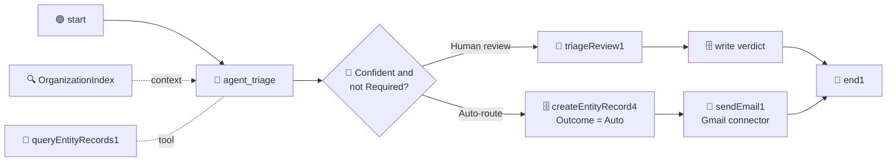

# Chapter 13: Sending Emails

Part 6: V3 - Auto-Resolve

Since Chapter 12 the flow routes routine emails on its own. Nobody hears about it: the run writes a row and ends. The support team is waiting for a message, and Chapter 14 will need the flow to send a customer a reply. Both need the same thing, a flow that can send mail.

This chapter connects the flow to **Gmail through Integration Service** and adds one node: a notification, sent to you, every time the gate routes an email without a review. It is the smallest useful send, it exercises the whole connector mechanism, and Chapter 14 reuses the node type unchanged for the reply.



Note where the email node sits: **after the Auto write**, on the branch no human sees. The reviewed branch already has a human who knows what happened; the automated one is the branch that needs a witness.

> 💡 **Choose Your Starting Point:**
>
> **Mode 1: 🔄 Reset to the Chapter 12 Checkpoint**
>
> 💬 *Prompt your AI Coding Agent:*
> ```text
> Reset TutorialSolution to its ch12-done checkpoint: hard-reset the solution's own git repository to that tag and remove untracked files. Then confirm EmailTriage validates and contains the Triage AI Agent with the OrganizationIndex context node and the Query Entity Records tool, the "Confident and not Required?" gate, the Triage Review form on its false branch, and the four TriageDecision write nodes, with no Gmail node. If the tag does not exist, stop and tell me.
> ```
> 💻 *Underlying CLI Commands:*
> ```bash
> git -C TutorialSolution reset -q --hard ch12-done
> git -C TutorialSolution clean -qfd
> uip maestro flow validate TutorialSolution/EmailTriage/EmailTriage.flow
> uip maestro flow node list TutorialSolution/EmailTriage/EmailTriage.flow --output json --output-filter "[*].Id"   # no sendEmail1
> ```
>
> ---
>
> **Mode 2: ⚡ 1-Shot Autonomous Fast-Track**
> 💬 *Paste this master prompt into your coding assistant to execute the entire Chapter 13 in one turn:*
> ```text
> Make the EmailTriage flow report every email it routes without a review:
> 1. Find the Gmail connection available in my tenant and tell me which folder it lives in.
> 2. Add a Gmail Send Email node after the Auto write node (createEntityRecord4), so it runs only for cases the gate routed without a human.
> 3. Address the email to me. Subject: "[Triage]", the ticket id and the department. Body: the department, the confidence, the agent's reasoning, and the original customer email.
> 4. Wire the Auto write node's output into the email node, and the email node's output into the End node, replacing the Auto write's direct edge to the End node.
> 5. Format and validate the flow.
> 6. Run a cloud debug with ticket T01 in phase 0 (the invoice download question, which has a phase 1 precedent) and confirm from the payload that the gate auto-routed, that the email node returned a real message id, and that no error was recorded. Then delete the Phase 0 row.
> 7. Finish with the checkpoint: commit everything in TutorialSolution to its own git repository with the message "Chapter 13 done" and move the tag ch13-done to that commit.
> ```
>
> ---
>
> **Mode 3: 📖 Step-by-Step Guided Walkthrough (Recommended for Learning)**
> Proceed through Sections 1 through 7 below, pasting each prompt step-by-step.

---

## 1. Integration Service: Connections, Not Credentials

Every previous node in this flow ran inside UiPath. This one reaches outside, and that changes how credentials work.

You will not put a Gmail password or an API key anywhere in this project. The credential lives in an **Integration Service connection** - a tenant-level object someone authorizes once, in a browser, against their Google account. Your flow references it by GUID. Rotate the credential and the flow never notices; hand the project to a colleague and they swap in their own connection.

| Approach | Where the secret lives | What happens at handover |
| :--- | :--- | :--- |
| Hard-coded key in a flow variable | in your `.flow` file, in git | the secret is now in everyone's clone forever |
| Manual HTTP node with a bearer token | in a flow input or asset | you rebuild OAuth refresh by hand |
| **Connector + IS connection (this chapter)** | in Integration Service | swap the connection GUID; nothing else changes |

> ⚠️ **A raw credential in a flow variable is the tell.** If you find yourself declaring an `apiKey` or `gmailToken` input to make an integration work, stop and look for a connector first. A connector-backed flow never carries the secret.

---

## 2. Finding the Connection

### 💬 Prompt Your AI Coding Agent (Recommended)

```text
Find the Gmail connection available in my UiPath tenant. Show me its id, which folder it lives in, and whether it is enabled. Then show me the Gmail send email node type from the flow registry.
```

### 💻 Underlying CLI Commands (What the Agent Executes)

```bash
# 1. Find the connection - --all-folders is mandatory, connections are folder-scoped
uip is connections list "uipath-google-gmail" --all-folders --output json

# 2. Confirm the node type exists and is enabled on this tenant
uip maestro flow registry pull --force
uip maestro flow registry search "send email" --output json \
  --output-filter "[*].{NodeType:NodeType,DisplayName:DisplayName,Avail:AvailableOnTenant}"
```

The connection carries the two GUIDs the node needs:

```json
{
  "Id": "3f2a91c4-8b6d-4e07-9a51-c2d84f7e6b10",
  "Name": "GMail",
  "ConnectorKey": "uipath-google-gmail",
  "State": "Enabled",
  "Folder": "your.name@example.com's workspace",
  "FolderKey": "a81d4c62-97b3-4f28-8e05-6b1f9d3c7a44"
}
```

> ⚠️ **Never guess the connector key from the brand name.** The registry key is `uipath-google-gmail`, not `gmail`. A guessed key returns an empty list, which reads exactly like "no connection exists" and sends you off to create one you already have. Search the registry for the node type first, then take the key from it. The same trap applies to `uip is connections list` without `--all-folders`: connections are folder-scoped, and an unscoped query silently misses them.

> 💡 **No Gmail connection yet?** Create one in Integration Service in the browser (Gmail, sign in, authorize), then re-run the list. The tutorial uses Gmail because most people can authorize one in a minute; `uipath-microsoft-outlook365.send-email`, `uipath-amazon-ses.send-email` and several others expose the same node shape, so everything below transfers.

---

## 3. Adding and Configuring the Node

Here is the part that differs from every node you have added so far.

Most Maestro nodes are **user-owned**: you write their JSON directly. Connector nodes are **CLI-owned**. Their configuration lives in an `inputs.detail` envelope that the validator rejects when hand-authored, so they are added with `node add` and configured with `node configure`. Hand-editing them breaks them.

### 💬 Prompt Your AI Coding Agent (Recommended)

```text
Add a Gmail Send Email node to EmailTriage and configure it with my Gmail connection.

Address it to me. The subject should be "[Triage]" followed by the ticket id and the department the agent chose. The body should say the ticket was routed without review, then list the department, the confidence and the agent's reasoning, then the original customer email underneath.
```

### 💻 Underlying CLI Commands (What the Agent Executes)

```bash
cd ./TutorialSolution

uip maestro flow node add EmailTriage/EmailTriage.flow \
  "uipath.connector.uipath-google-gmail.send-email" --output json

uip maestro flow node configure EmailTriage/EmailTriage.flow sendEmail1 --detail '{
  "connectionId": "<CONNECTION_ID>",
  "folderKey": "<FOLDER_KEY>",
  "method": "POST",
  "endpoint": "/SendEmail",
  "bodyParameters": {
    "To": "you@example.com",
    "Subject": "[Triage] {{ $vars.start.output.ticketId }} auto-routed to {{ $vars.agent_triage.output.category }}",
    "Body": "Ticket {{ $vars.start.output.ticketId }} was routed without review.\n\nDepartment: {{ $vars.agent_triage.output.category }}\nConfidence: {{ $vars.agent_triage.output.confidence }}\nReasoning: {{ $vars.agent_triage.output.reasoning }}\n\nOriginal email:\n{{ $vars.start.output.emailBody }}"
  }
}' --output json
```

A successful configure reports what it wrote:

```json
{ "NodeId": "sendEmail1", "BindingsCreated": 2, "DetailPopulated": true }
```

`BindingsCreated: 2` is the connection and folder being registered as flow bindings - the same mechanism that let Chapter 06's index become a solution resource.

> 💡 **Where `method` and `endpoint` come from.** Not from guesswork. `uip maestro flow registry get "<nodeType>"` returns a `connectorMethodInfo` block giving `"method": "POST"` and `"reference": "/SendEmail"`. To see the fields the request accepts, ask Integration Service directly:
> ```bash
> uip is resources describe "uipath-google-gmail" "SendEmail" \
>   --operation Create --connection-id <CONNECTION_ID> --output json
> ```
> Its `RequestFields` array is the authoritative list: `To` (the only required one), `Subject`, `Body`, `CC`, `BCC`, `ReplyTo`, `Importance`.

> ⚠️ **All three `bodyParameters` values here are strings, so all three use Handlebars.** `{{ $vars.agent_triage.output.confidence }}` is correct even though `confidence` is a number - it is being interpolated into a body, and a body is text. The `=js:` form from Chapter 05 is for fields that must stay typed. Same paths, different wrapper, chosen by the destination field's type rather than the source value's.

---

## 4. Wiring It After the Auto Write

The email node goes between the Auto write and the End node. That means replacing one existing edge rather than adding a new terminal step.

### 💬 Prompt Your AI Coding Agent (Recommended)

```text
Rewire EmailTriage so the Auto write node (createEntityRecord4) feeds the Send Email node instead of the End node, and the Send Email node's output feeds the End node. Then format and validate the flow.
```

### 💻 Underlying CLI Commands (What the Agent Executes)

```bash
cd ./TutorialSolution
# remove the edge createEntityRecord4 -> end1 by hand, then:
uip maestro flow edge add EmailTriage/EmailTriage.flow createEntityRecord4 sendEmail1
uip maestro flow edge add EmailTriage/EmailTriage.flow sendEmail1 end1
uip maestro flow format EmailTriage/EmailTriage.flow
uip maestro flow validate EmailTriage/EmailTriage.flow
```

The edges that changed:

```text
decision1            true   -> createEntityRecord4
createEntityRecord4  output -> sendEmail1        (was: -> end1)
sendEmail1           output -> end1
```

> 💡 **A connector node has two output handles, `output` and `error`.** Wiring only `output` means a Gmail failure faults the flow. That is the right default here: if the notification does not go out, nobody learns that an email was routed unseen, and a silent success would be worse than a visible failure. Wire `error` when you have a real fallback, not to make red disappear.

---

## 5. Testing the Auto-Route Branch

Use ticket T01 in phase 0. It has a phase 1 precedent, so the gate opens, no task is created, and the email goes out. Phase 0 rows never count on the scoreboard, and you delete the row afterwards.

### 💬 Prompt Your AI Coding Agent (Recommended)

```text
Debug the EmailTriage flow with ticketId "T01", phase 0, and the T01 body from Data/TriageBatch.csv.

Then confirm from the run payload that the email node actually sent: I want the message id it returned and the value of its error output, not just the run status. Also tell me which elements ran. Finally delete the Phase 0 row from TriageDecision.
```

### 💻 Underlying CLI Commands (What the Agent Executes)

```bash
cd ./TutorialSolution
uip maestro flow debug EmailTriage --inputs '{"ticketId": "T01", "phase": 0, "emailBody": "Hello, our auditor has asked for copies of all invoices from the last quarter. I only have the email receipts and cannot find the PDF versions anywhere. Could you tell me where I can download them for our account? Thanks, Anna"}' --output json
cd ..
ENTITY_ID=$(uip df entities list --output plain --output-filter "[?Name=='TriageDecision'].Id | [0]")
for ID in $(uip df records list "$ENTITY_ID" --limit 100 --output plain --output-filter "Items[?Phase==\`0\`].Id"); do
  uip df records delete "$ENTITY_ID" "$ID" --yes --reason "Chapter 13 test row"
done
```

### 5.1 What Proves It Worked

A verified run:

```json
{
  "finalStatus": "Completed",
  "elements": ["start", "agent_triage", "decision1", "createEntityRecord4", "sendEmail1", "end1"],
  "globals": {
    "category": "Billing Operations",
    "confidence": 95,
    "sendEmail1.output": {
      "threadId": "1a079fded9b35a00",
      "id": "1a079fded9b35a00",
      "labelIds": ["UNREAD", "SENT", "INBOX"]
    },
    "sendEmail1.error": null
  }
}
```

Three things to read, in order:

| # | Check | Why it matters |
| :-: | :--- | :--- |
| **1** | `elements` contains `sendEmail1` but **not** `triageReview1` | the gate took the auto-route branch, as a case with a precedent should |
| **2** | `sendEmail1.output.id` is a real message id and `labelIds` contains `SENT` | Gmail accepted and sent it - this is the difference between "the node ran" and "an email exists" |
| **3** | `sendEmail1.error` is `null` | no swallowed failure |

Then check your inbox: a message titled `[Triage] T01 auto-routed to Billing Operations`, with the confidence, the reasoning that names the precedent, and Anna's email underneath. That is the only check that cannot be faked by a green status.

> ⚠️ **A `Completed` status does not mean an email was sent.** Every chapter in this tutorial has made the same point from a different angle: Chapter 04 with empty `JobArguments`, Chapter 05 with `null` typed outputs, Chapter 06 with an ungrounded category, Chapter 07 with a task nobody was assigned. Here the tell is a `sendEmail1.output` with no `id`. Read the payload.

---

## 6. Where to Take It Next

The flow can now act on its own conclusion. Two extensions reuse exactly what you built:

- **Route to the department's real mailbox.** Add a fourth column to `Departments.xlsx` holding each department's address, re-sync the index, have the agent return it, and bind `To` to that output instead of a fixed address. Same lesson as Chapter 07's `Human Review` column: routing rules belong in data.
- **Let the agent write the reply.** That is Chapter 14: a second Send Email node on a new branch, carrying an answer the agent composed from a knowledge base, and a row that records it.

---

## 7. 📌 Checkpoint: Chapter 13 Done

The notification node validates, and the test run returned a real Gmail message id. Record it in the solution's own repository (set up at the end of Chapter 03), so that any later reset can bring the files back to exactly this point.

### 💬 Prompt Your AI Coding Agent (Recommended)
```text
Commit everything in TutorialSolution to its own git repository with the message "Chapter 13 done" and move the tag ch13-done to that commit.
```

### 💻 Underlying CLI Commands (What the Agent Executes)
```bash
git -C TutorialSolution add -A
git -C TutorialSolution commit -qm "Chapter 13 done"
git -C TutorialSolution tag -f ch13-done
```

---

## 8. Summary Checklist

- [x] Understood why an Integration Service connection beats a credential in a flow variable.
- [x] Found the Gmail connection with `uip is connections list --all-folders`, and learned that the connector key comes from the registry rather than the brand name.
- [x] Learned that connector nodes are **CLI-owned**: `node add` then `node configure`, never hand-authored JSON.
- [x] Read `method` and `endpoint` from `connectorMethodInfo`, and the request fields from `uip is resources describe`.
- [x] Interpolated a number into a subject line with Handlebars, and understood why `=js:` is wrong there.
- [x] Placed the email node after the Auto write, on the branch that has no human witness.
- [x] Verified the send by its returned message id and `SENT` label, not by the run status.

---

## 🔗 Navigation Links
- ⬅️ [Back to Chapter 12: V2 - The Precedent Tool and the Decision Gate](./12-V2-EarnedTrust.md)
- 🏠 [Return to Main README](../README.md)
- ➡️ [Proceed to Chapter 14: V3 - The FAQ, the Reply Branch and the Planted Miss](./14-V3-AutoResolve.md)
