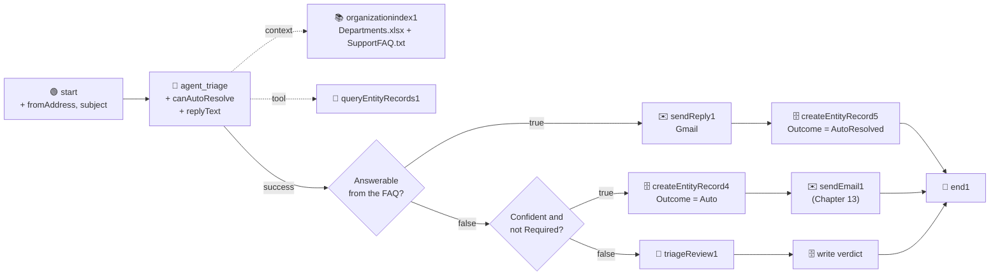

# Chapter 14: V3 - The FAQ, the Reply Branch and the Planted Miss

Part 6: V3 - Auto-Resolve

V2 taught the flow to route on its own where a human had already agreed. V3 lets it do one more thing: for the emails whose whole request is answered by the knowledge base, it **replies** instead of routing. That is a different kind of autonomy, and it needs three additions: something to answer from, two more agent outputs, and a branch that sends the answer. It also produces the tutorial's closing lesson, an email the agent answers when it should not have.



| Addition | Where | What it does |
| :--- | :--- | :--- |
| `SupportFAQ.txt` in the bucket, index re-synced | Orchestrator | Gives the agent answers, not only departments |
| `canAutoResolve` (boolean), `replyText` (string) | the agent | "Is the whole request answered by the FAQ?" and the answer itself |
| `decision2` before the Chapter 12 gate | the flow | Sends answerable emails to the reply branch |
| `sendReply1` and `createEntityRecord5` | the flow | Sends the reply, writes an `AutoResolved` row with the reply text |
| `fromAddress` and `subject` flow inputs | the Start trigger | So the reply has an addressee and a subject line |

> 💡 **Choose Your Starting Point:**
>
> **Mode 1: 🔄 Reset to the Chapter 13 End State**
>
> 💬 *Prompt your AI Coding Agent:*
> ```text
> Prepare a clean baseline for Chapter 14. TutorialSolution/EmailTriage must validate and be at the Chapter 13 shape: the precedent tool, the "Confident and not Required?" gate, the Auto write followed by the notification email node, and the Triage Review form on the false branch. If a second decision node, a reply email node or a fifth Create Entity Record node exist from an earlier attempt, remove them and wire the agent's success handle straight into the "Confident and not Required?" gate again. TriageDecision must hold the Phase 1 and Phase 2 rows and no Phase 3 rows; delete any Phase 3 rows. If SupportFAQ.txt is in the OrganizationData bucket, leave it there.
> ```
> 💻 *Underlying CLI Commands:*
> ```bash
> cd ./TutorialSolution
> uip maestro flow node remove EmailTriage/EmailTriage.flow decision2
> uip maestro flow node remove EmailTriage/EmailTriage.flow sendReply1
> uip maestro flow node remove EmailTriage/EmailTriage.flow createEntityRecord5
> uip maestro flow edge add EmailTriage/EmailTriage.flow agent_triage decision1 --source-port success
> uip maestro flow validate EmailTriage/EmailTriage.flow
> cd ..
> ENTITY_ID=$(uip df entities list --output plain --output-filter "[?Name=='TriageDecision'].Id | [0]")
> for ID in $(uip df records list "$ENTITY_ID" --limit 100 --output plain --output-filter "Items[?Phase==\`3\`].Id"); do
>   uip df records delete "$ENTITY_ID" "$ID" --yes --reason "Chapter 14 reset: Phase 3 rows"
> done
> node scripts/scoreboard.js
> ```
>
> ---
>
> **Mode 2: ⚡ 1-Shot Autonomous Fast-Track**
> 💬 *Paste this master prompt into your coding assistant to execute the entire Chapter 14 in one turn:*
> ```text
> Turn the EmailTriage flow into phase 3 of the three-phase design: emails whose whole request is answered by the support FAQ are answered by the agent itself.
> 1. Upload Data/SupportFAQ.txt into the OrganizationData bucket in the TutorialSolution folder and remind me to Sync the OrganizationIndex in Orchestrator; continue when I confirm the ingestion succeeded.
> 2. Add two flow inputs on the Start trigger: fromAddress (string) and subject (string).
> 3. Add two typed outputs to the Triage AI Agent: canAutoResolve (boolean) and replyText (string). Extend the system prompt: the context now also contains a support FAQ; set canAutoResolve to true only when the FAQ contains a direct answer to the whole request and the email asks for nothing to be done on the account; set it to false the moment the email also asks for an action such as a change, a cancellation, a refund, a reset or a deactivation, or when the chosen department has Human Review = Required; when true, write replyText as a complete, polite answer of at most 120 words using only the FAQ; when false, replyText is an empty string. Keep the department, precedent and confidence rules unchanged.
> 4. Add a decision node "Answerable from the FAQ?" between the agent and the "Confident and not Required?" gate, with the expression: canAutoResolve is true AND confidence is greater than 90 AND requiresEscalation is false. Its false branch goes to the existing gate. Its true branch goes to a new Gmail Send Email node that sends replyText to me with the subject "Re: " plus the ticket's subject and the customer's address in the first line of the body, then to a new Create Entity Record node that writes the same fields as the Auto write with Outcome 4 and ReplyText, then to the End node.
> 5. Format and validate the flow, refresh and validate the inline agent, and remove the underscore-prefixed sort parameter from the tool resource again.
> 6. Run a cloud debug with ticket T01 in phase 3 (the invoice download question): it must complete without a task, send me the reply, and write an AutoResolved row. Then run ticket T03 in phase 3 (a deactivation request): it must not auto-resolve. Delete both Phase 3 test rows.
> 7. Run node scripts/run-batch.js --phase 3, tell me when the tasks are waiting, and after I have reviewed them run node scripts/scoreboard.js. Phase 3 must read 2 of 9, and T05 must appear as AutoResolved: that one is the planted miss.
> ```
>
> ---
>
> **Mode 3: 📖 Step-by-Step Guided Walkthrough (Recommended for Learning)**
> Proceed through Sections 1 through 7 below, pasting each prompt step-by-step.

---

## 1. Something to Answer From

The index so far holds one spreadsheet. It can say who handles invoices; it cannot say where invoices are downloaded. `Data/SupportFAQ.txt` is six short answers: invoices, renewal date, payment card, password reset, the status page, release notes. Plain text, because Context Grounding ingests CSV, DOCX, JPG, JSON, PDF, PNG, TXT and XLSX, and not Markdown.

### 💬 Prompt Your AI Coding Agent (Recommended)

```text
Upload Data/SupportFAQ.txt into the OrganizationData bucket in the TutorialSolution folder and list the bucket to confirm both files are there. Then remind me to Sync the OrganizationIndex in Orchestrator, and wait until I confirm the ingestion succeeded.
```

### 💻 Underlying CLI Commands (What the Agent Executes)

```bash
BUCKET_KEY=$(uip or buckets list --folder-path "TutorialSolution" --limit 200 \
  --output plain --output-filter "[?Name=='OrganizationData'].Key | [0]")
uip or bucket-files upload "$BUCKET_KEY" "SupportFAQ.txt" \
  --folder-path "TutorialSolution" --file ./Data/SupportFAQ.txt
uip or bucket-files list "$BUCKET_KEY" --folder-path "TutorialSolution" --output table
```

Then **Sync** the index on the Indexes page, as in Chapter 06, and wait for the successful status. Two chunks now come back for a renewal question: the FAQ entry first, the department row second. The agent sees both, which is exactly what V3 needs: the answer and the department, in one retrieval.

> 💡 **Re-syncing is a habit, not a step.** The bucket changed, so the index is stale until synced. This is the third time the tutorial says it; production flows put the sync on a schedule.

---

## 2. Two Inputs the Reply Needs

A reply has an addressee and a subject. Neither is in the email body, so the flow takes them as inputs, and the runner passes them from the batch file's `From` and `Subject` columns.

### 💬 Prompt Your AI Coding Agent (Recommended)

```text
In TutorialSolution/EmailTriage, add two flow input arguments on the Start trigger: fromAddress (string) and subject (string). Validate the flow.
```

### 💻 Underlying CLI Command (What the Agent Executes)

```bash
cd ./TutorialSolution
uip maestro flow validate EmailTriage/EmailTriage.flow --output json
```

```json
{ "id": "fromAddress", "direction": "in", "type": "string", "defaultValue": "", "triggerNodeId": "start" },
{ "id": "subject",     "direction": "in", "type": "string", "defaultValue": "", "triggerNodeId": "start" }
```

`scripts/run-batch.js` sends both when they exist in the CSV; earlier phases simply ignored the columns.

---

## 3. Teaching the Agent When It May Answer

### 💬 Prompt Your AI Coding Agent (Recommended)

```text
In TutorialSolution/EmailTriage, add two typed outputs to the Triage AI Agent and forward both through the End node: canAutoResolve (boolean) and replyText (string).

Extend the system prompt with an AUTO-RESOLVE section: the OrganizationContext now also contains a support FAQ. Set canAutoResolve to true only when the FAQ contains a direct answer to the whole request and the email asks for nothing to be done on the account. Set it to false the moment the email also asks for an action (a change, a cancellation, a refund, a reset, a deactivation, a quote), when the FAQ answers only part of the request, or when the chosen department has Human Review = Required. When canAutoResolve is true, write replyText as a complete, polite answer of at most 120 words that uses only the FAQ and addresses the customer by the tone of their email; when false, replyText is an empty string. Keep the department, precedent and confidence rules unchanged.

Then refresh and validate the inline agent, and remove the underscore-prefixed sort parameter from the tool resource again.
```

### 💻 Underlying CLI Commands (What the Agent Executes)

```bash
cd ./TutorialSolution
uip agent refresh EmailTriage/<agentId> --inline-in-flow \
  --bindings-target EmailTriage/bindings_v2.json --output json
# strip _sortFieldName from EmailTriage/<agentId>/resources/<toolResourceId>/resource.json (Chapter 12)
uip agent validate EmailTriage/<agentId> --inline-in-flow --output json
uip maestro flow validate EmailTriage/EmailTriage.flow --output json
```

> 💡 **"The whole request."** Those two words carry the chapter. The FAQ answers "when does my plan renew"; it does not switch off auto-renewal. An agent that reads the first sentence, finds the answer and stops has done half the job and told the customer it did all of it. The prompt says so. Section 7 shows how well the model listens.

---

## 4. The Reply Branch

### 💬 Prompt Your AI Coding Agent (Recommended)

```text
In TutorialSolution/EmailTriage, add a decision node labelled "Answerable from the FAQ?" between the Triage AI Agent and the "Confident and not Required?" gate. Expression: canAutoResolve is true AND confidence is greater than 90 AND requiresEscalation is false. Wire the agent's success handle to it and its false branch to the existing gate.

On its true branch add a Gmail Send Email node using my Gmail connection: To me, Subject "Re: " followed by the flow's subject input, Body starting with "To: " and the customer's fromAddress on the first line, then the agent's replyText. Then a Create Entity Record connector node writing to TriageDecision the same fields as the Auto write, with Outcome 4 and ReplyText set to the agent's replyText, then the End node. Format and validate the flow.
```

### 💻 Underlying CLI Commands (What the Agent Executes)

```bash
cd ./TutorialSolution
uip maestro flow node add EmailTriage/EmailTriage.flow "core.logic.decision" --output json            # decision2
uip maestro flow node add EmailTriage/EmailTriage.flow "uipath.connector.uipath-google-gmail.send-email" --output json   # sendEmail2 -> rename to sendReply1 in the file
uip maestro flow node add EmailTriage/EmailTriage.flow "uipath.connector.uipath-uipath-dataservice.create-entity-record" --output json   # createEntityRecord5

uip maestro flow node configure EmailTriage/EmailTriage.flow sendReply1 --detail '{
  "connectionId": "<GMAIL_CONNECTION_ID>", "folderKey": "<GMAIL_FOLDER_KEY>",
  "method": "POST", "endpoint": "/SendEmail",
  "bodyParameters": {
    "To": "you@yourcompany.com",
    "Subject": "Re: {{ $vars.start.output.subject }}",
    "Body": "To: {{ $vars.start.output.fromAddress }}\n\n{{ $vars.agent_triage.output.replyText }}"
  }
}' --output json

uip maestro flow node configure EmailTriage/EmailTriage.flow createEntityRecord5 --detail '{
  "connectionId": "<CONNECTION_ID>", "folderKey": "<CONNECTION_FOLDER_KEY>",
  "method": "POST", "endpoint": "/v2/{entityName}/CreateEntityRecord",
  "pathParameters": { "entityName": "TriageDecision" },
  "bodyParameters": {
    "TicketId": "{{ $vars.start.output.ticketId }}", "Phase": "=js:$vars.start.output.phase",
    "EmailBody": "{{ $vars.start.output.emailBody }}",
    "ProposedDepartment": "{{ $vars.agent_triage.output.category }}", "Department": "{{ $vars.agent_triage.output.category }}",
    "Outcome": 4, "ReplyText": "{{ $vars.agent_triage.output.replyText }}",
    "Confidence": "=js:$vars.agent_triage.output.confidence",
    "HumanReviewRequired": "=js:$vars.agent_triage.output.requiresEscalation",
    "Reasoning": "{{ $vars.agent_triage.output.reasoning }}"
  }
}' --output json

# Rewire (remove the agent -> decision1 edge by hand first)
uip maestro flow edge add EmailTriage/EmailTriage.flow agent_triage decision2 --source-port success
uip maestro flow edge add EmailTriage/EmailTriage.flow decision2 sendReply1 --source-port true
uip maestro flow edge add EmailTriage/EmailTriage.flow decision2 decision1 --source-port false
uip maestro flow edge add EmailTriage/EmailTriage.flow sendReply1 createEntityRecord5
uip maestro flow edge add EmailTriage/EmailTriage.flow createEntityRecord5 end1
uip maestro flow format EmailTriage/EmailTriage.flow
uip maestro flow validate EmailTriage/EmailTriage.flow
```

```json
"inputs": {
  "expression": "=js:$vars.agent_triage.output.canAutoResolve === true && $vars.agent_triage.output.confidence > 90 && $vars.agent_triage.output.requiresEscalation === false",
  "trueLabel": "Reply",
  "falseLabel": "Route"
}
```

> 💡 **Why the reply goes to you and not to the customer.** The batch file's addresses end in `.example`; nothing is listening there. The node sends to your own address with the customer's address on the first line, so you can read every reply the agent sends without spamming anyone. Swapping `To` for `{{ $vars.start.output.fromAddress }}` is the one-line production change.

> 💡 **Three conditions, again.** `canAutoResolve` is the agent's opinion. `confidence > 90` means the routing itself was earned in V2. `requiresEscalation === false` is the floor from Chapter 07, checked a third time in the graph: a Required department never gets an automated reply, whatever the FAQ says.

---

## 5. Two Emails, Two Verdicts

### 💬 Prompt Your AI Coding Agent (Recommended)

```text
Run two cloud debugs of TutorialSolution/EmailTriage in phase 3, each with the ticket's fromAddress, subject and body from Data/TriageBatch.csv. First T01, the invoice download question: it must complete without a task, sendReply1 must return a message id, and the entity must gain a Phase 3 row with Outcome 4 and a ReplyText. Then T03, the deactivation request: canAutoResolve must be false and the run must take the routing path. Show me the replyText of the first and the reasoning of the second, then delete both Phase 3 rows.
```

### 💻 Underlying CLI Commands (What the Agent Executes)

```bash
cd ./TutorialSolution
uip maestro flow debug EmailTriage --inputs '{"ticketId":"T01","phase":3,"fromAddress":"anna.keller@northwind-consulting.example","subject":"Invoices for the last quarter","emailBody":"Hello, our auditor has asked for copies of all invoices from the last quarter. I only have the email receipts and cannot find the PDF versions anywhere. Could you tell me where I can download them for our account? Thanks, Anna"}' --output json
uip maestro flow debug EmailTriage --inputs '{"ticketId":"T03","phase":3,"fromAddress":"hr@cobaltworks.example","subject":"Deactivate a leaver and reassign the seat","emailBody":"One of our project managers, Mark Ellis, left the company on Friday. Please deactivate his user account and remove his access to all shared workspaces. We would like his seat moved to Priya Raman, who starts on Monday and will need a standard user role."}' --output json
cd ..
node scripts/scoreboard.js --phase 3
```

What proves the chapter: T01's element list contains `sendReply1` and `createEntityRecord5` and no form; `sendReply1.outputs` carries a Gmail message id; the row's `ReplyText` tells Anna where the Billing page is. T03's `canAutoResolve` is `false` and its reasoning says why: the FAQ has nothing on deactivation, and the email asks for an action.

---

## 6. The Batch, Third Pass

```bash
node scripts/run-batch.js --phase 3
```

What to expect, and what to press:

| Tickets | Expected path | What to press |
| :--- | :--- | :--- |
| `T01` | reply (invoices are in the FAQ) | nothing |
| `T02`, `T03`, `T04` | route on precedent | nothing |
| `T05` | **reply, and it should not** (see Section 7) | nothing: the miss is the lesson |
| `T06`, `T07` | route: two agreeing verdicts now exist, rule 3 | nothing |
| `T08`, `T09` | review: the floor | **Approve** |

```bash
node scripts/scoreboard.js
```

```text
Phase  | Rows  | Auto  | Approved  | Modified  | Denied  | AutoResolved  | Escalations
------------------------------------------------------------------------------------
1      | 9     | 0     | 7         | 2         | 0       | 0             | 9 of 9
2      | 9     | 5     | 4         | 0         | 0       | 0             | 4 of 9
3      | 9     | 5     | 2         | 0         | 0       | 2             | 2 of 9
```

**2 of 9**, and two rows that no human touched in a new way: the agent answered them.

---

## 7. The Planted Miss

Open the phase 3 row for T05 and read its `ReplyText`. Then read the email again:

> *Could you confirm the date on which our annual plan renews this year? ... Please also switch off auto-renewal on our account so that nothing is charged before our finance team has approved the renewal.*

The FAQ answers the first sentence. Nothing in the knowledge base switches off auto-renewal, and the prompt said, twice, that a request for an action means `canAutoResolve = false`. If the model answered anyway, the customer received a friendly note about where to find the renewal date and no one switched anything off. The finance team finds out when the charge lands.

### 💬 Prompt Your AI Coding Agent (Recommended)

```text
Show me the Phase 3 row for T05 from TriageDecision with its ReplyText and Reasoning. Does the reply address the request to switch off auto-renewal? If not, this is the planted miss from Chapter 08: explain in three sentences what the agent got wrong and why the design keeps the review loop alive.
```

### 💻 Underlying CLI Command (What the Agent Executes)

```bash
ENTITY_ID=$(uip df entities list --output plain --output-filter "[?Name=='TriageDecision'].Id | [0]")
uip df records list "$ENTITY_ID" --limit 100 --output json \
  --output-filter "Items[?Phase==\`3\` && TicketId=='T05'].{Outcome:Outcome,Reply:ReplyText,Reasoning:Reasoning}"
```

This is the last lesson, and it is the reason the design never reaches 0 of 9. Each phase extended autonomy by one step, each step was backed by rows, and each step was measured. The step that failed was caught by the same measurement, one row at a time, by a person reading it. **The review loop is never switched off.** It gets smaller. It does not go away.

If the model refused the miss and routed T05 to a human, good: read its reasoning, and try the same email with the action sentence moved to the front. The point is not that the model fails on cue; it is that when it does, the row is there to be read.

---

## 8. Summary Checklist

- [x] Added a knowledge document to the bucket, re-synced the index, and saw the FAQ come back first for an FAQ question.
- [x] Gave the agent `canAutoResolve` and `replyText`, with "the whole request" as the rule.
- [x] Built the reply branch: a third decision with three conditions, a Gmail send to yourself, an `AutoResolved` row with the reply text.
- [x] Proved one reply and one refusal from the payloads and the entity.
- [x] Read 2 of 9 on the scoreboard, and read the planted miss in T05's row.

---

## 🔗 Navigation Links
- ⬅️ [Back to Chapter 13: Sending Emails](./13-SendingEmails.md)
- 🏠 [Return to Main README](../README.md)
- ➡️ [Appendix A1: Receiving Emails](./A1-ReceivingEmails.md)
