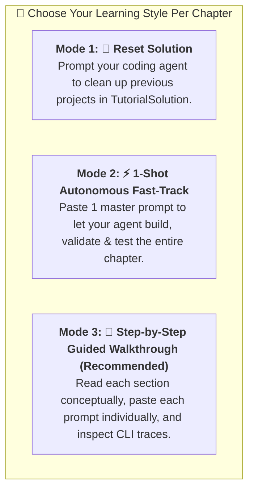

# Coding Agents with UiPath CLI Tutorial

This repository provides a hands-on tutorial on using **Coding Agents** integrated with the **UiPath CLI (`uip`)**. See [STATUS.md](./STATUS.md) for where the tutorial stands against the Fusion Triage Lab plan.

### 🤖 What is a Coding Agent?
A **Coding Agent** is an autonomous, tool-augmented AI pair programmer capable of reasoning over complex codebases, planning multi-step implementations, executing terminal commands, inspecting file systems, and building or debugging software directly within the developer's workspace.

---

> 💡 **Disabling UiPath CLI Telemetry:**
> To opt out of anonymous CLI usage telemetry, set the `UIPATH_TELEMETRY_DISABLED` environment variable:
>
> **🍏 macOS / Linux (Bash / Zsh):**
> ```bash
> export UIPATH_TELEMETRY_DISABLED=true
> ```
> **🪟 Windows 11 (PowerShell):**
> ```powershell
> $env:UIPATH_TELEMETRY_DISABLED = "true"
> [System.Environment]::SetEnvironmentVariable('UIPATH_TELEMETRY_DISABLED', 'true', 'User')
> ```
> For more details, refer to the [UiPath CLI Telemetry Documentation](https://docs.uipath.com/automation-cloud/automation-cloud/latest/user-guide/cli-telemetry).

---

## 🛠️ Tools Tested in This Tutorial

This tutorial has been tested and verified across three primary AI coding agent environments alongside the UiPath CLI:

1. **Claude Code** (Anthropic): Terminal-native agentic AI coding assistant designed for fast, shell-driven iteration, file editing, and command execution.
2. **Google Antigravity** (Google DeepMind): Multi-agent pair programming and reasoning platform featuring autonomous task planning, verification loops, and deep IDE workspace integration.
3. **UiPath Autopilot in UiPath Studio** (UiPath): In-IDE and in-platform AI assistant specialized in enterprise automation, natural language workflow creation, coded activity generation, and solution development.
4. **UiPath CLI (`uip`)**: Official command-line interface and Model Context Protocol (MCP) server for modern UiPath solutions, Maestro flows, and cloud Orchestrator deployments.

---

## 🚀 Prerequisites

- **UiPath CLI (`uip`)**: Installed globally via `npm install -g @uipath/cli` or executable via `npx @uipath/cli`.
- **Node.js**: Node.js (v18+) and npm.
- **Git & GitHub CLI (`gh`)**:
  - **macOS:** `brew install git gh`
  - **Windows 11 (PowerShell):** `winget install --id Git.Git -e; winget install --id GitHub.cli -e`
- **UiPath Automation Cloud Account**: Access to UiPath Cloud Orchestrator and Solution Management.

---

## 🎓 The 3-Mode Agentic Learning Paradigm

In this tutorial, you do not need to copy static boilerplate files or manage ZIP archives. Instead, every practical chapter (`03` through `10`) provides **3 flexible ways to engage**:



### 1. 🔄 Mode 1: Reset Solution via Prompt
If you ever want to start a chapter fresh, simply prompt your coding assistant:
```text
Delete the TutorialSolution folder if it already exists so we can start Chapter 03 completely fresh.
```

### 2. ⚡ Mode 2: 1-Shot Autonomous Fast-Track
Each chapter includes a **1-Shot Master Prompt** located right at the top. Pasting this single prompt into Claude Code, Google Antigravity, or Autopilot causes the agent to autonomously scaffold, wire, validate, and cloud-debug the entire chapter in under 30 seconds!

### 3. 📖 Mode 3: Step-by-Step Guided Walkthrough (Recommended)
Follow the step-by-step numbered sections. For each step:
1. **Read the concept and architecture diagram.**
2. **Copy the natural language prompt** from the `💬 Prompt Your AI Coding Agent` block.
3. **Paste into your coding agent** and observe the underlying `💻 CLI Command` it executes.

---

## 📂 Repository & Tutorial Structure

```text
Tutorial/
├── README.md                               <-- Master syllabus & learning paradigm guide
├── STATUS.md                               <-- Coverage status against the Fusion Triage Lab plan
├── .gitignore                               <-- Excludes ./TutorialSolution/ and build outputs
├── AGENTS.md / CLAUDE.md                   <-- AI Coding Agent rules and formatting standards
├── scripts/
│   ├── verify-dual-path.js                 <-- Automated linter for Dual-Path prompts
│   └── pre-commit                          <-- Git pre-commit hook
├── Chapters/                                <-- Step-by-step tutorial modules
│   ├── 01-CodingAgents.md                  <-- Coding Agent fundamentals & why uip is agent-friendly
│   ├── 02-Setup.md                         <-- Setup, CLI install, 3 form factors & telemetry
│   ├── 03-SolutionsAndProjects.md          <-- Solutions vs. legacy single projects & creating TutorialSolution
│   ├── 04-BuildingFirstFlow.md              <-- Adding EmailTriage flow with an Autonomous Agent
│   ├── 05-VariablesAndSchemas.md            <-- Multi-typed variables, complex JSON, namespacing & Update Variable
│   ├── 06-StorageBucketAndIndex.md          <-- Orchestrator folders, storage buckets & Context Grounding indexes
│   ├── 07-HumanInTheLoop.md                 <-- Decision gateways, Quick Form tasks & human approval checkpoints
│   ├── 08-SendingEmails.md                  <-- Integration Service connections & the Gmail Send Email connector
│   ├── 09-ReceivingEmails.md                <-- Gmail connector trigger, entry points & optional-chained bindings
│   └── 10-Deployment.md                     <-- Packaging, Cloud Solutions Management & Orchestrator deployment
└── TutorialSolution/                        <-- Active student solution (gitignored)
    ├── TutorialSolution.uipx                <-- Parent Solution manifest
    ├── EmailTriage/                         <-- Chapters 04 to 10 Email Triage flow
    └── resources/solution_folder/           <-- Declarative cloud resources
```

---

## 📚 Tutorial Chapters

1. **[Chapter 01: Coding Agents & UiPath CLI Architecture](./Chapters/01-CodingAgents.md)**
   - What are Coding Agents and how they differ from simple autocomplete/chat.
   - Dual-use: manual terminal execution vs. automated AI agent loops.
   - The 4 Pillars of `uip` agent-friendliness (JSON by default, Skills, MCP, Scaffolder briefings).
   - How Claude Code, Google Antigravity, and UiPath Autopilot interact with `uip`.

2. **[Chapter 02: Environment Setup & Agent Configuration](./Chapters/02-Setup.md)**
   - Installing Node.js, Git, and GitHub CLI across macOS and Windows 11.
   - Installing and configuring the UiPath CLI (`uip`).
   - Disabling telemetry and authenticating against UiPath Cloud.
   - The 3 Interface Form Factors: Terminal CLIs, VS Code Extensions, and Standalone IDEs.
   - Equipping agents with UiPath skills (`uip skills install`) & MCP server.

3. **[Chapter 03: UiPath Solutions and Projects (Top-Down)](./Chapters/03-SolutionsAndProjects.md)**
   - The architectural shift: Legacy Single Projects (`project.json`) vs. Modern Solutions (`.uipx`).
   - Creating your multi-project solution folder: **`TutorialSolution`**.
   - The 2 Essential Commands to scaffold solutions and flows.
   - The Assign and Unassign lifecycle mechanism in `TutorialSolution.uipx`.
   - Inspecting and unassigning unused projects (`Project03`).

4. **[Chapter 04: Building Your First Maestro Flow](./Chapters/04-BuildingFirstFlow.md)**
   - Why scaffold flows with an AI agent instead of manual canvas drawing.
   - Adding the **`EmailTriage`** project to `TutorialSolution`.
   - Discovering tenant LLM models (`uip agent model list`) and setting `gpt-4o-2024-11-20`.
   - Scaffolding the 3-node baseline flow: Start Trigger ➔ Triage AI Agent ➔ End Node.
   - Flow inputs at `Start` (`emailBody`) and flow outputs at `End` (`triageResult`).
   - CLI verification tools (`uip maestro flow format` & `validate`).
   - Visual Canvas controls: Fit to Screen (🔲) and Tidy Up (🧹).
   - Running the first live cloud debug session (`uip maestro flow debug`).

5. **[Chapter 05: Variables, Schemas & Complex Data](./Chapters/05-VariablesAndSchemas.md)**
   - Flow & Agent Data Types (string, number, boolean, object, and array of objects).
   - Upgrading the Triage Agent to output multiple strongly-typed schema variables.
   - Demystifying Namespaces: The `{{ $vars.NodeId.OutputEnvelope.Property }}` formula.
   - Single vs Multi-Output nodes.
   - Step Outputs (immutable) vs Flow Variables (mutable via "Update Variable").
   - Live cloud debug testing and inspecting structured agent JSON payloads.

6. **[Chapter 06: Storage Buckets & Context Grounding Indexes](./Chapters/06-StorageBucketAndIndex.md)**
   - Why hard-coding organizational knowledge into a system prompt does not survive a reorganization.
   - Installing the `@uipath/context-grounding-tool` CLI tool.
   - Creating a **root** Orchestrator folder with its own package feed (`--feed-type FolderHierarchy`).
   - Creating the `OrganizationData` storage bucket and uploading `Departments.xlsx` to it.
   - Building the `OrganizationIndex` over the bucket, triggering ingestion, and polling `last_ingestion_status` to completion.
   - Attaching the index to the inline agent: agent resource + flow `context` handle node + a retrieval-capped system prompt.

7. **[Chapter 07: Human in the Loop](./Chapters/07-HumanInTheLoop.md)**
   - Flow-level HITL vs agent escalations, and why a compliance gate belongs in the graph.
   - Sharpening `requiresEscalation` instead of adding a field, with the rule living in the spreadsheet's `Human Review` column.
   - Branching with a `core.logic.decision` gateway and a `=js:` typed expression.
   - Scaffolding a **Quick Form** task with `uip maestro flow hitl add`: fields, outcomes, priority and assignee in one command.
   - The two output wiring styles (`completed` + `status` vs per-outcome handles) and the cached-definition trick behind the second.
   - Returning the reviewer's verdict as flow outputs, read by field `id` rather than by the `variable` alias.

8. **[Chapter 08: Sending Emails](./Chapters/08-SendingEmails.md)**
   - Why an Integration Service connection beats a credential in a flow variable.
   - Discovering the Gmail connection (`uip is connections list --all-folders`) and its connector key.
   - Connector nodes are **CLI-owned**: `uip maestro flow node add` then `node configure`, never hand-authored JSON.
   - Reading `method` / `endpoint` from `connectorMethodInfo` and request fields from `uip is resources describe`.
   - Placing the send after the branch merge so one template serves both paths.
   - Verifying the send by the returned Gmail message id and `SENT` label, not by the run status.

9. **[Chapter 09: Receiving Emails](./Chapters/09-ReceivingEmails.md)**
   - Triggers are BPMN **start events** with `entryPointId`, so a flow can have several.
   - Keeping the manual trigger for testing while adding a Gmail trigger for production.
   - `registry get` on a trigger **requires `--connection-id`**; activities do not.
   - Configuring a trigger with `eventMode` and `eventParameters` rather than `method` / `endpoint`.
   - Why two entry points break unguarded bindings (`400300 Cannot read property of null`) and how optional chaining fixes it.
   - Why a connector trigger cannot fire during `flow debug`, and what to test instead.

10. **[Chapter 10: Deployment](./Chapters/10-Deployment.md)**
   - Solutions Management (Tenant Catalog) vs. Orchestrator execution engine.
   - Packaging the complete multi-project `TutorialSolution` into a `.zip` bundle (`uip solution pack`).
   - Publishing to the tenant solution feed (`uip solution publish`).
   - Deploying and provisioning processes in Orchestrator folders (`uip solution deploy run`), where the Chapter 09 trigger goes live.

---

## 💡 UiPath Product & Tooling Improvement Suggestions

Based on hands-on developer experience with the UiPath CLI (`uip`) and Coding Agents, here are key product suggestions for the UiPath Engineering and Product teams:

1. **Card-Width Aware Auto-Layout in `uip maestro flow format`:**
   - **Current Behavior:** The headless formatter currently assumes uniform 96px bounding boxes for all node types. When formatting flows containing wide rectangular cards (e.g. `uipath.agent.autonomous` which renders at ~280px in UiPath Studio and VS Code), downstream nodes (like `core.control.end` at `x: 480`) visually overlap the agent card (`x: 288 + 280 = 568px`) until the user manually clicks "Tidy Up" in the visual UI.
   - **Improvement:** Update the `uip maestro flow format` layout engine to factor in intrinsic node dimensions (e.g. 280px for Autonomous Agents, 96px for circular triggers/ends) so headless CLI formatting produces visually perfect, non-overlapping layouts out of the box.

2. **Canvas Viewport & Layout Options in CLI (`--fit-to-screen` & `--card-spacing`):**
   - **Improvement:** Add layout flags to `uip maestro flow format` (such as `--fit-to-screen`, `--card-spacing <px>`, and `--orientation <horizontal|vertical>`) to give developers and coding agents programmatic control over canvas scaling and spacing presets.

3. **Prevent Silent Fallback Solution Creation in VS Code Extension:**
   - **Current Behavior:** When opening a parent folder containing nested solution directories (e.g. `./TutorialSolution/TutorialSolution.uipx`), the UiPath Maestro VS Code extension's background language server silently generates a phantom `./Workspace/Solution1/Solution1.uipx` and `Project1/project.uiproj` on disk without user interaction.
   - **Improvement:** The extension should detect nested `.uipx` manifests across subdirectories or prompt the user before creating fallback solution folders in the workspace root.

4. **Document Handlebars Token Syntax for Prompts & Flow Outputs in `uipath.maestro.flow` Agent Skill:**
   - **Current Behavior:** Coding agents frequently confuse the three distinct variable referencing syntaxes in Maestro:
     - JavaScript expression bindings for typed values: `=js:$vars.<nodeId>.output.<prop>`
     - Visual Token Templates for strings: `{{ $vars.<nodeId>.output.<prop> }}` (Mustache / Handlebars syntax)
     - Inline agent prompt inputs: `{{input.<triggerNodeId>__output__<var>}}`, delivered by the flow node's `agentInputVariables[].binding`
   - When an agent generates `${start.output.emailBody}` in prompt fields or `=$vars.agent_triage...` on End node string outputs, Studio Web's frontend AST tokenizer treats them as unmapped static strings or empty payloads, leading to runtime errors (`AGENT_RUNTIME.TERMINATION_LLM_RAISED_ERROR`) or unmapped output arguments (`null`).
   - **The failures are silent.** Two verified cases where `uip maestro flow validate`, `uip agent validate`, and `uip maestro flow debug` all report success while the data is wrong: (a) a `{{ $vars... }}` token inside an inline agent's `agent.json` prompt reaches the LLM literally, so the model answers from an empty input; (b) an End node typed output missing its `=js:` prefix returns `null` for numbers and booleans and a literal `"vars.<nodeId>.output.<prop>"` string for arrays.
   - **Improvement:** Update the official `uipath.maestro.flow` skill briefing (`uip skills list`) and MCP tool documentation to state the three syntaxes explicitly, and make `flow validate` raise a warning when a typed output mapping references `$vars` without an `=js:` prefix, rather than passing it through as a literal.

5. **Orphaned Solution Package Artifacts Cause a Misleading "Project name already exists" Error:**
   - **Current Behavior:** `uip solution projects remove <name>` prunes the project's solution resource artifact at `resources/solution_folder/package/<Name>.json`. Deleting a project folder by hand (`rm -rf`) does not, so the artifact is left behind still bound to the `projectKey` it was created for.
   - The collision fires when a package artifact of that name exists but is bound to a **different** `projectKey` than the project now being created. A controlled experiment run side by side in the same solution (uip CLI 1.200.0, staging tenant): with a leftover `Project03.json` whose manifest entry had also been removed, so a fresh project Id was minted, `uip maestro flow init Project03` returned `ProjectArtifacts.Created: false` with `Error: "Project name already exists"` and logged an ERROR-level line from `ResourceBuilder:ProjectCreateCommandHandler`, while `uip maestro flow init ProjectZZ` (no residue) returned `Created: true`. Same command, same solution, same moment.
   - Deleting only the folder and leaving the manifest entry in place does **not** trigger it: re-init then reuses the same project Id, the keys match, and the artifact is adopted (`Created: true`). So the trigger is a key mismatch, not the mere presence of a leftover artifact. Two ways to reach a mismatch: the manifest entry was also removed (for example by the hand-edit in Chapter 03), or the artifact survives from an older incarnation of the project carrying a stale key.
   - **The error is misleading rather than fatal.** The project files ARE written to disk and the project IS registered in the manifest (`SolutionRegistration.Status: Registered`). Only the solution-level package resource is skipped, because one with that name already exists. A user reading the ERROR line reasonably concludes the scaffold failed when it did not.
   - `uip solution resources refresh` does not clean this up either: it reported `Synced 0 resources` and left the orphaned artifact in place. Only `uip solution projects remove` prunes it. The situation is easy to hit during normal cleanup, because `uip solution projects remove` refuses to unregister the last project in a solution ("Cannot remove the only project in the solution"), which pushes users toward deleting the folder by hand.
   - **Improvement:** `uip maestro flow init` should either silently reuse the orphaned artifact or report it at INFO level as "reusing existing solution resource", instead of an ERROR that reads like a failed scaffold. Additionally, `uip solution resources refresh` should prune package artifacts whose project is absent from both disk and the manifest.

---

## ❓ Frequently Asked Questions (Q&A)

### Q: Should logs and CLI outputs from staging / internal tenants be anonymized?
**A:** **Yes, absolutely.** When creating public tutorials, documentation, or open-source repositories:
1. **Sanitize Cloud URLs:** Replace internal endpoints (e.g. `staging.uipath.com`) with standard production placeholders:  
   `https://cloud.uipath.com/{organization}/{tenant}/studio_/designer/...`
2. **Mask Tenant Identifiers & GUIDs:** Scrub internal organization IDs, folder keys, trace IDs, and job keys to prevent unintentional exposure of internal infrastructure.
3. **Anonymize User Data & Emails:** Use standard sample domains (e.g. `user@example.com` or `johannes.test@example.com`) rather than real employee or personal mailboxes.
4. **Protect Credentials:** Never commit `.auth` files, API keys, or PAT tokens. Always ensure `.auth` and `TutorialSolution/` are included in `.gitignore`.
