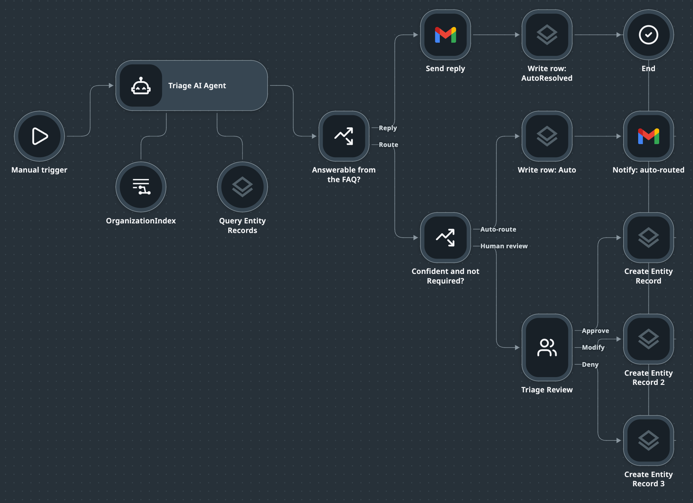
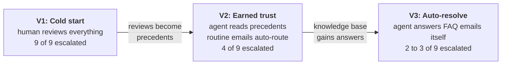
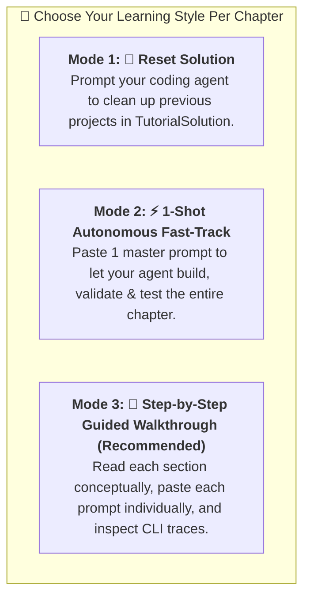

# Coding Agents with UiPath CLI Tutorial

This repository provides a hands-on tutorial on using **Coding Agents** integrated with the **UiPath CLI (`uip`)**.

### 🎯 What You Will Build
An **email triage process** for a support inbox. A Maestro flow reads an incoming email, retrieves the department directory from a Context Grounding index, proposes a department, and hands the sensitive cases to a human in Action Center. Every human decision is written back as a row in a Data Fabric entity, and those rows are what lets the process earn more autonomy over time.

This is the finished flow, as Studio Web draws it at the end of Chapter 14. Every node in it is created by prompting a coding agent:



The flow file behind this picture is [Reference/EmailTriage.flow](Reference/EmailTriage.flow), with the tenant ids replaced by placeholders: import it into a new Studio Web project to look ahead, and the unset connections show you where your own go. Read the picture left to right. The **Triage AI Agent** has two resources below it: the **OrganizationIndex** holding the department directory, and **Query Entity Records**, the tool it uses to look up earlier human decisions. Two decision gates follow. "Answerable from the FAQ?" sends emails the agent can answer itself to **Send reply**. "Confident and not Required?" auto-routes the routine cases and sends the rest to the **Triage Review** form, where a person approves, modifies or denies. Every path ends in a **Create Entity Record** write, so each outcome becomes a row the next run can learn from.

You build the same flow three times, and a fixed batch of nine emails plus one scoreboard measures each version:



No model is trained anywhere in this tutorial. The model stays the same; what grows is the context it is shown and the policy that decides when it may act alone. Chapter 08 explains the design; Parts 4 to 6 build it. And all of it is built by prompting a coding agent that drives the `uip` CLI, which is the second thing this tutorial teaches.

### 🤖 What is a Coding Agent?
A **Coding Agent** is an autonomous, tool-augmented AI pair programmer capable of reasoning over complex codebases, planning multi-step implementations, executing terminal commands, inspecting file systems, and building or debugging software directly within the developer's workspace.

---

## 🛠️ Tools Tested in This Tutorial

This tutorial has been tested and verified across three primary AI coding agent environments alongside the UiPath CLI:

1. **Claude Code** (Anthropic): Terminal-native agentic AI coding assistant designed for fast, shell-driven iteration, file editing, and command execution.
2. **Google Antigravity** (Google DeepMind): Multi-agent pair programming and reasoning platform featuring autonomous task planning, verification loops, and deep IDE workspace integration.
3. **UiPath Autopilot in UiPath Studio** (UiPath): In-IDE and in-platform AI assistant specialized in enterprise automation, natural language workflow creation, coded activity generation, and solution development.
4. **UiPath CLI (`uip`)**: Official command-line interface and Model Context Protocol (MCP) server for modern UiPath solutions, Maestro flows, and cloud Orchestrator deployments.

### 💻 Recommended IDE & Tested Toolchain Versions

You can run this tutorial in a pure terminal or inside **Visual Studio Code (VS Code)**, which provides visual file tree inspection, integrated terminal execution, and side-panel agent chats.

| Tool / Component | Identifier / Extension ID | Tested Version | Role in Tutorial |
| :--- | :--- | :--- | :--- |
| **Visual Studio Code** | `code` | `v1.137.0` | Recommended editor & integrated workspace |
| **Google Antigravity** | `google.google-antigravity` | `v1.2.0` | In-editor multi-agent pair programming |
| **Claude Code** | `anthropic.claude-code` | `v2.1.263` | In-editor agent chat & terminal CLI (`claude`) |
| **UiPath Autopilot** | `uipath.autopilot-vscode` | `v1.0.260828024` | Native enterprise automation assistance |
| **UiPath Maestro Flow** | `uipath.uipath-maestro` | `v1.201.14` | Flow graph language syntax support |
| **UiPath CLI** | `@uipath/cli` (`uip`) | `v1.200.1` | Deterministic platform orchestration & debug engine |

---

## 🚀 Prerequisites

You need **Node.js v18+**, the **UiPath CLI** (`uip`), **Git**, and a **UiPath Automation Cloud account**. Node.js is the only language runtime involved; Python is not required. [Chapter 02](Chapters/02-Setup.md) installs each of these for macOS and Windows 11, clones this repository, and authenticates against your tenant.

---

## 🎓 The 3-Mode Agentic Learning Paradigm

In this tutorial, you do not need to copy static boilerplate files or manage ZIP archives. Instead, every practical chapter (`03` through `14`, except the design chapter `08`) provides **3 flexible ways to engage**:



### 1. 🔄 Mode 1: Reset Solution via Prompt
If you ever want to start a chapter fresh, simply prompt your coding assistant. From Chapter 04 on the reset is one command, because every chapter ends with a **📌 Checkpoint** (see below):
```text
Reset TutorialSolution to its ch06-done checkpoint: hard-reset the solution's own git repository to that tag and remove untracked files.
```

### 2. ⚡ Mode 2: 1-Shot Autonomous Fast-Track
Each chapter includes a **1-Shot Master Prompt** located right at the top. Pasting this single prompt into Claude Code, Google Antigravity, or Autopilot causes the agent to autonomously scaffold, wire, validate, and cloud-debug the entire chapter in under 30 seconds!

### 3. 📖 Mode 3: Step-by-Step Guided Walkthrough (Recommended)
Follow the step-by-step numbered sections. For each step:
1. **Read the concept and architecture diagram.**
2. **Copy the natural language prompt** from the `💬 Prompt Your AI Coding Agent` block.
3. **Paste into your coding agent** and observe the underlying `💻 CLI Command` it executes.

### 📌 Checkpoints: Going Back, and Jumping Forward

`TutorialSolution/` is your workspace and is ignored by this repository, so Chapter 03 gives it a small git repository of its own. Every chapter from 03 on ends with a checkpoint step that commits the solution and moves a tag, `ch03-done` through `ch14-done`. A chapter's Mode 1 resets the files to the previous tag with `git reset --hard` plus `git clean`, and says separately what to do about the cloud (rows to delete, artifacts to tear down), because no tag covers the tenant.

The tags are yours alone: from Chapter 06 on the files carry your tenant's ids (folder key, index id, connection ids, assignee), so a tag from another machine validates and fails at runtime. Going **back** is a checkout; jumping **forward** is a rebuild. The parts start here:

| Part | Starts from | Files | Tenant |
| :--- | :--- | :--- | :--- |
| Part 2 | `ch05-done` | typed outputs, no ids | nothing yet |
| Part 3 | `ch07-done` | grounded flow with the Quick Form | folder, bucket, index |
| Part 4 | `ch09-done` | same files as `ch07-done` | plus the empty `TriageDecision` entity |
| Part 5 | `ch11-done` | V1 flow plus `.batch-runs/phase1` | plus nine Phase 1 rows |
| Part 6 | `ch12-done` | V2 flow | plus the Phase 2 rows |

[WORKSHOP.md](./WORKSHOP.md) lists the fast path to each starting point for a student who has to skip ahead.

---

## 📂 Repository & Tutorial Structure

```text
Tutorial/
├── README.md                               <-- Master syllabus & learning paradigm guide
├── WORKSHOP.md                             <-- Running the triage lab in two 45-minute blocks: timings, recordings, fast paths
├── .gitignore                               <-- Excludes ./TutorialSolution/ and build outputs
├── AGENTS.md / CLAUDE.md                   <-- AI Coding Agent rules and formatting standards
├── scripts/
│   ├── verify-dual-path.js                 <-- Automated linter for Dual-Path prompts
│   └── pre-commit                          <-- Git pre-commit hook
├── Chapters/                                <-- Step-by-step tutorial modules
│   ├── 01-CodingAgents.md                  <-- Part 1: Coding Agent fundamentals & why uip is agent-friendly
│   ├── 02-Setup.md                         <-- Part 1: Setup, CLI + skills install, login, 3 form factors
│   ├── 03-SolutionsAndProjects.md          <-- Part 1: Solutions vs. legacy single projects & creating TutorialSolution
│   ├── 04-BuildingFirstFlow.md              <-- Part 1: Adding EmailTriage flow with an Autonomous Agent
│   ├── 05-VariablesAndSchemas.md            <-- Part 1: Multi-typed variables, complex JSON, namespacing & Update Variable
│   ├── 06-StorageBucketAndIndex.md          <-- Part 2: Orchestrator folders, storage buckets & Context Grounding indexes
│   ├── 07-HumanInTheLoop.md                 <-- Part 2: Decision gateways, Quick Form tasks & human approval checkpoints
│   ├── 08-Triage3PhaseDesign.md             <-- Part 3: V1 cold start, V2 earned trust, V3 auto-resolve
│   ├── 09-DataFabric.md                     <-- Part 3: The TriageDecision entity: recording every decision in Data Fabric
│   ├── 10-V1-WriteBack.md                   <-- Part 4: V1 - every review becomes a row
│   ├── 11-BatchRunnerAndScoreboard.md       <-- Part 4: The nine-email batch and the escalation scoreboard
│   ├── 12-V2-EarnedTrust.md                 <-- Part 5: V2 - the precedent tool and the decision gate
│   ├── 13-SendingEmails.md                  <-- Part 6: Integration Service connections & the Gmail Send Email connector
│   ├── 14-V3-AutoResolve.md                 <-- Part 6: V3 - the FAQ, the reply branch and the planted miss
│   ├── A1-ReceivingEmails.md                <-- Optional appendix: Gmail connector trigger, entry points & optional-chained bindings
│   └── A2-Deployment.md                     <-- Optional appendix: Packaging, Cloud Solutions Management & Orchestrator deployment
├── Data/
│   ├── Departments.xlsx                     <-- The department directory indexed in Chapter 06
│   ├── TriageBatch.csv                      <-- The nine test emails every phase runs (Chapter 11)
│   ├── ExtraEmails.csv                      <-- Optional: 33 easy one-line emails, three per department, for extra runs (Chapter 11)
│   └── SupportFAQ.txt                        <-- The knowledge base V3 answers from (Chapter 14)
├── Images/                                  <-- Screenshots used in the README
├── Reference/                               <-- EmailTriage.flow as it looks at the end of Chapter 14, tenant ids replaced by placeholders
└── TutorialSolution/                        <-- Active student solution (gitignored)
    ├── TutorialSolution.uipx                <-- Parent Solution manifest
    ├── EmailTriage/                         <-- Chapters 04 to 14 Email Triage flow
    └── resources/solution_folder/           <-- Declarative cloud resources
```

---

## 📚 Tutorial Chapters

The tutorial has six parts: Parts 1 and 2 set up the tooling and build the baseline flow, Parts 3 to 6 take it through the three phases described above. The appendices cover production concerns that the phases do not need.

### Part 1: Foundations

1. **[Chapter 01: Coding Agents & UiPath CLI Architecture](./Chapters/01-CodingAgents.md)**
   - What are Coding Agents and how they differ from simple autocomplete/chat.
   - Dual-use: manual terminal execution vs. automated AI agent loops.
   - The 4 Pillars of `uip` agent-friendliness (JSON by default, Skills, MCP, Scaffolder briefings).
   - How Claude Code, Google Antigravity, and UiPath Autopilot interact with `uip`.

2. **[Chapter 02: Environment Setup & Agent Configuration](./Chapters/02-Setup.md)**
   - Installing Node.js, Git, and GitHub CLI across macOS and Windows 11.
   - Installing the UiPath CLI (`uip`) and its agent skills (`uip skills install`), and verifying both.
   - Authenticating against UiPath Cloud; optionally disabling telemetry.
   - The 3 Interface Form Factors: Terminal CLIs, VS Code Extensions, and Standalone IDEs.
   - The agent briefing files (`AGENTS.md`, `CLAUDE.md`) and why they let you prompt in plain language.

3. **[Chapter 03: UiPath Solutions and Projects (Top-Down)](./Chapters/03-SolutionsAndProjects.md)**
   - The architectural shift: Legacy Single Projects (`project.json`) vs. Modern Solutions (`.uipx`).
   - Creating your multi-project solution folder: **`TutorialSolution`**.
   - The 2 Essential Commands to scaffold solutions and flows.
   - The Assign and Unassign lifecycle mechanism in `TutorialSolution.uipx`.
   - Inspecting and unassigning unused projects (`Project03`).
   - Giving `TutorialSolution` its own git repository: the `ch<NN>-done` checkpoint tags that every later reset uses.

4. **[Chapter 04: Building Your First Maestro Flow](./Chapters/04-BuildingFirstFlow.md)**
   - Why scaffold flows with an AI agent instead of manual canvas drawing.
   - Adding the **`EmailTriage`** project to `TutorialSolution`.
   - Discovering tenant LLM models (`uip agent model list`) and setting `gpt-4o-2024-11-20`.
   - Scaffolding the 3-node baseline flow: Start Trigger ➔ Triage AI Agent ➔ End Node.
   - Flow inputs at `Start` (`emailBody`) and flow outputs at `End` (`triageResult`).
   - CLI verification tools (`uip maestro flow format` & `validate`).
   - Visual Canvas controls: Fit to Screen (🔲) and Tidy Up (🧹).
   - Running the first live cloud debug session (`uip maestro flow debug`).

5. **[Chapter 05: Variables, Schemas & Complex Data](./Chapters/05-VariablesAndSchemas.md)**
   - Flow & Agent Data Types (string, number, boolean, object, and array of objects).
   - Upgrading the Triage Agent to output multiple strongly-typed schema variables.
   - Demystifying Namespaces: The `{{ $vars.NodeId.OutputEnvelope.Property }}` formula.
   - Single vs Multi-Output nodes.
   - Step Outputs (immutable) vs Flow Variables (mutable via "Update Variable").
   - Live cloud debug testing and inspecting structured agent JSON payloads.

### Part 2: The Baseline Triage Agent

6. **[Chapter 06: Storage Buckets & Context Grounding Indexes](./Chapters/06-StorageBucketAndIndex.md)**
   - Why hard-coding organizational knowledge into a system prompt does not survive a reorganization.
   - Why indexes have no core CLI, and what stays in the browser.
   - Creating a **root** Orchestrator folder with its own package feed (`--feed-type FolderHierarchy`).
   - Creating the `OrganizationData` storage bucket and uploading `Departments.xlsx` to it.
   - Creating and syncing the `OrganizationIndex` in Orchestrator, and finding its id in the flow registry.
   - Attaching the index to the inline agent: agent resource + flow `context` handle node + a retrieval-capped system prompt.

7. **[Chapter 07: Human in the Loop](./Chapters/07-HumanInTheLoop.md)**
   - Flow-level HITL vs agent escalations, and why a compliance gate belongs in the graph.
   - Sharpening `requiresEscalation` instead of adding a field, with the rule living in the spreadsheet's `Human Review` column.
   - Branching with a `core.logic.decision` gateway and a `=js:` typed expression.
   - Scaffolding a **Quick Form** task with `uip maestro flow hitl add`: fields, outcomes, priority and assignee in one command.
   - The two output wiring styles (`completed` + `status` vs per-outcome handles) and the cached-definition trick behind the second.
   - Returning the reviewer's verdict as flow outputs, read by field `id` rather than by the `variable` alias.

### Part 3: The Three-Phase Design

8. **[Chapter 08: The Three-Phase Triage Design](./Chapters/08-Triage3PhaseDesign.md)**
   - Nothing is trained: facts live in the index, experience in the entity, policy in the graph.
   - V1 reviews everything to produce evidence, V2 auto-routes where a human precedent exists, V3 answers FAQ emails itself.
   - Rule-based confidence instead of a self-reported percentage, the compliance floor that never auto-routes, and the planted miss.
   - A fixed batch of nine emails composed backwards from the escalation curve, and the one-query scoreboard.

9. **[Chapter 09: Data Fabric - Recording Every Triage Decision](./Chapters/09-DataFabric.md)**
   - Why the learning loop needs a queryable entity rather than a log, and why it is named `TriageDecision` rather than "approvals".
   - The eleven attributes and the two that carry the design: `Confidence` (the agent's opinion) vs. `Outcome` (the verdict).
   - Creating the `TriageOutcome` choice set and the entity with `uip df`, verifying the schema with a JMESPath filter, and a write-read-delete round trip.

### Part 4: V1 - Cold Start

10. **[Chapter 10: V1 - Every Review Becomes a Row](./Chapters/10-V1-WriteBack.md)**
   - Adding `confidence` and `reasoning` to the agent, and a `Feedback` field plus a third outcome to the Quick Form.
   - Writing a `TriageDecision` row on every outcome, including Deny, with the Data Fabric connector node.
   - Proving the write from the entity, not from the run status.

11. **[Chapter 11: The Batch Runner and the Scoreboard](./Chapters/11-BatchRunnerAndScoreboard.md)**
   - The nine emails in `Data/TriageBatch.csv` and why they are composed backwards from the curve.
   - Running the batch from the command line with a phase number, reviewing nine tasks in Action Center.
   - The scoreboard query: escalations per phase, and the first number: 9.

### Part 5: V2 - Earned Trust

12. **[Chapter 12: V2 - The Precedent Tool and the Decision Gate](./Chapters/12-V2-EarnedTrust.md)**
   - Attaching `Query Entity Records` to the agent as a tool and proving the call from the execution trace.
   - The precedent prompt and the rule-based confidence rubric.
   - The gate: confidence above 90 and no Human Review floor. Rerun the batch: 4.

### Part 6: V3 - Auto-Resolve

13. **[Chapter 13: Sending Emails](./Chapters/13-SendingEmails.md)**
   - Why an Integration Service connection beats a credential in a flow variable.
   - Discovering the Gmail connection (`uip is connections list --all-folders`) and its connector key.
   - Connector nodes are **CLI-owned**: `uip maestro flow node add` then `node configure`, never hand-authored JSON.
   - Reading `method` / `endpoint` from `connectorMethodInfo` and request fields from `uip is resources describe`.
   - Placing the send after the Auto write, so every unreviewed routing has a witness.
   - Verifying the send by the returned Gmail message id and `SENT` label, not by the run status.

14. **[Chapter 14: V3 - The FAQ, the Reply Branch and the Planted Miss](./Chapters/14-V3-AutoResolve.md)**
   - Adding `Data/SupportFAQ.txt` to the bucket and re-ingesting the index.
   - Two new agent outputs, `canAutoResolve` and `replyText`, and the reply branch that sends them.
   - Rerun the batch: 2, plus the one the agent should not have answered.

### Appendix (optional)

The two appendices are not part of the three-phase arc and are not needed for the workshop. Read them when the finished flow has to run without anyone pressing the button (A1) or has to leave your laptop (A2).

- **[Appendix A1: Receiving Emails](./Chapters/A1-ReceivingEmails.md)**
   - Triggers are BPMN **start events** with `entryPointId`, so a flow can have several.
   - Keeping the manual trigger for testing while adding a Gmail trigger for production.
   - `registry get` on a trigger **requires `--connection-id`**; activities do not.
   - Configuring a trigger with `eventMode` and `eventParameters` rather than `method` / `endpoint`.
   - Why two entry points break unguarded bindings (`400300 Cannot read property of null`) and how optional chaining fixes it.
   - Why a connector trigger cannot fire during `flow debug`, and what to test instead.

- **[Appendix A2: Deployment](./Chapters/A2-Deployment.md)**
   - Solutions Management (Tenant Catalog) vs. Orchestrator execution engine.
   - Packaging the complete multi-project `TutorialSolution` into a `.zip` bundle (`uip solution pack`).
   - Publishing to the tenant solution feed (`uip solution publish`).
   - Deploying and provisioning processes in Orchestrator folders (`uip solution deploy run`), where the Appendix A1 trigger goes live.

---

## 💡 UiPath Product & Tooling Improvement Suggestions

Based on hands-on developer experience with the UiPath CLI (`uip`) and Coding Agents, here are key product suggestions for the UiPath Engineering and Product teams:

1. **Card-Width Aware Auto-Layout in `uip maestro flow format`:**
   - **Current Behavior:** The headless formatter currently assumes uniform 96px bounding boxes for all node types. When formatting flows containing wide rectangular cards (e.g. `uipath.agent.autonomous` which renders at ~280px in UiPath Studio and VS Code), downstream nodes (like `core.control.end` at `x: 480`) visually overlap the agent card (`x: 288 + 280 = 568px`) until the user manually clicks "Tidy Up" in the visual UI.
   - **Improvement:** Update the `uip maestro flow format` layout engine to factor in intrinsic node dimensions (e.g. 280px for Autonomous Agents, 96px for circular triggers/ends) so headless CLI formatting produces visually perfect, non-overlapping layouts out of the box.

2. **Canvas Viewport & Layout Options in CLI (`--fit-to-screen` & `--card-spacing`):**
   - **Improvement:** Add layout flags to `uip maestro flow format` (such as `--fit-to-screen`, `--card-spacing <px>`, and `--orientation <horizontal|vertical>`) to give developers and coding agents programmatic control over canvas scaling and spacing presets.

3. **Prevent Silent Fallback Solution Creation in VS Code Extension:**
   - **Current Behavior:** When opening a parent folder containing nested solution directories (e.g. `./TutorialSolution/TutorialSolution.uipx`), the UiPath Maestro VS Code extension's background language server silently generates a phantom `./Workspace/Solution1/Solution1.uipx` and `Project1/project.uiproj` on disk without user interaction.
   - **Improvement:** The extension should detect nested `.uipx` manifests across subdirectories or prompt the user before creating fallback solution folders in the workspace root.
   - **Second case, same extension (verified three times on 10.09.2026, extension `v1.201.14`, once under observation: no change for five minutes with the flow closed, first write twelve seconds after opening it):** merely opening a `.flow` file in the designer rewrites the project on disk: icons and a trigger output block are added to the flow, node versions are bumped, an `evals/` folder is created (twice also a `simulations.json`), and `agent.json` is re-serialized without every `description` in the output schema (twice out of three also without the `items` definition of an array property). While the tab stays open, the extension re-applies the rewrite seconds after any external change, so even a `git reset --hard` is undone until the tab is closed. A student who opens the flow to look at it, then continues with the CLI, builds on a degraded schema without knowing. The designer should either not write on open, or write back the same document it read.

4. **Document Handlebars Token Syntax for Prompts & Flow Outputs in `uipath.maestro.flow` Agent Skill:**
   - **Current Behavior:** Coding agents frequently confuse the three distinct variable referencing syntaxes in Maestro:
     - JavaScript expression bindings for typed values: `=js:$vars.<nodeId>.output.<prop>`
     - Visual Token Templates for strings: `{{ $vars.<nodeId>.output.<prop> }}` (Mustache / Handlebars syntax)
     - Inline agent prompt inputs: `{{input.<triggerNodeId>__output__<var>}}`, delivered by the flow node's `agentInputVariables[].binding`
   - When an agent generates `${start.output.emailBody}` in prompt fields or `=$vars.agent_triage...` on End node string outputs, Studio Web's frontend AST tokenizer treats them as unmapped static strings or empty payloads, leading to runtime errors (`AGENT_RUNTIME.TERMINATION_LLM_RAISED_ERROR`) or unmapped output arguments (`null`).
   - **The failures are silent.** Two verified cases where `uip maestro flow validate`, `uip agent validate`, and `uip maestro flow debug` all report success while the data is wrong: (a) a `{{ $vars... }}` token inside an inline agent's `agent.json` prompt reaches the LLM literally, so the model answers from an empty input; (b) an End node typed output missing its `=js:` prefix returns `null` for numbers and booleans and a literal `"vars.<nodeId>.output.<prop>"` string for arrays.
   - **Improvement:** Update the official `uipath.maestro.flow` skill briefing (`uip skills list`) and MCP tool documentation to state the three syntaxes explicitly, and make `flow validate` raise a warning when a typed output mapping references `$vars` without an `=js:` prefix, rather than passing it through as a literal.

5. **Orphaned Solution Package Artifacts Cause a Misleading "Project name already exists" Error:**
   - **Current Behavior:** `uip solution projects remove <name>` prunes the project's solution resource artifact at `resources/solution_folder/package/<Name>.json`. Deleting a project folder by hand (`rm -rf`) does not, so the artifact is left behind still bound to the `projectKey` it was created for.
   - The collision fires when a package artifact of that name exists but is bound to a **different** `projectKey` than the project now being created. A controlled experiment run side by side in the same solution (uip CLI 1.200.0, staging tenant): with a leftover `Project03.json` whose manifest entry had also been removed, so a fresh project Id was minted, `uip maestro flow init Project03` returned `ProjectArtifacts.Created: false` with `Error: "Project name already exists"` and logged an ERROR-level line from `ResourceBuilder:ProjectCreateCommandHandler`, while `uip maestro flow init ProjectZZ` (no residue) returned `Created: true`. Same command, same solution, same moment.
   - Deleting only the folder and leaving the manifest entry in place does **not** trigger it: re-init then reuses the same project Id, the keys match, and the artifact is adopted (`Created: true`). So the trigger is a key mismatch, not the mere presence of a leftover artifact. Two ways to reach a mismatch: the manifest entry was also removed (for example by the hand-edit in Chapter 03), or the artifact survives from an older incarnation of the project carrying a stale key.
   - **The error is misleading rather than fatal.** The project files ARE written to disk and the project IS registered in the manifest (`SolutionRegistration.Status: Registered`). Only the solution-level package resource is skipped, because one with that name already exists. A user reading the ERROR line reasonably concludes the scaffold failed when it did not.
   - `uip solution resources refresh` does not clean this up either: it reported `Synced 0 resources` and left the orphaned artifact in place. Only `uip solution projects remove` prunes it. The situation is easy to hit during normal cleanup, because `uip solution projects remove` refuses to unregister the last project in a solution ("Cannot remove the only project in the solution"), which pushes users toward deleting the folder by hand.
   - **Improvement:** `uip maestro flow init` should either silently reuse the orphaned artifact or report it at INFO level as "reusing existing solution resource", instead of an ERROR that reads like a failed scaffold. Additionally, `uip solution resources refresh` should prune package artifacts whose project is absent from both disk and the manifest.

6. **Coding Agents Cannot Approve Pending Tasks in Action Center:**
   - **Current Behavior:** Every human-in-the-loop chapter (07, 10, 11) pauses a debug run on a Quick Form task, and the coding agent has no way to action it. `uip or` has no `tasks` command, `uip maestro flow instance element` only offers `cancel` and `retry`, and there is no Action Center tool in the registry. The student has to switch to the browser once per task; a nine-email batch is nine context switches, and an unattended test of a HITL flow is impossible from the CLI.
   - **What works today:** The CLI's token (`uip login refresh`) is accepted by the Orchestrator Tasks API. `GET /odata/Tasks/UiPath.Server.Configuration.OData.GetTasksAcrossFolders` lists the pending Quick Form tasks with the same token, so the gap is a missing command, not a missing permission.
   - **Improvement:** Add `uip or tasks list / get / complete` (mirroring `GetTasksAcrossFolders`, `GetTaskDataById` and `GenericTasks/CompleteTask`), so an agent can list the pending tasks of a run, read the form data, and submit an outcome with output fields. Even a test-only flag on `uip maestro flow debug` that auto-completes Quick Forms with a given outcome would unblock automated testing of HITL flows.

7. **Context Grounding Indexes Have No Core CLI:**
   - **Current Behavior:** Folders and buckets are managed by `uip or`, but indexes only by `@uipath/context-grounding-tool`, a wrapper over the Python SDK that needs a Python runtime, the `uipath` package and a `setup` step. For a tutorial audience on their own notebooks that is a second language runtime for one chapter, so Chapter 06 creates and syncs the index in the browser instead.
   - **Improvement:** Expose index create / sync / status / delete in the Node-based `uip or` tool, next to buckets.

8. **The Canvas Data Fabric Node Writes Nothing When Built From the CLI:**
   - **Current Behavior:** `core.datafabric.create` (the palette's "Create entity record") depends on an entity binding only the canvas can create. Added from the CLI it validates, runs to `Completed`, and writes no row, with empty `inputs` and `outputs` in the debug payload. The Integration Service connector node `uipath.connector.uipath-uipath-dataservice.create-entity-record` writes correctly, so Chapter 10 uses that.
   - **Improvement:** Either let `uip maestro flow node configure` create the entity binding for `core.datafabric.*` nodes, or make `flow validate` fail on a Data Fabric node whose entity binding is absent.

9. **`uip maestro flow hitl add` Leaves the Form Unfinished:**
   - **Current Behavior (tool 1.200):** The scaffolded Quick Form has no `schemaId` (the run faults at task creation with `[200000] Activity failed to execute`), every field is `"type": "text"` with its id as the label (the reviewer sees `EMAILBODY`), a field bound to a number cannot be submitted (*Invalid input: expected string, received number*, the buttons stop working), and the assignee is a plain email without the `displayName` a `user` assignee needs. The node id is derived from the label, which the documentation does not say.
   - **Improvement:** Generate the `schemaId`, accept `type` and `label` per field in `--schema`, stringify or reject numeric bindings, and resolve `--assignee` against the directory.

10. **Small `uip df` Papercuts:**
   - `Version` is a reserved field name but the error only appears at create time; `INTEGER` fields are accepted and then cannot be rendered in the UI (use `DECIMAL` with precision 0); `records delete`, `entities delete` and `choice-sets delete` require `--yes --reason` that `--help` does not list; list commands reject `--output-filter` unless `--limit` is given, and then wrap rows in `Items[*]`; choice values are written and read as `NumberId` integers, not names.

11. **A Debug Run Waiting on a Human Task Is Cancelled After About 35 Minutes:**
   - **Current Behavior:** Verified on five `uip maestro flow debug` runs paused on a Quick Form: 35 minutes after the run started, the platform cancelled it (form element `Terminated`, run `Cancelled`), left the task pending in Action Center as an orphan, and actioning the task afterwards did nothing. Combined with suggestion 6 (no way to complete a task from the CLI) this means a HITL flow can only be tested from the CLI with a person standing by. The CLI's own `--timeout` does not change the platform's limit.
   - **Improvement:** Document the debug-instance lifetime, make it configurable, or at least have `flow debug` report it (the run's `finalStatus: Cancelled` arrives with no reason). Better: let a debug run outlive the polling session when a human task is open.
