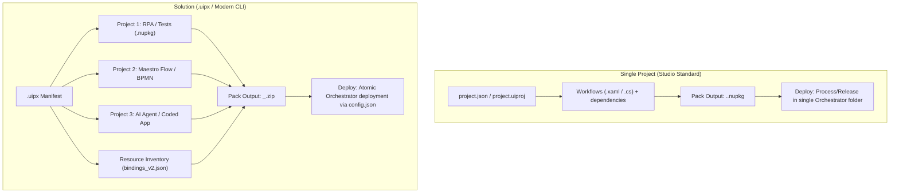

# UiPath Studio vs. CLI & Solutions Architecture Guide

*A technical reference and workshop guide for the UiPath Fusion Workshop on building, orchestrating, and packaging UiPath automations code-first via Antigravity & the `uip` CLI.*

---

## 1. Executive Summary

UiPath automations can be developed in two ways:
1. **Visual / Desktop Studio-First**: Traditional GUI-driven authoring focusing on standalone projects (`project.json`), visual XAML activities, and `.nupkg` releases to Orchestrator.
2. **Code-First / Agentic CLI-First (`uip` + Antigravity)**: Terminal-driven and AI-assisted authoring supporting both standalone projects and multi-component Solutions (`.uipx`), C# coded workflows/tests (`.cs`), and automated atomic deployments (`.zip`).

Both environments share the **exact same underlying metamodel, Roslyn/C# compiler, and WorkflowAnalyzer engine**, ensuring 100% interoperability.

---

## 2. Project Architecture: Single Project vs. Solution



### Key Differences Table

| Feature | Single Project (`project.json`) | Solution (`.uipx`) |
| :--- | :--- | :--- |
| **Descriptor** | `project.json` & `project.uiproj` | `<Solution>.uipx` referencing project paths |
| **Multi-Project** | ❌ No (one project per root) | ✅ Yes (RPA, Tests, Maestro, Agents, Apps) |
| **Packaging Artifact** | `.nupkg` (NuGet Package) | `.zip` (Composite Solution Package) |
| **Resource Provisioning** | Manual setup in Orchestrator | Automated via `bindings_v2.json` and deploy config |
| **Studio Windows UX** | Full visual authoring ("Project" panel) | Solution navigation ("Explorer" panel) |
| **Target Audience** | Standalone bots, test suites, libraries | Multi-component enterprise automations & CI/CD |

---

## 3. C# Coded Test Cases: No XAML Required

For code-first automation, visual XAML files (`.xaml`) are completely optional.

* **Workflows/Tests**: Written purely in C# (`.cs`) using standard classes inheriting from `CodedWorkflow`.
* **Activity Packages**: Kept as NuGet dependencies in `project.json` (`UiPath.Testing.Activities`, `UiPath.System.Activities`) because they supply the C# SDK API (`testing.VerifyExpression`, `system.Log`, etc.).
* **Third-Party Libraries**: Any standard NuGet package (e.g. `FluentAssertions`, `RestSharp`, `Newtonsoft.Json`) can be added directly to `project.json`.

### Example C# Coded Test Case:
```csharp
using System;
using UiPath.CodedWorkflows;
using UiPath.Testing;

namespace MyProject
{
    public class OrderProcessingTests : CodedWorkflow
    {
        [TestCase]
        public void VerifyOrderCalculation()
        {
            Log("Executing C# test case...");
            int subtotal = 100;
            int tax = 20;
            int total = subtotal + tax;

            testing.VerifyExpression(total == 120, "Total must match subtotal + tax");
        }
    }
}
```

---

## 4. How `pack` Works (Project vs. Solution)

### Project-Level Pack (`uip rpa pack`)
1. Reads `project.json`.
2. Restores project NuGet dependencies.
3. Runs Workflow Analyzer rules.
4. Compiles XAML and C# code into assemblies.
5. Emits `<Project>.<Version>.nupkg`.

### Solution-Level Pack (`uip solution pack`)
1. Reads `<solution>.uipx` to discover all registered child projects.
2. Reconciles all resource declarations (`bindings_v2.json` for assets, queues, buckets).
3. Compiles and packs each subproject into its native artifact (e.g. `.nupkg` for RPA).
4. (Optional) Signs `.nupkg`s with a code-signing certificate.
5. Injects traceability metadata (`package.metadata.json` with git SHA, repo URL, release notes).
6. Compresses all artifacts and manifests into `<Solution>_<Version>.zip`.

---

## 5. Working Between Studio and CLI/AGY

* **To author code in AGY**: Create `.cs` or `.xaml` files directly; AGY and CLI handle validation and build.
* **To visually design/debug a subproject in Studio**: Open `Test1/project.json` directly in Studio Windows rather than `.uipx` to unlock the active Project toolbar.
* **To bundle and deploy via CI/CD**: Run `uip solution pack` and `uip solution publish` at the solution root.
